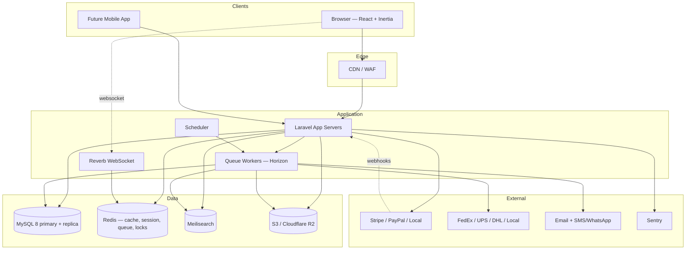
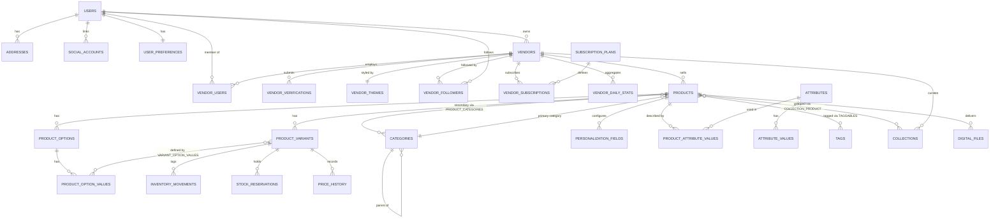
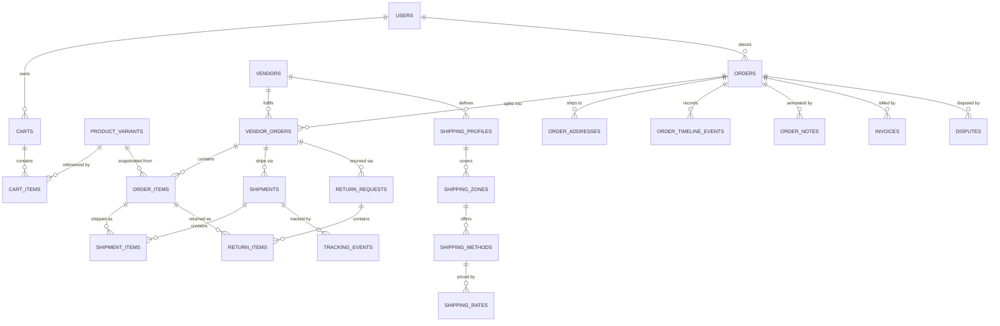
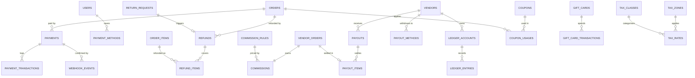
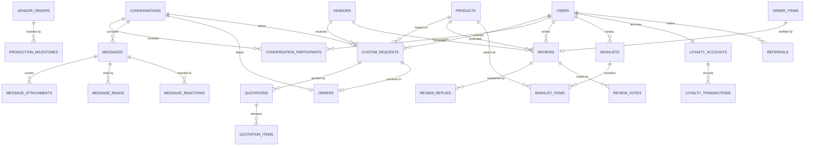
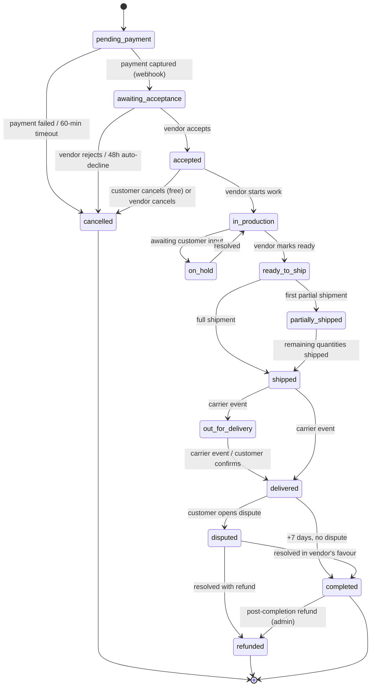
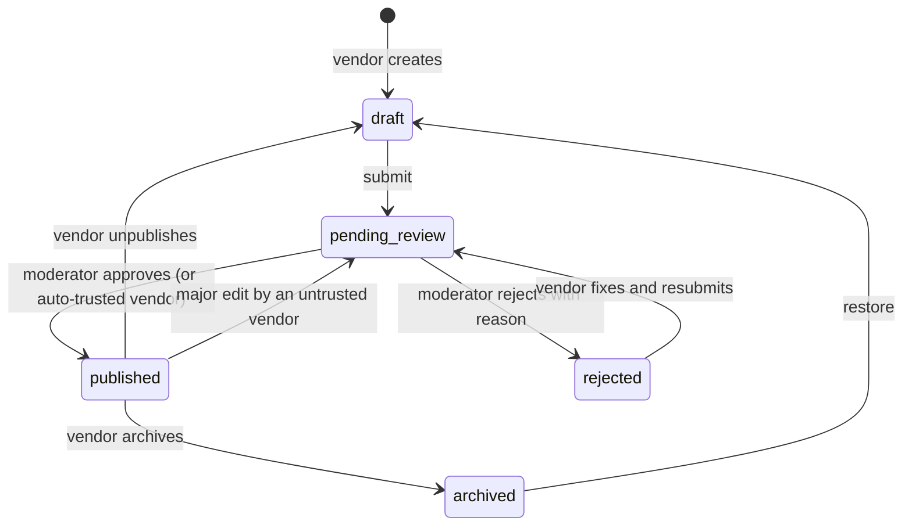
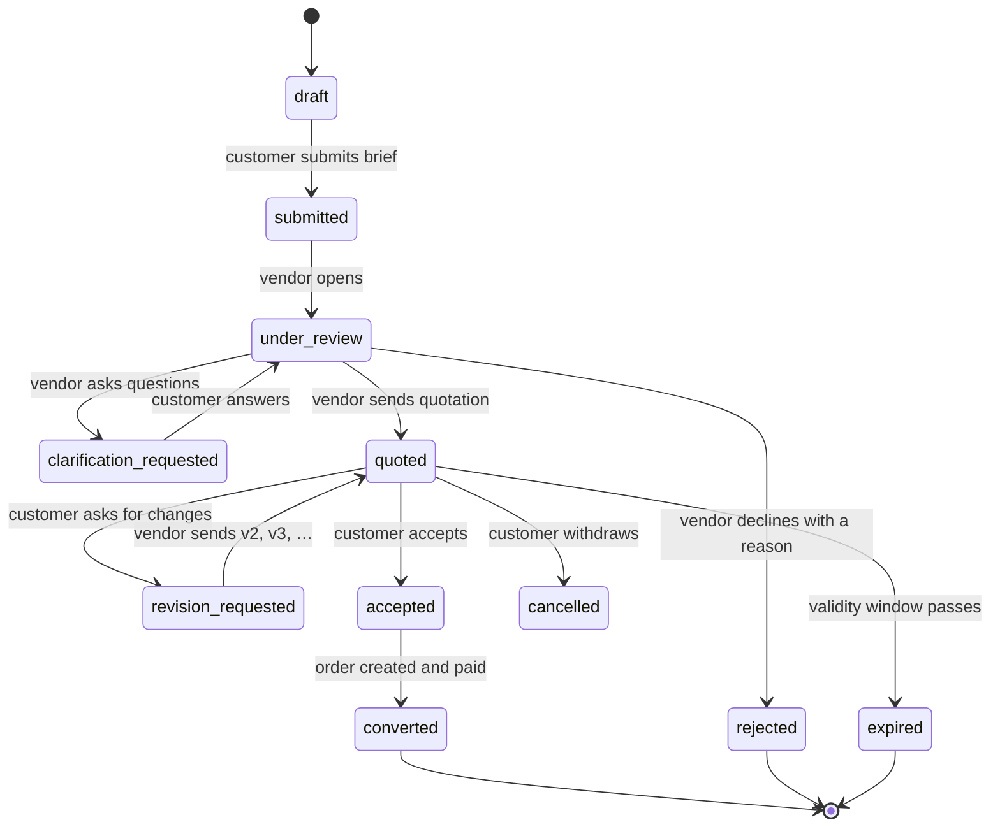

# Craftique — Project Plan

> **Multi-Vendor Handmade Marketplace**
> Version: 1.0 (Draft for approval)
> Date: 2026-08-03
> Status: **Awaiting approval — no implementation code has been written.**

---

## Table of Contents

1. [Vision](#1-vision)
2. [Business Goals](#2-business-goals)
3. [Architecture Decision Records (read this first)](#3-architecture-decision-records-read-this-first)
4. [User Types](#4-user-types)
5. [Complete Feature List](#5-complete-feature-list)
6. [User Stories](#6-user-stories)
7. [Functional Requirements](#7-functional-requirements)
8. [Non-Functional Requirements](#8-non-functional-requirements)
9. [Architecture](#9-architecture)
10. [Folder Structure](#10-folder-structure)
11. [Database Design](#11-database-design)
12. [ER Diagram](#12-er-diagram)
13. [API Design](#13-api-design)
14. [UI Pages](#14-ui-pages)
15. [Vendor Dashboard](#15-vendor-dashboard)
16. [Customer Dashboard](#16-customer-dashboard)
17. [Admin Dashboard](#17-admin-dashboard)
18. [Order Workflow](#18-order-workflow)
19. [Product Workflow](#19-product-workflow)
20. [Custom Product Workflow](#20-custom-product-workflow)
21. [Chat Workflow](#21-chat-workflow)
22. [Notifications Workflow](#22-notifications-workflow)
23. [Search Workflow](#23-search-workflow)
24. [Security](#24-security)
25. [Permissions](#25-permissions)
26. [Performance](#26-performance)
27. [Caching](#27-caching)
28. [SEO](#28-seo)
29. [Accessibility](#29-accessibility)
30. [Mobile Responsive](#30-mobile-responsive)
31. [Future Features](#31-future-features)
32. [Risks](#32-risks)
33. [Development Roadmap](#33-development-roadmap)

---

## 1. Vision

Craftique is a premium marketplace built for people who make things by hand — resin artists, jewellers, crocheters, candle makers, calligraphers, florists, and gift-box curators — who today run their entire business out of an Instagram DM inbox, a WhatsApp thread, and a screenshot of a bank transfer.

Those creators do not have a "shopping cart problem." They have a **trust, coordination, and repeatability problem**:

- The customer cannot tell a real business from a scam account.
- Every custom order is renegotiated from scratch in chat, with no record of what was agreed.
- Payment is manual, unverifiable, and disputed.
- The maker has no idea which products sell, what stock remains, or how much they actually earned.
- The conversation *is* the order, and when the conversation is lost, the order is lost.

Craftique's thesis: **the chat thread is not a bug to be replaced — it is the core of handmade commerce, and it should be a first-class, structured, auditable part of the order lifecycle.** Everything else in the platform (catalog, cart, checkout, payouts) exists to give that conversation a spine.

The product must feel like a design object, not an admin panel. The visual bar is Apple-level restraint: generous whitespace, one confident type scale, photography-first layouts, motion that clarifies rather than decorates, and an interface that gets out of the way of the work being sold.

**In one sentence:** Craftique turns a maker's social-media DM shop into a real, trusted, measurable business — without taking away the personal conversation that made it work.

### What Craftique is not

- Not a generic Shopify/WooCommerce clone with a "vendor" plugin bolted on.
- Not a race to the cheapest price; it is a curated, verified, quality-signalled marketplace.
- Not a dropshipping catalog. Products are made, often to order, often slowly. The whole system must be honest about lead times.

---

## 2. Business Goals

### 2.1 Primary goals

| # | Goal | Metric | Target (12 months post-launch) |
|---|------|--------|-------------------------------|
| G1 | Onboard makers who currently sell via social | Verified active vendors | 500 |
| G2 | Make custom orders effortless | Custom requests → paid orders conversion | ≥ 35% |
| G3 | Earn revenue on GMV | Take rate (commission) | 8–12% blended |
| G4 | Build buyer trust | Order dispute rate | < 1.5% of orders |
| G5 | Retain buyers | Repeat purchase rate (90-day) | ≥ 25% |
| G6 | Retain vendors | Vendor 6-month retention | ≥ 60% |
| G7 | Be discoverable | Organic traffic share | ≥ 40% of sessions |

### 2.2 Revenue model

1. **Commission per sale** — configurable globally, per category, per vendor, per subscription tier. Deducted at settlement, not at checkout.
2. **Subscription plans** for vendors — Free / Studio / Atelier tiers gating product limits, commission rate, storefront themes, analytics depth, featured slots, custom domain.
3. **Featured placement** — paid promotion of vendors, products, and collections (time-boxed, inventory-controlled).
4. **Payment processing margin** — small spread over gateway fees where legally permitted.
5. **Value-added services (later)** — professional photography, packaging supplies, shipping label discounts.

### 2.3 Non-goals for v1

- Native mobile apps (the API will be built to support them; the apps come later).
- Multi-language / multi-currency *storefronts* (the schema will be i18n- and multi-currency-ready from day one; only one active locale/currency ships in v1).
- Vendor-to-vendor wholesale.
- Live video shopping.

---

## 3. Architecture Decision Records (read this first)

The brief left several choices open, and in a few places I believe there is a materially better option than the one suggested. Each decision below is stated with its trade-off. **These are the decisions I need approved before Step 3.**

---

### ADR-001 — Tailwind CSS, not Bootstrap ✅ Recommended: Tailwind

**Decision:** Tailwind CSS v4 (already installed in this repo) + a small hand-built component layer. No Bootstrap. No heavyweight component kit (MUI/Ant) — they carry a strong visual identity that fights the "premium, minimal, Apple-level" goal.

**Why:** Bootstrap's design language is instantly recognisable and generic; escaping it costs more than starting from primitives. Tailwind gives a constraint system (spacing, type, colour scales) that *enforces* consistency, ships almost no unused CSS, and the v4 engine is already configured via `@tailwindcss/vite`.

**Component strategy:** **shadcn/ui pattern** — copy Radix UI primitives into our own `resources/js/components/ui/` rather than depending on a component library. Radix gives correct, accessible behaviour (focus traps, ARIA, keyboard nav) for dialogs, dropdowns, comboboxes, tabs, tooltips; we own 100% of the styling. This is the only realistic way to hit both "Apple-level" and "WCAG 2.1 AA" without writing a11y from scratch.

**Trade-off:** more upfront component work than Bootstrap. Paid back from week 3 onward.

---

### ADR-002 — Inertia.js v2 (React + TypeScript), not a decoupled SPA ✅ Recommended: Inertia

**Decision:** Laravel + **Inertia v2** + React 19 + TypeScript + Vite for the entire web application (storefront, all three dashboards). **Plus** a separate, versioned, token-authenticated REST API (`/api/v1`) exposed from the same service layer for future mobile apps and partner integrations.

**Why this over "React SPA + Sanctum API" (the brief's default reading):**

| Concern | Decoupled SPA | Inertia |
|---|---|---|
| Auth | Token/cookie juggling, CSRF/CORS edge cases | Laravel session auth, unchanged |
| Authorization | Re-implemented client-side, drifts from Policies | Policies evaluated server-side, shared to the page as props |
| Validation | Duplicated in Zod + Form Requests | Form Requests only; errors auto-flow into React |
| Routing | Two routers to keep in sync | One router (Laravel) |
| SEO | Needs a separate SSR service | Inertia SSR built in |
| Data fetching | React Query everywhere, cache invalidation bugs | Props are the data; partial reloads for the rest |
| Time to build 3 dashboards | High | Substantially lower |

Inertia v2 specifically adds deferred props, prefetching, polling, and infinite scroll — which covers most of what React Query was wanted for.

**Where React Query still earns its place:** genuinely client-owned, high-churn state — chat message pagination, notification polling/socket merge, live search-as-you-type, analytics chart ranges. It will be used **only** there, not as the general data layer.

**Zustand:** used only for cart drawer UI state, chat UI state (open thread, drafts), and the compare tray. Server state never lives in Zustand.

**Trade-off:** the web app is coupled to Laravel routing. Mitigated by the parallel `/api/v1` — and critically, both Inertia controllers and API controllers call **the same Actions/Services**, so there is one source of business truth.

---

### ADR-003 — Order model: one Order → many VendorOrders ⚠️ Critical

**Decision:** A customer checkout produces **one `Order`** (the payment and customer-facing envelope) that contains **N `vendor_orders`** (one per vendor in the cart), each with its own status, fulfilment, shipping, commission, refunds, and timeline. `order_items` belong to a `vendor_order`.

**Why:** Every hard multi-vendor problem — partial shipment, per-vendor cancellation, split refunds, split payouts, per-vendor lead times, per-vendor shipping rates, per-vendor chat — becomes trivial with this shape and becomes a permanent source of bugs without it. This is the single most expensive decision to reverse. It must be right in Milestone 5.

**Consequence:** The customer sees "Order #CRQ-10432" with three sub-shipments; each vendor sees only their own `vendor_order` (`#CRQ-10432-2`), never the others' contents.

---

### ADR-004 — Money as integer minor units ⚠️ Non-negotiable

**Decision:** All monetary values stored as `BIGINT` minor units (cents/paisa) with an adjacent 3-letter `currency` column. Never `FLOAT`, never `DOUBLE`. A `Money` value object (amount + currency) handles arithmetic, allocation (remainder-safe splitting for commission), and formatting. `DECIMAL` is acceptable only for tax *rates* and commission *percentages*.

**Why:** Commission splits, tax, coupons, and multi-vendor refunds all require exact allocation. Floating point guarantees eventual off-by-one-cent ledger drift, and ledger drift in a payouts system is a legal problem, not a bug.

---

### ADR-005 — Repository Pattern used sparingly ✅ Recommended: Actions + Services + Query objects

**Decision:** Do **not** wrap every Eloquent model in a repository interface. Instead:

- **Actions** (single-purpose invokable classes) for writes: `PlaceOrder`, `AcceptQuotation`, `ReleaseVendorPayout`.
- **Services** for orchestration across multiple actions and third parties: `CheckoutService`, `PayoutService`.
- **Query objects / builders** for complex reads: `ProductSearchQuery`, `VendorSalesReportQuery`.
- **Repository interfaces only where a real second implementation exists or is planned**: search index, payment gateways, shipping carriers, storage, and the chat transport. These are genuine ports.

**Why:** Blanket repositories over Eloquent produce hundreds of pass-through methods, forfeit the query builder, and add zero testability (Laravel already has an in-memory database and model factories). This honours the brief's "Repository Pattern **where appropriate**" and the DRY/KISS rules.

---

### ADR-006 — Payments: driver contract + Stripe Connect first

**Decision:** A `PaymentGateway` contract with drivers (`StripeDriver`, `PayPalDriver`, `LocalGatewayDriver`, `CashOnDeliveryDriver`), selected by config, with a uniform `PaymentIntent`/`PaymentResult` DTO and idempotency keys on every call. Webhooks are the single source of payment truth — never the browser redirect.

**Marketplace settlement model:** **Aggregator (platform-of-record)** for v1 — the platform collects the full amount, holds vendor balances in an internal ledger, and pays out on a schedule. Stripe Connect (Express accounts) is the target for markets where it is available, so funds can be split at source; the internal ledger stays authoritative either way.

**Why not Laravel Cashier:** Cashier is excellent for *subscriptions* and will be used for **vendor subscription plans**. It is not designed for marketplace split payments, so order payments go through our own driver layer.

**Compliance note:** holding funds on behalf of sellers has regulatory implications (money transmission / payment aggregation) that vary by jurisdiction. Flagged in [Risks](#32-risks) — a business/legal decision, not an engineering one.

---

### ADR-007 — Real-time: Laravel Reverb

**Decision:** **Laravel Reverb** (first-party WebSocket server) for chat, typing indicators, read receipts, notifications, and order status pushes. Laravel Echo on the client. Private + presence channels authorised through the same Policies as HTTP.

**Why:** first-party, no per-message vendor cost, no external dependency for the platform's most-used feature. Pusher stays a drop-in fallback via config if self-hosting Reverb proves operationally painful — the broadcasting contract is identical.

---

### ADR-008 — Search: Laravel Scout, driver-swappable, Meilisearch target

**Decision:** Laravel Scout with a **database driver in development** and **Meilisearch in production**. Search behind our own `SearchService` + `ProductSearchQuery` so the engine is replaceable.

**Why Meilisearch over Elasticsearch:** typo tolerance out of the box (critical when buyers type "resign art keychain"), sub-50ms responses, trivially operable, faceting and custom ranking rules sufficient for a marketplace of this size. Elasticsearch/OpenSearch is a Milestone-14 concern if scale demands it.

---

### ADR-009 — MySQL 8 in all environments; drop the SQLite default

**Decision:** Switch `DB_CONNECTION` to `mysql` (8.0+) immediately. The schema uses generated columns, JSON columns with functional indexes, `FULLTEXT` fallback search, and window functions in reports — SQLite will silently diverge and let broken migrations pass CI.

---

### ADR-010 — PHP 8.3+ recommended (currently 8.2.12)

**Observation:** the local XAMPP runs PHP 8.2.12. Laravel 12 supports 8.2, so this is not a blocker. **Recommendation:** move to PHP 8.3 or 8.4 before Milestone 1 for typed class constants, `json_validate()`, `#[\Override]`, and meaningfully better performance. If we stay on 8.2, that is fine — I will simply not use 8.3+ syntax anywhere.

---

### ADR-011 — Media: Spatie MediaLibrary + Flysystem, S3/R2-compatible

**Decision:** `spatie/laravel-medialibrary` for all uploads, with conversions (thumb / card / detail / zoom) generated **on the queue**, served as **WebP + AVIF** with a JPEG fallback via `<picture>`. Storage disk is config-driven: `local` in dev, S3 or Cloudflare R2 in production (R2 preferred — zero egress fees matter a lot for an image-heavy marketplace). Uploads go **direct-to-storage with presigned URLs**, never through PHP, for anything above 2 MB.

---

### ADR-012 — Roles: Spatie Permission + explicit Policies, vendor-scoped by team

**Decision:** `spatie/laravel-permission` with **teams mode enabled**, where `team_id` = `vendor_id`. This lets one user be Owner of their own store and Staff in another. Global roles (admin, support, customer) live on the null team. Every authorization decision that involves ownership goes through a **Policy**, never a bare `hasRole()` check.

---

### ADR-013 — Approved package list (nothing else without justification)

| Package | Purpose |
|---|---|
| `inertiajs/inertia-laravel` | Web app transport |
| `laravel/breeze` (Inertia+React scaffold) | Auth scaffolding starting point |
| `laravel/sanctum` | API tokens for the mobile/partner API |
| `laravel/fortify` (via Breeze) | 2FA, password reset primitives |
| `spatie/laravel-permission` | Roles & permissions (teams mode) |
| `spatie/laravel-medialibrary` | Media, conversions, responsive images |
| `spatie/laravel-sluggable` | Slugs for products, vendors, categories |
| `spatie/laravel-activitylog` | Audit trail |
| `spatie/laravel-query-builder` | Safe filtering/sorting/includes on list endpoints |
| `spatie/laravel-backup` | Automated backups |
| `laravel/scout` + `meilisearch/meilisearch-php` | Search |
| `laravel/reverb` + `laravel/echo` | WebSockets |
| `laravel/cashier` | Vendor subscription billing |
| `laravel/horizon` | Queue supervision + metrics |
| `laravel/telescope` (local/staging only) | Debugging |
| `laravel/pulse` | Production app metrics |
| `stripe/stripe-php`, `paypal/paypal-server-sdk` | Payment SDKs |
| `barryvdh/laravel-dompdf` | Invoices, packing slips |
| `maatwebsite/excel` | CSV/XLSX import & export |
| `pestphp/pest` | Testing (over raw PHPUnit — better DX, same engine) |
| `larastan/larastan` | Static analysis (level 6+) |
| `laravel/pint` | Formatting (already present) |
| `rector/rector` | Automated refactors/upgrades |

Frontend: `react`, `react-dom`, `typescript`, `@inertiajs/react`, `@tanstack/react-query` (scoped per ADR-002), `zustand` (scoped), `tailwindcss`, `@radix-ui/*`, `lucide-react`, `motion` (Framer Motion v12), `class-variance-authority`, `clsx`, `tailwind-merge`, `zod` (client-side pre-validation only), `recharts` (dashboards), `laravel-echo` + `pusher-js` (Reverb client), `embla-carousel-react`, `sonner` (toasts), `vitest` + `@testing-library/react`, `@playwright/test`.

---

### ADR-014 — Modular monolith, not microservices

**Decision:** One deployable Laravel application, internally organised by **domain module** (`app/Domains/Catalog`, `app/Domains/Ordering`, …) with enforced boundaries: a domain may depend on `Shared`, and may listen to another domain's **events**, but may not import another domain's internal services. Enforced in CI by an architecture test (Pest `arch()` presets).

**Why:** microservices for a pre-launch marketplace buy distributed-systems problems and no delivery speed. The module boundaries preserve the *option* to extract a service (search, chat, media) later, when there is a measured reason.

---

## 4. User Types

### 4.1 Guest (unauthenticated)

Browses everything public, builds a cart (cookie/session-backed, merged into the account on login), follows nothing, cannot message. Guest checkout **is supported** (email + phone), with an optional one-click account claim afterwards — forcing registration is the single largest checkout drop-off in this category.

**Can:** browse, search, filter, view products/vendors/collections/reviews, add to cart, compare, guest checkout, track an order via order number + email, subscribe to the newsletter, view CMS pages.
**Cannot:** wishlist (prompts sign-up), chat, review, request custom work, save addresses.

### 4.2 Customer

A registered buyer. Owns addresses, wishlists, orders, reviews, conversations, loyalty points, referrals, and payment methods (tokenised — we never store PANs).

### 4.3 Vendor

**Vendor** is an *organisation* (a store), not a person. Users are attached to a vendor with a vendor-scoped role:

| Vendor role | Capability |
|---|---|
| **Owner** | Everything, including payout details, subscription, and deleting the store. Exactly one per vendor. |
| **Manager** | Products, orders, inventory, coupons, chat, reviews, analytics. No payouts, no billing, no staff management. |
| **Staff** | Orders + chat + inventory only. No pricing, no payouts, no analytics. |

A vendor progresses through: `pending` → `under_review` → `approved` (`suspended` / `rejected` / `closed` as terminal or reversible states). Only `approved` vendors have a public storefront and can transact.

### 4.4 Admin

Platform operator. Full access **through policies**, not through god-mode `if ($user->isAdmin()) return true` scattered in code. Every destructive or financial admin action is logged to the audit trail with actor, IP, before/after state, and reason.

### 4.5 Staff (platform staff)

Scoped internal roles, so support agents are not handed the payouts console:

| Staff role | Scope |
|---|---|
| **Support Agent** | Orders, refunds up to a threshold, conversations, customer accounts. Read-only on finance. |
| **Catalog Moderator** | Product approval, category/tag management, review moderation, takedowns. |
| **Vendor Onboarding** | Vendor applications, KYC document review, verification badges. |
| **Finance** | Payouts, commissions, ledger, invoices, tax reports, refunds without limit. |
| **Content Editor** | CMS pages, banners, collections, homepage merchandising, SEO metadata. |

### 4.6 System

Not a user, but a first-class actor in the audit trail: queued jobs, scheduled tasks, webhooks. Anything the system does on a user's behalf (auto-cancel unpaid order, auto-release payout) is attributed to `system` with the triggering rule named.

---

## 5. Complete Feature List

Legend: **[v1]** ships in the initial release · **[v1.1]** fast-follow · **[v2]** later.

### 5.1 Marketplace & vendors

- Multi-vendor marketplace with isolated vendor data **[v1]**
- Vendor application + onboarding wizard (store identity → categories → shipping → payout → policies → submit) **[v1]**
- KYC / verification document upload and admin review **[v1]**
- Verified-vendor badge, tiers of verification (identity / business / handmade-certified) **[v1]**
- Public vendor storefront: `/@handle` with banner, avatar, story, product grid, collections, policies, reviews, chat CTA **[v1]**
- Vendor "About the maker" rich profile: workspace photos, process video, materials, craft story **[v1]**
- Store themes (colour palette, hero layout, typography pairing, product-card style) **[v1]**
- Custom domain per store **[v2]**
- Vendor ratings (aggregate) and vendor reviews (order-verified) **[v1]**
- Vendor followers + "new drop" notifications to followers **[v1]**
- Featured vendors (editorial + paid slots) **[v1]**
- Vendor analytics (traffic, conversion, revenue, top products, repeat rate, response time) **[v1]**
- Vendor earnings ledger with pending/available/paid balances **[v1]**
- Vendor withdrawals / payout requests with approval workflow **[v1]**
- Commission system: global → category → vendor → subscription-tier override chain **[v1]**
- Subscription plans for vendors (Cashier) with plan-gated limits **[v1.1]**
- Vendor vacation mode / temporary store pause **[v1]**
- Vendor staff accounts with scoped roles **[v1]**
- Vendor onboarding checklist + health score **[v1.1]**

### 5.2 Product catalog

- Unlimited products (plan-gated on lower tiers) **[v1]**
- Nested categories and subcategories (unlimited depth, materialised path) **[v1]**
- Tags (free-form, moderated) **[v1]**
- Collections — platform-curated and vendor-curated **[v1]**
- Product variants (size × colour × material, up to 3 option axes, 100 variants) **[v1]**
- Product options with per-option price deltas and per-variant images **[v1]**
- Product attributes / specifications (filterable facets: material, colour family, occasion, technique) **[v1]**
- Inventory tracking per variant, with "made to order" and "one of a kind" modes **[v1]**
- Low-stock thresholds and alerts **[v1]**
- SKU and barcode (EAN/UPC) **[v1]**
- Physical products **[v1]**
- Digital products (secure, expiring, download-limited links) **[v1.1]**
- Handmade products with lead time / "ships in X–Y days" **[v1]**
- Custom products (fully bespoke, quote-driven) **[v1]**
- Personalised products (fixed product + personalisation fields) **[v1]**
- Occasion-based merchandising (wedding, Eid, Christmas, birthday, anniversary, graduation) **[v1]**
- Multiple images per product and per variant, drag-to-reorder **[v1]**
- Product videos (upload + YouTube/Vimeo embed) **[v1]**
- 360° spin images **[v1.1]**
- Image zoom / lightbox with pinch-zoom on touch **[v1]**
- Care instructions, materials list, dimensions, weight **[v1]**
- Product Q&A (public questions answered by the vendor) **[v1.1]**
- Product approval workflow (moderation before first publish) **[v1]**
- Bulk product import/export (CSV/XLSX) **[v1.1]**
- Duplicate product **[v1]**
- Scheduled publishing **[v1.1]**

### 5.3 Discovery

- Wishlist (multiple named lists, shareable, public/private) **[v1]**
- Recently viewed **[v1]**
- Compare products (up to 4) **[v1]**
- Related products (same category/tags/vendor) **[v1]**
- Recommended products (co-purchase + content-based) **[v1.1]**
- Trending (velocity-weighted view/sale score) **[v1]**
- Featured products **[v1]**
- Best selling (per window, per category) **[v1]**
- New arrivals **[v1]**
- Back-in-stock alerts **[v1.1]**
- Price-drop alerts on wishlisted items **[v2]**
- Search with typo tolerance, synonyms, faceting, autocomplete **[v1]**
- Visual/image search **[v2]**
- Gift finder quiz (occasion → recipient → budget → results) **[v1.1]**

### 5.4 Promotions

- Coupons: percentage, fixed, free shipping, BOGO **[v1]**
- Coupon scoping: platform-wide vs vendor-owned, product/category/collection restrictions, min spend, usage caps, per-customer caps, first-order-only, date windows, stackability rules **[v1]**
- Flash sales with countdown and inventory caps **[v1]**
- Gift cards (issue, redeem, partial balance, expiry) **[v1.1]**
- Automatic discounts (spend X get Y) **[v1.1]**
- Referral program (referrer + referee rewards) **[v1.1]**
- Loyalty points (earn on delivery, redeem at checkout) **[v1.1]**

### 5.5 Custom & personalised orders

- Personalisation fields on a normal product (text, colour, date, file upload, select) with per-field price deltas and character limits **[v1]**
- Live personalisation preview (text rendered on the product photo) **[v1.1]**
- Full custom request flow: brief → vendor review → clarification → quotation → acceptance → payment → production → delivery **[v1]**
- Upload inspiration photos, logo, handwriting sample, reference files **[v1]**
- Choose colours, materials, size, finishing, packaging, delivery date **[v1]**
- Notes field and structured brief questions **[v1]**
- Vendor: approve / reject / request clarification / send quotation **[v1]**
- Quotation with line items, revisions, validity window, deposit vs full payment **[v1]**
- Production milestones with photo proof-of-progress and customer approval gates **[v1.1]**
- Custom order converted into a real order on acceptance (same fulfilment pipeline) **[v1]**

### 5.6 Cart & checkout

- Persistent cart (guest cookie → merged on login) **[v1]**
- Multi-vendor cart grouped by vendor with per-vendor subtotal, shipping, and lead time **[v1]**
- Save for later **[v1]**
- Cart-level and vendor-level coupon application **[v1]**
- Live stock revalidation at checkout **[v1]**
- Address book with default shipping/billing, address validation **[v1]**
- Shipping method selection per vendor **[v1]**
- Gift options: gift wrap, gift message, hide prices on packing slip **[v1]**
- Delivery date selection where the vendor supports it **[v1]**
- Tax calculation by zone/class **[v1]**
- Payment: Stripe (cards, wallets), PayPal, local gateway, Cash on Delivery, gift card, loyalty points **[v1]**
- Guest checkout + post-purchase account claim **[v1]**
- Order confirmation page + email + optional SMS/WhatsApp **[v1]**
- Abandoned cart recovery emails **[v1.1]**
- One-page checkout with progressive disclosure **[v1]**

### 5.7 Orders & fulfilment

- Multi-vendor order splitting (`Order` → `VendorOrder`) **[v1]**
- Order timeline with every event, actor, and timestamp **[v1]**
- Order statuses per vendor sub-order **[v1]**
- Partial shipment (multiple shipments per vendor order) **[v1]**
- Shipment tracking (carrier + tracking number + status polling) **[v1]**
- Carrier integrations: FedEx, UPS, DHL, local couriers — behind a driver contract; manual tracking entry always available **[v1 manual / v1.1 API]**
- Shipping label purchase **[v2]**
- Cancellation (customer window, vendor-initiated with reason) **[v1]**
- Returns and RMA workflow **[v1]**
- Refunds — full, partial, per-item, to original method or store credit **[v1]**
- Exchanges **[v1.1]**
- Invoices (PDF) and packing slips (PDF) **[v1]**
- Order notes: internal (vendor/admin) vs customer-visible **[v1]**
- Order-linked chat thread **[v1]**
- Disputes / escalation to admin **[v1]**
- Automatic order state transitions (auto-cancel unpaid, auto-complete after delivery + N days) **[v1]**

### 5.8 Chat

- Customer ↔ Vendor, Vendor ↔ Admin, Customer ↔ Admin **[v1]**
- Real-time delivery via Reverb **[v1]**
- Read receipts, delivery ticks **[v1]**
- Typing indicators **[v1]**
- Image, file, product, and order sharing as rich message cards **[v1]**
- Order- and custom-request-linked threads **[v1]**
- Unread badges + push/email notification on missed messages **[v1]**
- Message search **[v1]**
- Pinned messages **[v1]**
- Emoji picker + reactions **[v1]**
- Quick replies / saved responses for vendors **[v1.1]**
- Vendor auto-reply and business hours **[v1.1]**
- Voice notes **[v2]**
- Video calls **[v2]**
- AI assistant (draft replies, FAQ deflection, translation) **[v2]**

### 5.9 Reviews & trust

- Product reviews with 1–5 stars, title, body, photos, and video **[v1]**
- Verified-purchase badge (review only allowed after delivery) **[v1]**
- Vendor reviews on communication / packaging / accuracy / speed sub-scores **[v1]**
- Vendor public reply to reviews **[v1]**
- Helpful votes **[v1]**
- Review moderation queue, profanity filter, report/flag **[v1]**
- Aggregate rating with rating distribution histogram **[v1]**
- Review request email after delivery **[v1]**

### 5.10 Notifications

- In-app notification centre **[v1]**
- Email (queued, templated, brand-consistent) **[v1]**
- Real-time browser push via WebSocket **[v1]**
- Web Push (service worker) **[v1.1]**
- SMS / WhatsApp for critical order events (driver-based) **[v1.1]**
- Per-user, per-channel, per-event notification preferences **[v1]**
- Digest emails (vendor daily summary, customer weekly picks) **[v1.1]**

### 5.11 Admin & platform

- Everything manageable: users, vendors, products, categories, orders, payments, refunds, payouts, commissions, coupons, reviews, chats, reports, CMS, settings **[v1]**
- Moderation queues (products, reviews, vendors, reported content) **[v1]**
- Impersonate user (audited, banner-visible, time-limited) **[v1]**
- Feature flags **[v1]**
- Platform settings UI (fees, currency, tax, email, storage, gateway keys) **[v1]**
- CMS: pages, banners, homepage sections, FAQ, blog **[v1 / blog v1.1]**
- Audit log viewer **[v1]**
- Financial reports: GMV, revenue, commission, refunds, payouts, tax **[v1]**
- Data export (GDPR) and account deletion **[v1]**
- Health dashboard (queues, failed jobs, webhooks, search index) **[v1]**

---

## 6. User Stories

Written as `As a … I want … so that …`, each with acceptance criteria. Grouped by actor; these feed directly into `TASKS.md` in Step 3.

### 6.1 Guest

**US-G1 — Browse without friction**
*As a guest, I want to browse and search the whole catalog without an account so that I can evaluate the marketplace before committing.*
**AC:** all catalog routes are public; no auth walls; wishlist/chat CTAs prompt sign-in inline (modal) without losing page context; the cart survives a browser restart for 30 days.

**US-G2 — Guest checkout**
*As a guest, I want to buy without creating an account so that I can order a gift quickly.*
**AC:** email + phone + shipping address is sufficient; order confirmation includes a tracking link keyed by a signed token; a "claim this order" link creates an account and back-links the order; the same email later registering sees the guest order in history.

**US-G3 — Track an order**
*As a guest, I want to track my order with an order number and email so that I don't need an account.*
**AC:** rate-limited lookup form (5/min/IP); shows per-vendor shipment status and tracking; never exposes other orders.

### 6.2 Customer

**US-C1 — Confident purchase**
*As a customer, I want to see the maker, their verification, ratings, lead time, and shipping cost before I add to cart so that I trust the purchase.*
**AC:** PDP shows vendor card (avatar, name, badge, rating, response time, ships-from), lead time, estimated delivery range, return policy, and total-cost preview.

**US-C2 — Personalise a product**
*As a customer, I want to add my own text/colour/date to a product so that the gift feels personal.*
**AC:** personalisation fields validated client + server; character limits enforced; price deltas reflected live; personalisation snapshotted onto the order item and shown on the vendor's packing slip.

**US-C3 — Request a fully custom piece**
*As a customer, I want to describe a bespoke piece with reference images and get a quote so that I can commission work.*
**AC:** multi-step brief with uploads (10 files, 10 MB each); request appears in the vendor's queue; customer receives a notification on every state change; accepting a quotation creates a real payable order.

**US-C4 — Multi-vendor cart**
*As a customer, I want to buy from three makers in one checkout so that I pay once.*
**AC:** cart groups by vendor; each group shows its own shipping and lead time; one payment; order confirmation explains that items arrive separately.

**US-C5 — Talk to the maker**
*As a customer, I want to message a vendor about an order so that I can ask for changes.*
**AC:** thread opens pre-linked to the order; real-time; read receipts; email fallback if unread after 10 minutes.

**US-C6 — Return an item**
*As a customer, I want to request a return so that I can get a refund for a damaged item.*
**AC:** eligible only inside the vendor's return window and for returnable items; photo evidence required for "damaged"; visible status; refund reflected on the original payment method with a timeline entry.

**US-C7 — Manage my account**
*As a customer, I want addresses, wishlists, order history, reviews, and notification settings in one place.*
**AC:** all CRUD works on mobile; deleting an address used by an open order is soft-handled (snapshot preserved).

**US-C8 — Review after delivery**
*As a customer, I want to review a delivered product with photos so that I can help other buyers.*
**AC:** review enabled only for delivered items, one per order item, editable for 30 days, photos moderated.

### 6.3 Vendor

**US-V1 — Onboard in under 15 minutes**
*As a maker, I want a guided setup so that I can start selling the same day.*
**AC:** 6-step wizard, progress saved per step, resumable; can list (unpublished) products while verification is pending; clear status banner throughout.

**US-V2 — List a product fast**
*As a vendor, I want to publish a product with photos, variants, and lead time in a few minutes.*
**AC:** drag-and-drop multi-upload with progress and reordering; variant matrix generated from options; autosave draft; live PDP preview; validation errors inline.

**US-V3 — Manage orders**
*As a vendor, I want a single queue of orders that need action so that nothing is missed.*
**AC:** default view is "needs action"; bulk accept/print; each order shows personalisation details, deadline, and buyer notes; marking shipped requires a carrier + tracking (or explicit "no tracking").

**US-V4 — Quote custom work**
*As a vendor, I want to send a structured quotation with revisions so that expectations are recorded.*
**AC:** line items, deposit option, validity window, attachments; customer accept/reject/counter; accepted quote → payable order; all revisions retained.

**US-V5 — Understand my business**
*As a vendor, I want analytics on sales, traffic, conversion, and best sellers so that I can decide what to make next.*
**AC:** date-range comparison vs previous period; revenue net of commission; export CSV; loads under 1s from cache.

**US-V6 — Get paid**
*As a vendor, I want a clear earnings breakdown and a way to withdraw so that I trust the platform with my money.*
**AC:** pending vs available vs paid; per-order commission line visible; withdrawal request with method, minimum threshold, status tracking, and a downloadable statement.

**US-V7 — Stock control**
*As a vendor, I want stock to decrement on sale and warn me when low so that I don't oversell one-of-a-kind pieces.*
**AC:** atomic decrement at payment; one-of-a-kind auto-unpublishes at 0; low-stock notification; inventory movement log with reasons.

**US-V8 — Delegate**
*As a vendor owner, I want to add staff with limited access so that my assistant can pack orders without seeing payouts.*
**AC:** invite by email; role-scoped UI and API; staff actions attributed in the audit log.

### 6.4 Admin & staff

**US-A1 — Verify vendors** — review KYC docs, approve/reject with reason, issue badges; rejected vendors can resubmit; every decision audited.
**US-A2 — Moderate catalog** — queue of pending products with side-by-side preview, approve/reject/request-changes with templated reasons.
**US-A3 — Resolve disputes** — see the full order, payment, chat thread, and evidence in one screen; issue partial refunds; force order state with a reason.
**US-A4 — Control commissions** — set global/category/vendor/tier rates with effective dates; preview the impact on a sample order.
**US-A5 — Run payouts** — batch approve, export a bank file, mark paid, reconcile; the ledger must balance to zero at all times.
**US-A6 — Merchandise the homepage** — arrange hero, collections, featured vendors, and occasion rails with scheduling and preview.
**US-A7 — See platform health** — queue depth, failed jobs, webhook failures, search index lag, error rate, slow queries.

---

## 7. Functional Requirements

Numbered `FR-<area>-<n>` and referenced by tasks and tests.

### FR-AUTH — Authentication & accounts

| ID | Requirement |
|---|---|
| FR-AUTH-1 | Email + password registration with verification required before purchase-adjacent actions (review, chat, custom request). |
| FR-AUTH-2 | Social login: Google, Facebook, Apple (Socialite), with account linking by verified email. |
| FR-AUTH-3 | Password reset via signed, single-use, 60-minute link. |
| FR-AUTH-4 | Optional TOTP 2FA with recovery codes; **mandatory** for vendor Owners and all platform staff. |
| FR-AUTH-5 | Session list with device/IP/last-active and "revoke other sessions". |
| FR-AUTH-6 | Rate limits: 5 login attempts / minute / (email+IP), progressive lockout, CAPTCHA after 10 failures. |
| FR-AUTH-7 | Guest → customer conversion preserves cart, orders, and reviews written as a guest. |
| FR-AUTH-8 | Account deletion: 30-day soft delete, anonymisation of PII, financial records retained per statute. |

### FR-VENDOR — Vendors

| ID | Requirement |
|---|---|
| FR-VENDOR-1 | A user may create at most one vendor by default (config-limited) and may belong to many vendors as staff. |
| FR-VENDOR-2 | Store handle is globally unique, 3–30 chars, `[a-z0-9-]`, reserved-word blocklist, changeable twice per year with a 301 from the old handle. |
| FR-VENDOR-3 | Onboarding steps: identity → categories → shipping profile → payout method → policies → review & submit. Each independently saved and resumable. |
| FR-VENDOR-4 | Verification requires: government ID, proof of address or business registration, and (for the handmade badge) 3 work-in-progress photos. |
| FR-VENDOR-5 | Only `approved` vendors appear in search, sitemaps, and storefront routes. |
| FR-VENDOR-6 | Suspension immediately hides the storefront and blocks new orders, but preserves access to fulfil existing orders. |
| FR-VENDOR-7 | Vacation mode hides "add to cart" with a returns-on date, keeps the storefront browsable, and pauses new custom requests. |
| FR-VENDOR-8 | Vendor "response time" and "on-time shipping rate" computed nightly and shown publicly. |

### FR-CAT — Catalog

| ID | Requirement |
|---|---|
| FR-CAT-1 | Categories form a tree of unlimited depth with a materialised path for O(1) subtree queries; moving a node rewrites descendant paths in one transaction. |
| FR-CAT-2 | A product belongs to exactly one primary category and up to 4 secondary categories. |
| FR-CAT-3 | Products have a lifecycle: `draft` → `pending_review` → `published` / `rejected`, plus `archived`; only `published` is publicly visible. |
| FR-CAT-4 | First-time vendors have every product moderated; after N approved products the vendor is auto-trusted (config) and moderation becomes spot-check. |
| FR-CAT-5 | Up to 3 option axes and 100 variants per product; every variant has SKU, price, stock, weight, and optional image. |
| FR-CAT-6 | Price is stored per variant; the product carries a denormalised min/max price for listing and sorting, refreshed on variant save. |
| FR-CAT-7 | Product types: `physical`, `digital`, `made_to_order`, `one_of_a_kind`, `custom_request_only`. Type determines inventory and checkout behaviour. |
| FR-CAT-8 | Personalisation fields are ordered, typed (`text`, `textarea`, `number`, `date`, `select`, `color`, `file`, `checkbox`), individually required/optional, and may carry a price delta. |
| FR-CAT-9 | At least 1 and at most 12 images per product; first image is the cover; alt text required for accessibility and SEO. |
| FR-CAT-10 | Deleting a product that has orders performs a soft delete/archive; order history never breaks. |
| FR-CAT-11 | Slugs are immutable once published; changing the title keeps the slug and offers an explicit "update URL" with a 301. |

### FR-CART — Cart & checkout

| ID | Requirement |
|---|---|
| FR-CART-1 | Cart persists 30 days for guests (signed cookie → DB) and indefinitely for customers; login merges guest cart into the account cart, summing quantities and respecting stock. |
| FR-CART-2 | Cart lines snapshot the variant price at add-time but revalidate at checkout; a price or stock change blocks payment with an explicit diff shown to the customer. |
| FR-CART-3 | Checkout is a single page with sections: contact → shipping address → per-vendor shipping method → gift options → payment → review. |
| FR-CART-4 | Shipping is quoted per vendor from that vendor's shipping profile (zone → method → rate), summed into the order total. |
| FR-CART-5 | Tax is computed per line by tax class and destination zone; prices may be configured tax-inclusive or exclusive globally. |
| FR-CART-6 | Coupons validate against scope, dates, min spend, usage caps, product/category restrictions, and stackability; vendor coupons discount only that vendor's lines. |
| FR-CART-7 | Placing an order is idempotent: a client-generated `idempotency_key` guarantees one order per submission across retries and double-clicks. |
| FR-CART-8 | Stock is reserved for 15 minutes at payment initiation and released by a scheduled job if payment does not complete. |
| FR-CART-9 | Cash on Delivery is enabled per vendor **and** per shipping zone, with an order-value ceiling. |

### FR-ORDER — Orders

| ID | Requirement |
|---|---|
| FR-ORDER-1 | One `Order` per checkout; one `VendorOrder` per distinct vendor; `order_items` hang off `vendor_orders`. |
| FR-ORDER-2 | Order numbers are human-readable, non-sequential-looking, and collision-free: `CRQ-{base32(snowflake)}`; vendor orders append `-{n}`. |
| FR-ORDER-3 | Vendor order statuses: `pending_payment`, `awaiting_acceptance`, `accepted`, `in_production`, `ready_to_ship`, `partially_shipped`, `shipped`, `out_for_delivery`, `delivered`, `completed`, `cancelled`, `refunded`, `disputed`, `on_hold`. |
| FR-ORDER-4 | Transitions are enforced by a state machine; illegal transitions throw and are never silently ignored. |
| FR-ORDER-5 | Every transition writes a timeline event with actor (user/system), reason, and metadata; the timeline is append-only. |
| FR-ORDER-6 | Customers may cancel free of charge until the vendor sets `in_production`; after that, cancellation is a request the vendor may decline. |
| FR-ORDER-7 | Partial shipment: a shipment holds a subset of item quantities; the vendor order is `partially_shipped` until all quantities are covered. |
| FR-ORDER-8 | Refunds may be full, partial, per-item, or shipping-only, and always write both a payment record and a ledger entry reversing the corresponding commission. |
| FR-ORDER-9 | Invoices and packing slips are generated as PDFs on demand and cached in storage; the invoice number sequence is gapless per legal entity per year. |
| FR-ORDER-10 | Auto-transitions: unpaid orders cancel after 60 minutes; delivered orders complete after 7 days; completed orders release funds after the vendor's clearing period. |

### FR-CUSTOM — Custom requests

| ID | Requirement |
|---|---|
| FR-CUSTOM-1 | A custom request targets one vendor and optionally references a base product. |
| FR-CUSTOM-2 | Request states: `draft`, `submitted`, `under_review`, `clarification_requested`, `quoted`, `revision_requested`, `accepted`, `rejected`, `expired`, `converted`, `cancelled`. |
| FR-CUSTOM-3 | A quotation has line items, subtotal, shipping, tax, total, an optional deposit percentage, a validity date, and an estimated completion date. |
| FR-CUSTOM-4 | Quotation revisions are versioned; the customer always sees the current version and can view history. |
| FR-CUSTOM-5 | Accepting a quotation creates a real `Order`/`VendorOrder` with a synthetic line item carrying the full brief and all uploads. |
| FR-CUSTOM-6 | An expired quotation cannot be accepted; the vendor may reissue it in one click. |
| FR-CUSTOM-7 | Every custom request has a bound chat thread; brief updates post as system messages into that thread. |

### FR-CHAT — Chat

| ID | Requirement |
|---|---|
| FR-CHAT-1 | Conversations are typed: `customer_vendor`, `customer_admin`, `vendor_admin`, `support_ticket`. |
| FR-CHAT-2 | A conversation may be linked to an order, a vendor order, a product, or a custom request (nullable morph). |
| FR-CHAT-3 | Messages support `text`, `image`, `file`, `product_card`, `order_card`, `quotation_card`, `system`. |
| FR-CHAT-4 | Delivery is real-time via private channels; a REST fallback with cursor pagination exists for reconnect and history. |
| FR-CHAT-5 | Read state is per participant per message; unread counts are maintained per conversation and denormalised per user. |
| FR-CHAT-6 | Typing indicators are ephemeral (presence channel + Redis TTL), never persisted. |
| FR-CHAT-7 | Attachments are virus-scanned (or type/size restricted at minimum), stored privately, and served via short-lived signed URLs. |
| FR-CHAT-8 | Full-text message search is scoped strictly to the conversations the requesting user participates in. |
| FR-CHAT-9 | Up to 5 pinned messages per conversation. |
| FR-CHAT-10 | Contact-info sharing (phone/email/external links) is detected and warned about, with an admin-configurable policy of `allow` / `warn` / `block`. |
| FR-CHAT-11 | If a message is unread after 10 minutes, an email/push notification is queued; further notifications are throttled to one per conversation per hour. |

### FR-PAY — Payments & money

| ID | Requirement |
|---|---|
| FR-PAY-1 | All gateway calls carry an idempotency key derived from the order and attempt. |
| FR-PAY-2 | Webhooks are signature-verified, stored raw, processed on the queue, and replay-safe (dedupe by event id). |
| FR-PAY-3 | Payment status is derived from webhooks only; the browser redirect merely triggers an optimistic UI state. |
| FR-PAY-4 | Card data never touches our servers (Stripe Elements / PayPal SDK); we store only gateway tokens. |
| FR-PAY-5 | Commission is computed at capture time from the effective rate chain and frozen onto the vendor order. |
| FR-PAY-6 | A double-entry-style ledger records every movement (sale, commission, refund, adjustment, payout, fee); the sum of all entries per account must reconcile exactly. |
| FR-PAY-7 | Vendor balance = cleared credits − debits; funds clear after delivery + configurable hold days. |
| FR-PAY-8 | Payouts require: minimum threshold, verified payout method, no open disputes on the included orders. |
| FR-PAY-9 | Multi-currency ready: every money column has a currency; v1 enforces a single platform currency at the DB constraint level. |

### FR-SHIP — Shipping

| ID | Requirement |
|---|---|
| FR-SHIP-1 | Each vendor has one or more shipping profiles: zones (country/state/postcode ranges) → methods (flat, weight-based, price-based, free-over-X, local pickup) → rates. |
| FR-SHIP-2 | Products may override the vendor default with a per-product shipping override (oversized/fragile items). |
| FR-SHIP-3 | Carrier drivers expose `quote()`, `createLabel()`, `track()`; unimplemented capabilities degrade gracefully to manual entry. |
| FR-SHIP-4 | Tracking events are polled on a schedule and via carrier webhooks where available, and are appended to the order timeline. |
| FR-SHIP-5 | Estimated delivery = vendor lead time + method transit time, presented as a range, never a false promise of a single date. |

### FR-REVIEW — Reviews

| ID | Requirement |
|---|---|
| FR-REVIEW-1 | One review per order item, allowed only after `delivered`, editable for 30 days. |
| FR-REVIEW-2 | Vendor reviews carry sub-scores: communication, item accuracy, packaging, shipping speed. |
| FR-REVIEW-3 | Aggregates (average, count, distribution) are denormalised on product and vendor and recomputed on write. |
| FR-REVIEW-4 | Vendors may reply once per review; replies are moderated on report. |
| FR-REVIEW-5 | Reviews may be reported; N reports auto-hide pending moderation. |

### FR-SEARCH — Search

| ID | Requirement |
|---|---|
| FR-SEARCH-1 | Indexed entities: products, vendors, collections, categories. |
| FR-SEARCH-2 | Typo tolerance, prefix matching, and a managed synonym list ("necklace"/"pendant", "resin"/"epoxy"). |
| FR-SEARCH-3 | Facets: category, price range, colour, material, occasion, rating, lead time, vendor, in-stock, on-sale. |
| FR-SEARCH-4 | Sorts: relevance, newest, price ↑/↓, rating, best selling, trending. |
| FR-SEARCH-5 | Autocomplete returns products, categories, and vendors in one grouped dropdown in < 150 ms p95. |
| FR-SEARCH-6 | Index updates are queued on model save/delete; a nightly reconcile job repairs drift. |
| FR-SEARCH-7 | Zero-result queries are logged and surfaced to admins for synonym/merchandising fixes. |

### FR-NOTIF — Notifications

| ID | Requirement |
|---|---|
| FR-NOTIF-1 | Every notification declares its channels and is user-overridable per channel, with a small set of non-disableable transactional notifications (payment, refund, security). |
| FR-NOTIF-2 | All notifications are queued; none block a request. |
| FR-NOTIF-3 | Emails render from one design system with a plain-text alternative and a working unsubscribe where legally required. |
| FR-NOTIF-4 | Notification templates are versioned and previewable in the admin. |

### FR-ADMIN — Admin

| ID | Requirement |
|---|---|
| FR-ADMIN-1 | Every list view supports filtering, sorting, pagination, saved views, and CSV export. |
| FR-ADMIN-2 | Destructive actions require typed confirmation and a reason, and are audited. |
| FR-ADMIN-3 | Impersonation is time-limited (30 min), permanently banner-visible, blocked from payments and payout actions, and audited at start and end. |
| FR-ADMIN-4 | Settings changes are audited with before/after values. |

---

## 8. Non-Functional Requirements

### 8.1 Performance budgets

| Metric | Target |
|---|---|
| LCP (product listing, mobile 4G) | ≤ 2.0 s |
| LCP (product detail, mobile 4G) | ≤ 2.5 s |
| INP | ≤ 200 ms |
| CLS | ≤ 0.1 |
| Server response (TTFB, cached page) | ≤ 200 ms p95 |
| Server response (uncached, authenticated dashboard) | ≤ 500 ms p95 |
| Search autocomplete | ≤ 150 ms p95 |
| Chat message round-trip | ≤ 300 ms p95 |
| JS shipped to first storefront paint | ≤ 180 KB gzipped |
| DB queries per page | ≤ 25, zero N+1 (enforced by `preventLazyLoading` in non-production) |
| Image payload per listing page | ≤ 600 KB (responsive + AVIF/WebP) |

### 8.2 Scalability

- Stateless app servers behind a load balancer; sessions and cache in Redis.
- Horizontal scale of queue workers by queue priority (`payments` > `notifications` > `media` > `search` > `analytics`).
- Read-replica support in config from day one (`DB_READ_HOST`), so splitting reads is a config change, not a refactor.
- Target capacity for v1 infrastructure: 500 vendors, 100k products, 50k MAU, 1k orders/day, 200 concurrent WebSocket users — with headroom to 10× by scaling workers and adding a replica.

### 8.3 Availability & reliability

- 99.9% monthly uptime target for storefront and checkout.
- Zero-downtime deploys (`php artisan down` never used in normal deploys; migrations are expand/contract).
- RPO ≤ 15 minutes (binlog/PITR), RTO ≤ 1 hour.
- Nightly full backup + hourly incremental, encrypted, off-site, **restore-tested monthly**.
- Every external call (gateway, carrier, search, mail) has a timeout, a retry policy with exponential backoff and jitter, and a circuit breaker; a search outage must degrade to a database query, not a 500.

### 8.4 Maintainability

- PSR-12 via Pint; strict types in all new PHP files.
- Larastan level 6 minimum (target 8 for `app/Domains`), TypeScript `strict: true`, ESLint + Prettier.
- Test coverage: ≥ 80% overall, **100% on money, tax, commission, discount, and state-machine logic**.
- Every public class and method has a docblock explaining *why*, not restating the signature.
- Architecture tests enforce module boundaries, `final` by default, no `dd()`/`dump()`, no facades inside domain services.
- Conventional Commits; every PR runs the full CI gate.

### 8.5 Observability

- Structured JSON logs with a request/correlation id spanning HTTP → queue → webhook.
- Laravel Pulse (app metrics) + Horizon (queues) + Sentry (errors) + uptime monitoring on checkout specifically.
- Business dashboards: orders/hour, payment success rate, checkout funnel drop-off, search zero-result rate, chat response time.
- Alerts: payment success rate < 95% (5 min), queue depth > 1000, failed jobs > 50/hour, webhook failures > 10/hour, p95 response > 1 s.

### 8.6 Compliance & legal

- GDPR/CCPA: consent banner, data export, right to erasure, DPA-ready processor list, documented retention schedule.
- PCI-DSS SAQ-A posture (no card data on our infrastructure).
- Tax invoice retention per jurisdiction (typically 7 years) — financial records survive account deletion.
- Marketplace seller-disclosure obligations (EU P2B, US INFORM Act analogues) reflected in vendor profiles.

---

## 9. Architecture

### 9.1 System context



### 9.2 Layered architecture

```
HTTP / Console / Queue / Webhook / Broadcast   ← delivery mechanisms
        ↓ (Form Requests validate, Controllers stay thin)
Application Layer — Actions, Services, DTOs, Jobs, Listeners
        ↓ (pure business rules, framework-light)
Domain Layer — Entities (Eloquent), Value Objects, State Machines, Domain Events, Policies
        ↓
Infrastructure — Repositories (ports), Gateway drivers, Search engine, Storage, Notifications
        ↓
MySQL · Redis · Meilisearch · Object storage · Third-party APIs
```

**Rules:**
1. Controllers never contain business logic. They validate (Form Request), authorize (Policy), call one Action/Service, and return a response (Inertia page or API Resource).
2. Actions are single-purpose, invokable, injectable, and transactional at their boundary.
3. Domain events are raised inside transactions and dispatched **after commit** (`DispatchesAfterCommit`), so listeners never act on rolled-back state.
4. Cross-domain communication is via events only. `Ordering` does not `use App\Domains\Catalog\Services\...`.
5. Every external system sits behind an interface in `Shared/Contracts` with at least a fake implementation for tests.

### 9.3 Domain modules

| Module | Responsibility |
|---|---|
| `Identity` | Users, auth, roles, sessions, 2FA, addresses, preferences |
| `Vendor` | Stores, staff, onboarding, verification, themes, followers, subscriptions |
| `Catalog` | Categories, products, variants, options, attributes, tags, collections, media, personalisation |
| `Inventory` | Stock levels, reservations, movements, low-stock alerts |
| `Pricing` | Price rules, coupons, flash sales, gift cards, tax calculation |
| `Cart` | Cart, cart items, cart merging, cart validation |
| `Ordering` | Orders, vendor orders, items, state machine, timeline, cancellations, returns, disputes |
| `Payment` | Gateways, transactions, refunds, webhooks, ledger, commissions, payouts |
| `Shipping` | Zones, methods, rates, shipments, carriers, tracking |
| `CustomOrder` | Custom requests, briefs, uploads, quotations, revisions |
| `Messaging` | Conversations, messages, attachments, reads, presence |
| `Review` | Product & vendor reviews, replies, votes, moderation |
| `Search` | Index management, query building, facets, synonyms, analytics |
| `Notification` | Notification classes, channels, preferences, templates |
| `Analytics` | Event capture, aggregation, vendor/admin reporting |
| `Content` | CMS pages, banners, homepage sections, FAQ, SEO metadata |
| `Platform` | Settings, feature flags, audit log, moderation queues, health |
| `Shared` | Money, value objects, contracts, base classes, traits, enums |

### 9.4 Request lifecycle example — "Place order"

```
POST /checkout
  → EnsureCartIsValid middleware (stock, prices, vendor status)
  → PlaceOrderRequest (validation)
  → CheckoutController::store  (thin)
      → CheckoutService::place(cart, checkoutData, idempotencyKey)
          DB::transaction:
            → ValidateCart               (throws CartChangedException with a diff)
            → ReserveStock               (SELECT … FOR UPDATE per variant)
            → CalculateTotals            (Money; per-vendor subtotal, shipping, tax, discount)
            → CreateOrder                (Order + VendorOrders + OrderItems + address snapshots)
            → ApplyCoupons               (records coupon_usages)
            → RecordTimeline             (order.created)
          after commit:
            → InitiatePayment            (gateway driver, idempotent)
            → OrderPlaced event
                 → SendCustomerConfirmation (queue: notifications)
                 → NotifyVendors            (queue: notifications)
                 → OpenOrderConversations   (queue: default)
                 → IncrementCouponCounters  (queue: default)
                 → TrackAnalytics           (queue: analytics)
  → redirect to gateway or to /orders/{number}/confirmation
```

Payment completion arrives **only** by webhook → `PaymentCaptured` event → commission frozen, ledger entries written, vendor orders move to `awaiting_acceptance`, stock reservation converted to a real decrement.

### 9.5 Frontend architecture

- **Pages** (`resources/js/Pages/**`) map 1:1 to Inertia routes; they compose features and own no business logic.
- **Features** (`resources/js/Features/**`) are domain-grouped components (`Cart/`, `Checkout/`, `Chat/`, `ProductForm/`).
- **UI kit** (`resources/js/Components/ui/**`) — Radix-based primitives, styled with `cva` variants. Zero business awareness.
- **Layouts** — `StorefrontLayout`, `VendorLayout`, `AdminLayout`, `AuthLayout`, all persistent across navigations so the chat socket and cart state survive page changes.
- **Types** — a single generated `types/generated.d.ts` from PHP DTOs/Resources (via `spatie/typescript-transformer` or a small custom generator) so the API contract cannot silently drift.
- **Motion** — Framer Motion for shared-element product transitions, drawer/sheet physics, list reordering, and micro-feedback. All animation respects `prefers-reduced-motion` and stays ≤ 300 ms.
- **Code splitting** — per-page lazy chunks; vendor/admin dashboards never load on the storefront; chart and editor libraries are dynamically imported.

### 9.6 Queue topology

| Queue | Priority | Contents |
|---|---|---|
| `payments` | 1 | Webhook processing, capture, refunds, ledger writes |
| `notifications` | 2 | Emails, push, SMS |
| `default` | 3 | Order side effects, conversation creation |
| `media` | 4 | Image conversions, video processing, virus scan |
| `search` | 5 | Index upserts and deletes |
| `analytics` | 6 | Event rollups, report caches |
| `maintenance` | 7 | Backups, cleanups, reconciliation |

### 9.7 Environments

| Env | DB | Cache/Queue | Search | Storage | Notes |
|---|---|---|---|---|---|
| Local | MySQL 8 (XAMPP) | Redis (or database driver fallback) | Scout `database` | `local` | Mailpit for mail, Telescope on |
| CI | MySQL service | sync/array | `collection` | fake | Full test suite + static analysis |
| Staging | Managed MySQL | Redis | Meilisearch | R2 bucket | Production mirror, seeded demo data |
| Production | Managed MySQL + replica | Redis (persistent) | Meilisearch | R2 + CDN | Horizon, Pulse, Sentry, backups |

---

## 10. Folder Structure

```
craftique/
├── app/
│   ├── Domains/
│   │   ├── Identity/
│   │   │   ├── Actions/           RegisterUser.php, LinkSocialAccount.php, DeleteAccount.php
│   │   │   ├── Models/            User.php, Address.php, UserPreference.php, SocialAccount.php
│   │   │   ├── Policies/          UserPolicy.php, AddressPolicy.php
│   │   │   ├── Events/            UserRegistered.php, EmailVerified.php
│   │   │   ├── Listeners/
│   │   │   ├── DTOs/              RegisterUserData.php
│   │   │   └── Enums/             UserStatus.php
│   │   ├── Vendor/
│   │   │   ├── Actions/           CreateVendor.php, SubmitForVerification.php, ApproveVendor.php,
│   │   │   │                      InviteStaff.php, ToggleVacationMode.php
│   │   │   ├── Models/            Vendor.php, VendorUser.php, VendorVerification.php,
│   │   │   │                      VendorFollower.php, VendorTheme.php, VendorSubscription.php
│   │   │   ├── Policies/          VendorPolicy.php, VendorStaffPolicy.php
│   │   │   ├── Queries/           VendorHealthQuery.php
│   │   │   └── Enums/             VendorStatus.php, VendorRole.php, VerificationType.php
│   │   ├── Catalog/
│   │   │   ├── Actions/           CreateProduct.php, UpdateProduct.php, PublishProduct.php,
│   │   │   │                      GenerateVariants.php, ReorderMedia.php, DuplicateProduct.php
│   │   │   ├── Models/            Product.php, ProductVariant.php, ProductOption.php,
│   │   │   │                      ProductOptionValue.php, Category.php, Tag.php, Collection.php,
│   │   │   │                      Attribute.php, AttributeValue.php, PersonalizationField.php
│   │   │   ├── Queries/           ProductListQuery.php, RelatedProductsQuery.php
│   │   │   ├── Policies/          ProductPolicy.php, CategoryPolicy.php
│   │   │   ├── Observers/         ProductObserver.php (search sync, price denormalisation)
│   │   │   └── Enums/             ProductType.php, ProductStatus.php, PersonalizationFieldType.php
│   │   ├── Inventory/
│   │   ├── Pricing/               Coupon, FlashSale, GiftCard, TaxCalculator, DiscountEngine
│   │   ├── Cart/
│   │   ├── Ordering/
│   │   │   ├── Actions/           PlaceOrder.php, AcceptVendorOrder.php, CancelOrder.php,
│   │   │   │                      CreateShipmentDraft.php, RequestReturn.php, ApproveReturn.php
│   │   │   ├── Models/            Order.php, VendorOrder.php, OrderItem.php, OrderAddress.php,
│   │   │   │                      OrderTimelineEvent.php, ReturnRequest.php, ReturnItem.php,
│   │   │   │                      Dispute.php, Invoice.php
│   │   │   ├── StateMachines/     VendorOrderState.php, ReturnState.php
│   │   │   └── Enums/             OrderStatus.php, VendorOrderStatus.php, CancellationReason.php
│   │   ├── Payment/
│   │   │   ├── Gateways/          StripeGateway.php, PayPalGateway.php, LocalGateway.php,
│   │   │   │                      CashOnDeliveryGateway.php, FakeGateway.php
│   │   │   ├── Actions/           CapturePayment.php, RefundPayment.php, FreezeCommission.php,
│   │   │   │                      ReleaseFunds.php, RequestPayout.php, ApprovePayout.php
│   │   │   ├── Models/            Payment.php, PaymentTransaction.php, Refund.php,
│   │   │   │                      LedgerAccount.php, LedgerEntry.php, Commission.php,
│   │   │   │                      CommissionRule.php, Payout.php, PayoutMethod.php
│   │   │   └── Webhooks/          StripeWebhookHandler.php, PayPalWebhookHandler.php
│   │   ├── Shipping/
│   │   │   ├── Carriers/          FedExCarrier.php, UpsCarrier.php, DhlCarrier.php,
│   │   │   │                      LocalCarrier.php, ManualCarrier.php
│   │   │   └── Models/            ShippingProfile.php, ShippingZone.php, ShippingMethod.php,
│   │   │                          ShippingRate.php, Shipment.php, ShipmentItem.php,
│   │   │                          TrackingEvent.php
│   │   ├── CustomOrder/
│   │   ├── Messaging/
│   │   ├── Review/
│   │   ├── Search/
│   │   ├── Notification/
│   │   ├── Analytics/
│   │   ├── Content/
│   │   ├── Platform/
│   │   └── Shared/
│   │       ├── ValueObjects/      Money.php, Percentage.php, Slug.php, PhoneNumber.php,
│   │       │                      DateRange.php, Dimensions.php
│   │       ├── Contracts/         PaymentGateway.php, ShippingCarrier.php, SearchEngine.php,
│   │       │                      NotificationChannel.php, FileStorage.php
│   │       ├── Concerns/          HasUuid.php, HasSlug.php, Auditable.php, HasMoney.php
│   │       ├── Enums/             Currency.php, Country.php
│   │       └── Exceptions/
│   ├── Http/
│   │   ├── Controllers/
│   │   │   ├── Storefront/        HomeController.php, ProductController.php, VendorController.php,
│   │   │   │                      SearchController.php, CartController.php, CheckoutController.php
│   │   │   ├── Customer/          DashboardController.php, OrderController.php, …
│   │   │   ├── Vendor/            DashboardController.php, ProductController.php, …
│   │   │   ├── Admin/             …
│   │   │   ├── Api/V1/            mirrors the above, returns API Resources
│   │   │   └── Webhooks/          StripeController.php, PayPalController.php, CarrierController.php
│   │   ├── Middleware/            EnsureVendorApproved.php, SetVendorContext.php,
│   │   │                          EnsureCartIsValid.php, HandleInertiaRequests.php,
│   │   │                          TrackRecentlyViewed.php, ImpersonationBanner.php
│   │   ├── Requests/              grouped by area, one per write endpoint
│   │   └── Resources/             API Resources (API) + Inertia data objects (web)
│   ├── Jobs/                      cross-domain jobs only; domain jobs live in their module
│   ├── Console/Commands/
│   ├── Providers/
│   └── Support/                   helpers, macros, formatters
├── bootstrap/
├── config/                        + craftique.php, commission.php, payments.php, shipping.php,
│                                    search.php, media.php, chat.php
├── database/
│   ├── migrations/                one table per migration, always reversible
│   ├── factories/                 one per model, states for every meaningful scenario
│   └── seeders/                   DemoSeeder (realistic marketplace), ProductionSeeder (roles,
│                                  settings, categories, tax zones)
├── docs/
│   ├── PROJECT_PLAN.md            ← this document
│   ├── TASKS.md                   (Step 3)
│   ├── adr/                       one file per architecture decision
│   ├── api/                       OpenAPI spec + generated reference
│   ├── domain/                    per-module docs
│   └── runbooks/                  deploy, incident, payout reconciliation, restore drill
├── resources/
│   ├── js/
│   │   ├── app.tsx  ssr.tsx
│   │   ├── Pages/                 Storefront/ Customer/ Vendor/ Admin/ Auth/
│   │   ├── Layouts/
│   │   ├── Features/              Cart/ Checkout/ Chat/ ProductForm/ Analytics/ Reviews/
│   │   ├── Components/ui/         Radix-based primitives
│   │   ├── Components/            Product/ Vendor/ Order/ Media/ shared composites
│   │   ├── hooks/                 useCart, useChat, useEcho, useMediaUpload, useDebounce
│   │   ├── lib/                   api.ts, format.ts, money.ts, cn.ts, analytics.ts
│   │   ├── stores/                cartUi.ts, chatUi.ts, compare.ts (Zustand)
│   │   └── types/                 generated.d.ts + hand-written app types
│   ├── css/app.css                Tailwind entry + design tokens
│   ├── views/                     app.blade.php, emails/, pdf/
│   └── markdown/                  legal & help content
├── routes/                        web.php, auth.php, storefront.php, customer.php, vendor.php,
│                                  admin.php, api_v1.php, channels.php, console.php, webhooks.php
├── storage/
├── tests/
│   ├── Unit/                      value objects, calculators, state machines
│   ├── Feature/                   HTTP + queue + policy tests per domain
│   ├── Architecture/              module boundary + convention tests
│   └── Browser/                   Playwright E2E: checkout, custom order, chat
└── plan/                          original brief (kept for reference)
```

**Migration note:** Domain models live in `app/Domains/*/Models`, so `config/auth.php` and any `use App\Models\User` references from the Laravel skeleton get updated once, at Milestone 1, before anything depends on them.

---

## 11. Database Design

### 11.0 Conventions (applied to every table)

| Convention | Rule |
|---|---|
| Engine / charset | InnoDB, `utf8mb4`, `utf8mb4_0900_ai_ci` |
| Primary key | `id BIGINT UNSIGNED AUTO_INCREMENT` |
| Public identifier | `uuid CHAR(36) UNIQUE` on every entity exposed in a URL or API (never leak sequential ids) |
| Timestamps | `created_at`, `updated_at` on every table; `deleted_at` where soft deletes apply |
| Money | `*_amount BIGINT` (minor units, signed to allow reversals) + `currency CHAR(3)` on the owning row |
| Rates | `DECIMAL(8,5)` for tax and commission percentages |
| Booleans | `TINYINT(1)` with an explicit default, named positively (`is_active`, not `is_not_active`) |
| Enums | PHP-backed enums persisted as `VARCHAR(32)` — not MySQL `ENUM`, which locks tables on alter |
| JSON | `JSON` columns for open-ended config only; anything filtered or sorted gets a real column, or a generated column plus an index |
| Foreign keys | Always declared. `RESTRICT` by default; `CASCADE` only for true children (e.g. `cart_items`); `SET NULL` for optional references |
| Soft deletes | Anything a user can "delete" that is referenced by financial history: products, vendors, users, addresses, reviews |
| Snapshots | Orders never join live catalog data for display — title, SKU, price, image, personalisation, and address are copied onto order rows |
| Naming | Tables plural snake_case; pivots singular_singular alphabetical; FKs `<singular>_id`; indexes `idx_<table>_<cols>`; uniques `uniq_<table>_<cols>` |
| Migrations | One concern per migration, always with a working `down()`; destructive changes ship as expand → backfill → contract across releases |

---

### 11.1 Identity & Access

#### `users`

| Column | Type | Notes |
|---|---|---|
| id | bigint UNSIGNED PK | |
| uuid | char(36) | UNIQUE |
| first_name | varchar(80) | |
| last_name | varchar(80) | |
| display_name | varchar(120) NULL | shown publicly on reviews |
| email | varchar(191) | UNIQUE |
| email_verified_at | timestamp NULL | |
| phone | varchar(32) NULL | E.164 |
| phone_verified_at | timestamp NULL | |
| password | varchar(255) NULL | NULL for social-only accounts |
| avatar_path | varchar(255) NULL | |
| locale | varchar(10) | default `en` |
| timezone | varchar(64) | default `UTC` |
| currency | char(3) | display preference |
| status | varchar(32) | `active`, `suspended`, `pending_deletion`, `deleted` |
| two_factor_secret | text NULL | encrypted |
| two_factor_recovery_codes | text NULL | encrypted |
| two_factor_confirmed_at | timestamp NULL | |
| last_login_at | timestamp NULL | |
| last_login_ip | varchar(45) NULL | |
| marketing_opt_in | tinyint(1) | default 0 |
| referred_by_user_id | bigint NULL | FK -> users.id, SET NULL |
| remember_token | varchar(100) NULL | |
| deleted_at / created_at / updated_at | timestamp NULL | |

**Indexes:** `uniq_users_email(email)`, `uniq_users_uuid(uuid)`, `idx_users_phone(phone)`, `idx_users_status_created(status, created_at)`, `idx_users_referred_by(referred_by_user_id)`
**Constraints:** a `password` or a linked `social_accounts` row must exist (application-enforced, since it spans tables).

#### `social_accounts`
`id`, `user_id` FK->users CASCADE, `provider` varchar(32), `provider_user_id` varchar(191), `email` varchar(191) NULL, `avatar` varchar(255) NULL, `token` text (encrypted), `refresh_token` text NULL (encrypted), `expires_at` timestamp NULL, timestamps.
**Indexes:** `uniq_social_provider_uid(provider, provider_user_id)`, `idx_social_user(user_id)`

#### `addresses`
`id`, `uuid`, `user_id` FK->users CASCADE, `label` varchar(50) NULL, `first_name`, `last_name`, `company` NULL, `phone`, `line1`, `line2` NULL, `city`, `state` NULL, `postcode` NULL, `country_code` char(2), `latitude` decimal(10,7) NULL, `longitude` decimal(10,7) NULL, `delivery_notes` varchar(500) NULL, `is_default_shipping` tinyint(1), `is_default_billing` tinyint(1), `verified_at` timestamp NULL, soft deletes, timestamps.
**Indexes:** `idx_addresses_user(user_id)`, `idx_addresses_user_default_ship(user_id, is_default_shipping)`, `idx_addresses_country_postcode(country_code, postcode)`
**Constraint:** at most one default-shipping and one default-billing per user, enforced by an Action inside a transaction.

#### `user_preferences`
`id`, `user_id` FK UNIQUE CASCADE, `notification_settings` JSON, `privacy_settings` JSON, `ui_settings` JSON, timestamps.

#### `user_devices`
`id`, `user_id` FK CASCADE, `device_type` varchar(20) (`web`,`ios`,`android`), `push_token` varchar(512), `endpoint` text NULL, `p256dh` varchar(255) NULL, `auth` varchar(255) NULL, `user_agent` varchar(255) NULL, `last_used_at`, timestamps.
**Unique:** `(user_id, push_token(191))`

#### Framework and package tables
`sessions`, `password_reset_tokens`, `personal_access_tokens`, `cache`, `cache_locks`, `jobs`, `job_batches`, `failed_jobs`, `notifications`, `media` (MediaLibrary), `activity_log` (Activitylog), plus Spatie Permission's `roles`, `permissions`, `model_has_roles`, `model_has_permissions`, `role_has_permissions` — the last five in **teams mode**, so `roles` carries `team_id BIGINT NULL` (= `vendor_id`) and `model_has_roles` is keyed on `(role_id, model_id, model_type, team_id)`.

---

### 11.2 Vendors

#### `vendors`

| Column | Type | Notes |
|---|---|---|
| id | bigint PK | |
| uuid | char(36) | UNIQUE |
| owner_id | bigint | FK -> users.id, RESTRICT |
| name | varchar(120) | store name |
| handle | varchar(30) | UNIQUE — storefront URL `/@handle` |
| slug | varchar(140) | UNIQUE |
| tagline | varchar(160) NULL | |
| story | text NULL | "about the maker", markdown |
| logo_path / banner_path | varchar(255) NULL | |
| email | varchar(191) | public contact |
| phone | varchar(32) NULL | |
| website | varchar(255) NULL | |
| social_links | JSON NULL | instagram, tiktok, facebook, pinterest |
| country_code | char(2) | ships from |
| city | varchar(100) NULL | |
| business_type | varchar(32) | `individual`, `sole_trader`, `company` |
| business_registration_no | varchar(64) NULL | encrypted at rest |
| tax_id | varchar(64) NULL | encrypted at rest |
| status | varchar(32) | `pending`,`under_review`,`approved`,`rejected`,`suspended`,`closed` |
| verification_level | varchar(32) | `none`,`identity`,`business`,`handmade_certified` |
| verified_at / approved_at / suspended_at | timestamp NULL | |
| suspension_reason | varchar(500) NULL | |
| is_featured | tinyint(1) | default 0 |
| featured_until | timestamp NULL | |
| is_on_vacation | tinyint(1) | default 0 |
| vacation_message | varchar(500) NULL | |
| vacation_until | date NULL | |
| commission_rate_override | decimal(8,5) NULL | overrides category and global |
| payout_hold_days | smallint | default 7 |
| min_order_amount | bigint NULL | minor units |
| currency | char(3) | settlement currency |
| default_lead_time_min_days | smallint | default 1 |
| default_lead_time_max_days | smallint | default 3 |
| accepts_custom_orders | tinyint(1) | default 1 |
| accepts_cod | tinyint(1) | default 0 |
| return_policy / shipping_policy | text NULL | |
| rating_avg | decimal(3,2) | denormalised |
| rating_count | int UNSIGNED | denormalised |
| rating_breakdown | JSON NULL | `{"5":120,"4":18}` |
| products_count / orders_count / followers_count | int UNSIGNED | denormalised |
| response_time_minutes | int UNSIGNED NULL | rolling 30-day median |
| on_time_shipping_rate | decimal(5,2) NULL | rolling 90-day |
| cancellation_rate | decimal(5,2) NULL | rolling 90-day |
| meta_title / meta_description | varchar NULL | SEO overrides |
| settings | JSON NULL | misc store settings |
| deleted_at / created_at / updated_at | | |

**Indexes:** `uniq_vendors_handle(handle)`, `uniq_vendors_slug(slug)`, `uniq_vendors_uuid(uuid)`, `idx_vendors_status_featured(status, is_featured)`, `idx_vendors_owner(owner_id)`, `idx_vendors_rating(rating_avg, rating_count)`, `idx_vendors_country(country_code)`, `FULLTEXT ft_vendors(name, tagline, story)`
**Constraints:** `CHECK (rating_avg BETWEEN 0 AND 5)`, `CHECK (default_lead_time_min_days <= default_lead_time_max_days)`, `CHECK (commission_rate_override IS NULL OR commission_rate_override BETWEEN 0 AND 100)`

#### `vendor_users`
`id`, `vendor_id` FK CASCADE, `user_id` FK CASCADE, `role` varchar(20) (`owner`,`manager`,`staff`), `permissions` JSON NULL, `invited_by` bigint NULL FK->users, `invitation_token` varchar(64) NULL, `invitation_expires_at`, `accepted_at` timestamp NULL, `status` varchar(20) (`invited`,`active`,`revoked`), timestamps.
**Indexes:** `uniq_vendor_user(vendor_id, user_id)`, `idx_vendor_users_user(user_id)`, `uniq_vendor_users_token(invitation_token)`
**Constraint:** exactly one `role='owner'` per vendor — enforced with a generated column `owner_flag = IF(role='owner', vendor_id, NULL)` carrying a unique index.

#### `vendor_verifications`
`id`, `vendor_id` FK CASCADE, `type` varchar(32) (`identity`,`business`,`address`,`handmade`), `status` varchar(20) (`pending`,`approved`,`rejected`,`expired`), `submitted_at`, `reviewed_at` NULL, `reviewed_by` bigint NULL FK->users SET NULL, `rejection_reason` varchar(500) NULL, `expires_at` NULL, `metadata` JSON NULL, timestamps. Documents attach via MediaLibrary on a **private** disk.
**Indexes:** `idx_vv_vendor_type(vendor_id, type)`, `idx_vv_status(status, submitted_at)`

#### `vendor_followers`
`id`, `vendor_id` FK CASCADE, `user_id` FK CASCADE, `notify_new_products` tinyint(1) default 1, `notify_sales` tinyint(1) default 1, `created_at`.
**Indexes:** `uniq_vendor_follower(vendor_id, user_id)`, `idx_vf_user(user_id)`

#### `vendor_themes`
`id`, `vendor_id` FK UNIQUE CASCADE, `preset` varchar(40) (`atelier`,`linen`,`noir`,`bloom`,`clay`), `primary_color` char(7), `accent_color` char(7), `heading_font` varchar(60), `body_font` varchar(60), `hero_layout` varchar(32), `product_card_style` varchar(32), `corner_radius` varchar(16), `custom_css` text NULL (sanitised, plan-gated), timestamps.

#### `subscription_plans`
`id`, `code` varchar(32) UNIQUE, `name`, `description`, `price_amount` bigint, `currency` char(3), `interval` varchar(16) (`month`,`year`), `stripe_price_id` varchar(64) NULL, `commission_rate` decimal(8,5), `product_limit` int NULL (NULL = unlimited), `staff_limit` int NULL, `image_limit_per_product` smallint, `features` JSON, `is_active` tinyint(1), `sort_order` smallint, timestamps.

#### `vendor_subscriptions`
`id`, `vendor_id` FK CASCADE, `subscription_plan_id` FK RESTRICT, `status` varchar(24) (`trialing`,`active`,`past_due`,`cancelled`,`expired`), `started_at`, `trial_ends_at` NULL, `current_period_end` NULL, `cancelled_at` NULL, `stripe_subscription_id` varchar(64) NULL, timestamps.
**Indexes:** `idx_vs_vendor_status(vendor_id, status)`, `idx_vs_period_end(current_period_end)`
Cashier's own `subscriptions` and `subscription_items` tables also exist and hold billing-provider state; `vendor_subscriptions` is the domain-level projection we query.

#### `vendor_daily_stats`
`id`, `vendor_id` FK CASCADE, `date` date, `views` int, `unique_visitors` int, `product_views` int, `add_to_carts` int, `orders_count` int, `items_sold` int, `gross_amount` bigint, `net_amount` bigint, `refunded_amount` bigint, `new_followers` int, `messages_received` int, `avg_response_minutes` int NULL, `currency` char(3), timestamps.
**Indexes:** `uniq_vds_vendor_date(vendor_id, date)`, `idx_vds_date(date)`

---

### 11.3 Catalog

#### `categories`
`id`, `uuid`, `parent_id` bigint NULL FK->categories SET NULL, `name` varchar(120), `slug` varchar(140) UNIQUE, `path` varchar(255) (materialised, e.g. `1/14/57`), `depth` tinyint, `description` text NULL, `icon` varchar(60) NULL, `image_path` NULL, `banner_path` NULL, `is_active`, `is_featured`, `show_in_menu`, `sort_order` smallint, `products_count` int UNSIGNED, `commission_rate` decimal(8,5) NULL, `meta_title`, `meta_description`, timestamps.
**Indexes:** `uniq_categories_slug(slug)`, `idx_categories_parent_sort(parent_id, sort_order)`, `idx_categories_path(path)`, `idx_categories_active_featured(is_active, is_featured)`
**Constraint:** `CHECK (parent_id <> id)`; deeper cycles are prevented in the domain layer; moving a subtree rewrites `path` and `depth` transactionally.

#### `tags`
`id`, `name` varchar(60), `slug` varchar(80) UNIQUE, `type` varchar(32) NULL (`style`,`occasion`,`material`,`colour`), `usage_count` int, `is_approved` tinyint(1), timestamps.

#### `taggables`
`tag_id` FK CASCADE, `taggable_id`, `taggable_type` varchar(191). **PK** `(tag_id, taggable_id, taggable_type)`; **Index** `idx_taggables_morph(taggable_type, taggable_id)`

#### `collections`
`id`, `uuid`, `vendor_id` bigint NULL FK CASCADE (NULL = platform-curated), `title` varchar(140), `slug` varchar(160), `description` text NULL, `cover_path` NULL, `type` varchar(20) (`manual`,`automatic`), `rules` JSON NULL, `is_active`, `is_featured`, `starts_at` NULL, `ends_at` NULL, `sort_order`, `products_count`, `meta_title`, `meta_description`, timestamps.
**Indexes:** `uniq_collections_vendor_slug(vendor_id, slug)`, `idx_collections_featured_active(is_featured, is_active)`, `idx_collections_window(starts_at, ends_at)`

#### `collection_product`
`collection_id` FK CASCADE, `product_id` FK CASCADE, `sort_order` smallint. **PK** `(collection_id, product_id)`; **Index** `idx_cp_product(product_id)`

#### `attributes`, `attribute_values`, `attribute_category`
- `attributes`: `id`, `code` varchar(50) UNIQUE, `name`, `type` varchar(20) (`select`,`multiselect`,`text`,`number`,`boolean`,`color`), `unit` varchar(16) NULL, `is_filterable`, `is_searchable`, `is_required`, `sort_order`, timestamps.
- `attribute_values`: `id`, `attribute_id` FK CASCADE, `value` varchar(120), `slug` varchar(140), `hex` char(7) NULL, `sort_order`. **Unique** `(attribute_id, slug)`
- `attribute_category`: `attribute_id`, `category_id`, `is_required`. **PK** both — controls which facets appear per category.

#### `products`

| Column | Type | Notes |
|---|---|---|
| id | bigint PK | |
| uuid | char(36) | UNIQUE |
| vendor_id | bigint | FK -> vendors, RESTRICT |
| category_id | bigint | FK -> categories, RESTRICT (primary category) |
| title | varchar(180) | |
| slug | varchar(200) | UNIQUE |
| sku_prefix | varchar(40) NULL | |
| short_description | varchar(400) NULL | |
| description | longtext NULL | rich text, sanitised on write |
| type | varchar(32) | `physical`,`digital`,`made_to_order`,`one_of_a_kind`,`custom_request_only` |
| status | varchar(24) | `draft`,`pending_review`,`published`,`rejected`,`archived` |
| rejection_reason | varchar(500) NULL | |
| published_at | timestamp NULL | supports scheduled publishing |
| has_variants | tinyint(1) | |
| price_amount | bigint | min variant price, denormalised |
| max_price_amount | bigint | max variant price |
| compare_at_amount | bigint NULL | "was" price |
| cost_amount | bigint NULL | vendor cost, never exposed publicly |
| currency | char(3) | |
| tax_class_id | bigint NULL | FK -> tax_classes SET NULL |
| stock_quantity | int | sum of variant stock, denormalised |
| track_inventory / allow_backorder | tinyint(1) | |
| low_stock_threshold | int NULL | |
| lead_time_min_days / lead_time_max_days | smallint NULL | overrides vendor default |
| is_personalizable | tinyint(1) | fixed product + personalisation fields |
| is_customizable | tinyint(1) | accepts full custom requests |
| requires_shipping | tinyint(1) | |
| weight_grams | int NULL | |
| length_mm / width_mm / height_mm | int NULL | |
| materials | JSON NULL | |
| care_instructions | text NULL | |
| occasions | JSON NULL | wedding, eid, birthday, … |
| video_url | varchar(255) NULL | embed |
| has_360 | tinyint(1) | |
| is_featured | tinyint(1) | |
| featured_until | timestamp NULL | |
| views_count / favorites_count / sales_count | int UNSIGNED | denormalised |
| rating_avg | decimal(3,2) | |
| rating_count | int UNSIGNED | |
| rating_breakdown | JSON NULL | |
| trending_score | decimal(10,4) | recomputed hourly |
| meta_title / meta_description | varchar NULL | |
| search_keywords | varchar(500) NULL | vendor-supplied synonyms |
| approved_by | bigint NULL | FK -> users SET NULL |
| approved_at | timestamp NULL | |
| deleted_at / created_at / updated_at | | |

**Indexes:** `uniq_products_slug(slug)`, `uniq_products_uuid(uuid)`, `idx_products_vendor_status(vendor_id, status)`, `idx_products_category_status(category_id, status, published_at)`, `idx_products_status_published(status, published_at)`, `idx_products_price(price_amount)`, `idx_products_rating(rating_avg, rating_count)`, `idx_products_trending(trending_score)`, `idx_products_featured(is_featured, featured_until)`, `idx_products_type(type)`, `FULLTEXT ft_products(title, short_description, search_keywords)` (fallback when Meilisearch is unavailable)
**Constraints:** `CHECK (price_amount >= 0)`, `CHECK (max_price_amount >= price_amount)`, `CHECK (lead_time_min_days <= lead_time_max_days)`, `CHECK (rating_avg BETWEEN 0 AND 5)`

#### `product_categories` (secondary categories)
`product_id` FK CASCADE, `category_id` FK CASCADE, `sort_order`. **PK** both; **Index** `idx_pc_category(category_id)`. Max 4 rows per product (application-enforced).

#### `product_attribute_values`
`id`, `product_id` FK CASCADE, `attribute_id` FK CASCADE, `attribute_value_id` bigint NULL FK CASCADE, `value_text` varchar(255) NULL, `value_number` decimal(14,4) NULL, `value_boolean` tinyint(1) NULL.
**Indexes:** `idx_pav_product(product_id)`, `idx_pav_attr_value(attribute_id, attribute_value_id)`, `idx_pav_attr_number(attribute_id, value_number)`

#### `product_options` and `product_option_values`
- `product_options`: `id`, `product_id` FK CASCADE, `name` varchar(60) ("Size"), `type` varchar(20) (`select`,`swatch`,`button`), `position` tinyint. **Unique** `(product_id, name)`; max 3 per product.
- `product_option_values`: `id`, `product_option_id` FK CASCADE, `value` varchar(80), `hex` char(7) NULL, `image_path` NULL, `position` tinyint. **Unique** `(product_option_id, value)`

#### `product_variants`
`id`, `uuid`, `product_id` FK CASCADE, `vendor_id` bigint (generated/denormalised for the vendor-wide SKU unique), `sku` varchar(64), `barcode` varchar(64) NULL, `title` varchar(180) ("Gold / Small"), `price_amount` bigint, `compare_at_amount` NULL, `cost_amount` NULL, `currency` char(3), `stock_quantity` int default 0, `reserved_quantity` int default 0, `weight_grams` NULL, `length_mm/width_mm/height_mm` NULL, `image_path` NULL, `is_active` tinyint(1), `position` smallint, `sold_count` int UNSIGNED, soft deletes, timestamps.
**Indexes:** `uniq_variants_vendor_sku(vendor_id, sku)`, `idx_variants_product_active(product_id, is_active)`, `idx_variants_stock(stock_quantity)`, `idx_variants_barcode(barcode)`
**Constraints:** `CHECK (price_amount >= 0)`, `CHECK (stock_quantity >= 0)`, `CHECK (reserved_quantity >= 0 AND reserved_quantity <= stock_quantity)`

#### `variant_option_values`
`product_variant_id` FK CASCADE, `product_option_value_id` FK CASCADE. **PK** both; **Index** `idx_vov_value(product_option_value_id)`. Uniqueness of an option combination per product is enforced during variant generation.

#### `personalization_fields`
`id`, `product_id` FK CASCADE, `label` varchar(80), `type` varchar(20) (`text`,`textarea`,`number`,`date`,`select`,`color`,`file`,`checkbox`), `placeholder` NULL, `help_text` NULL, `is_required` tinyint(1), `max_length` smallint NULL, `min_value`/`max_value` decimal NULL, `options` JSON NULL, `accepted_file_types` varchar(191) NULL, `max_file_size_kb` int NULL, `price_delta_amount` bigint default 0, `position` tinyint, timestamps.
**Index:** `idx_pf_product_position(product_id, position)`

#### `digital_files` and `digital_downloads`
- `digital_files`: `id`, `product_id` FK CASCADE, `product_variant_id` NULL FK CASCADE, `name`, `disk`, `path`, `size_bytes` bigint, `mime` varchar(100), `download_limit` smallint NULL, `expires_days` smallint NULL, timestamps. Private disk only.
- `digital_downloads`: `id`, `order_item_id` FK CASCADE, `digital_file_id` FK RESTRICT, `token` varchar(64) UNIQUE, `downloads_used` smallint, `expires_at`, `last_downloaded_at` NULL, `last_ip` varchar(45) NULL, timestamps.

#### `product_questions` and `product_answers` (v1.1)
- `product_questions`: `id`, `product_id`, `user_id`, `question` varchar(500), `status` (`pending`,`published`,`rejected`), `answers_count`, timestamps.
- `product_answers`: `id`, `product_question_id`, `user_id`, `is_vendor` tinyint(1), `answer` text, `helpful_count`, `status`, timestamps.

---

### 11.4 Inventory

#### `inventory_movements`
`id`, `product_variant_id` FK RESTRICT, `vendor_id` FK, `type` varchar(32) (`sale`,`return`,`restock`,`adjustment`,`reservation`,`release`,`damage`,`initial`), `quantity_delta` int (signed), `quantity_after` int, `reference_type` varchar(191) NULL, `reference_id` bigint NULL, `reason` varchar(255) NULL, `user_id` bigint NULL FK SET NULL (NULL = system), `created_at`.
**Indexes:** `idx_im_variant_created(product_variant_id, created_at)`, `idx_im_vendor_created(vendor_id, created_at)`, `idx_im_reference(reference_type, reference_id)`
Append-only: no updates, no deletes. A variant's `stock_quantity` must always equal the sum of its `quantity_delta` values — verified nightly by a reconciliation job.

#### `stock_reservations`
`id`, `product_variant_id` FK CASCADE, `cart_id` bigint NULL, `order_id` bigint NULL, `quantity` int, `expires_at` timestamp, `released_at` NULL, `status` varchar(20) (`held`,`committed`,`released`,`expired`), timestamps.
**Indexes:** `idx_sr_variant_status(product_variant_id, status)`, `idx_sr_expires(expires_at, status)`

#### `back_in_stock_subscriptions`
`id`, `product_variant_id` FK CASCADE, `user_id` bigint NULL FK CASCADE, `email` varchar(191), `notified_at` NULL, `created_at`. **Unique** `(product_variant_id, email)`

---

### 11.5 Pricing and Promotions

#### `tax_classes`
`id`, `name` varchar(60), `code` varchar(32) UNIQUE, `description`, `is_default` tinyint(1), timestamps.

#### `tax_zones`
`id`, `name`, `country_code` char(2), `states` JSON NULL, `postcodes` JSON NULL, `priority` smallint, `is_active`, timestamps. **Index** `idx_tz_country(country_code)`

#### `tax_rates`
`id`, `tax_zone_id` FK CASCADE, `tax_class_id` FK CASCADE, `name` varchar(60), `rate` decimal(8,5), `is_compound` tinyint(1), `applies_to_shipping` tinyint(1), `priority` smallint, `starts_at`/`ends_at` NULL, timestamps.
**Indexes:** `idx_tr_zone_class(tax_zone_id, tax_class_id)`, `idx_tr_window(starts_at, ends_at)`

#### `coupons`
`id`, `uuid`, `vendor_id` bigint NULL FK CASCADE (NULL = platform coupon), `code` varchar(40), `name` varchar(120), `description` NULL, `type` varchar(24) (`percentage`,`fixed`,`free_shipping`,`bogo`), `value` decimal(12,4), `currency` char(3) NULL, `min_order_amount` bigint NULL, `max_discount_amount` bigint NULL, `usage_limit` int NULL, `usage_limit_per_user` smallint NULL, `used_count` int default 0, `applies_to` varchar(24) (`all`,`products`,`categories`,`collections`), `first_order_only` tinyint(1), `is_stackable` tinyint(1), `is_auto_apply` tinyint(1), `starts_at`, `ends_at` NULL, `is_active`, `created_by` bigint NULL, timestamps.
**Indexes:** `uniq_coupons_code(code)`, `idx_coupons_vendor_active(vendor_id, is_active)`, `idx_coupons_window(starts_at, ends_at)`
**Constraints:** `CHECK (value >= 0)`, `CHECK (type <> 'percentage' OR value <= 100)`

#### `coupon_products`, `coupon_categories`, `coupon_collections`, `coupon_users`
Pivots of `(coupon_id, <entity>_id)` plus `is_exclusion tinyint(1)`, so one coupon can express both include and exclude sets. **PK** on both columns.

#### `coupon_usages`
`id`, `coupon_id` FK RESTRICT, `user_id` bigint NULL FK SET NULL, `order_id` FK CASCADE, `vendor_order_id` bigint NULL, `discount_amount` bigint, `currency`, `created_at`.
**Indexes:** `idx_cu_coupon_user(coupon_id, user_id)`, `idx_cu_order(order_id)`

#### `flash_sales` and `flash_sale_items`
- `flash_sales`: `id`, `title`, `slug`, `description`, `banner_path`, `starts_at`, `ends_at`, `is_active`, `vendor_id` NULL, timestamps. **Index** `idx_fs_window(starts_at, ends_at, is_active)`
- `flash_sale_items`: `id`, `flash_sale_id` FK CASCADE, `product_variant_id` FK CASCADE, `sale_price_amount` bigint, `quantity_limit` int NULL, `quantity_sold` int, `per_user_limit` smallint NULL. **Unique** `(flash_sale_id, product_variant_id)`

#### `gift_cards` and `gift_card_transactions`
- `gift_cards`: `id`, `uuid`, `code_hash` varchar(64) UNIQUE (only last 4 displayed), `initial_amount` bigint, `balance_amount` bigint, `currency`, `purchaser_user_id` NULL, `recipient_email` NULL, `recipient_name` NULL, `message` varchar(500) NULL, `deliver_at` NULL, `expires_at` NULL, `status` varchar(20) (`active`,`redeemed`,`expired`,`void`), `order_id` NULL, timestamps. **Constraint:** `CHECK (balance_amount >= 0 AND balance_amount <= initial_amount)`
- `gift_card_transactions`: `id`, `gift_card_id` FK CASCADE, `order_id` NULL, `amount` bigint (signed), `balance_after` bigint, `type` (`issue`,`redeem`,`refund`,`expire`,`adjust`), `created_at`.

#### `price_history`
`id`, `product_variant_id` FK CASCADE, `price_amount` bigint, `compare_at_amount` NULL, `currency`, `changed_by` bigint NULL, `created_at`. **Index** `idx_ph_variant_created(product_variant_id, created_at)`

---

### 11.6 Cart

#### `carts`
`id`, `uuid`, `user_id` bigint NULL FK CASCADE, `session_token` varchar(64) NULL, `currency` char(3), `coupon_id` bigint NULL FK SET NULL, `gift_card_id` bigint NULL, `notes` varchar(500) NULL, `abandoned_email_sent_at` NULL, `expires_at`, `last_activity_at`, timestamps.
**Indexes:** `uniq_carts_uuid(uuid)`, `idx_carts_user(user_id)`, `uniq_carts_session(session_token)`, `idx_carts_expires(expires_at)`, `idx_carts_abandoned(last_activity_at, abandoned_email_sent_at)`
**Constraint:** `user_id` or `session_token` must be present (application-enforced).

#### `cart_items`
`id`, `cart_id` FK CASCADE, `product_id` FK CASCADE, `product_variant_id` FK CASCADE, `vendor_id` FK CASCADE (denormalised for grouping), `quantity` int, `unit_price_amount` bigint (snapshot at add time), `currency`, `personalization` JSON NULL (`[{field_id, label, value, price_delta}]`), `personalization_files` JSON NULL, `personalization_hash` char(32) (generated column, MD5 of personalisation), `is_saved_for_later` tinyint(1), `added_at`, timestamps.
**Indexes:** `idx_ci_cart_vendor(cart_id, vendor_id)`, `uniq_ci_cart_variant_config(cart_id, product_variant_id, personalization_hash)` — identical configurations merge, different ones stay separate lines.
**Constraint:** `CHECK (quantity > 0)`

---

### 11.7 Ordering

#### `orders` (customer envelope)

| Column | Type | Notes |
|---|---|---|
| id | bigint PK | |
| uuid | char(36) | UNIQUE |
| number | varchar(24) | UNIQUE, `CRQ-XXXXXXXX` |
| user_id | bigint NULL | FK -> users SET NULL (guest orders) |
| guest_email / guest_phone | varchar NULL | |
| guest_token | varchar(64) NULL | UNIQUE, powers the guest tracking link |
| status | varchar(24) | `pending_payment`,`processing`,`partially_completed`,`completed`,`cancelled`,`refunded` |
| payment_status | varchar(24) | `pending`,`authorized`,`paid`,`partially_refunded`,`refunded`,`failed` |
| currency | char(3) | |
| items_subtotal_amount | bigint | |
| discount_amount | bigint | |
| shipping_amount | bigint | |
| tax_amount | bigint | |
| gift_card_amount | bigint | |
| loyalty_points_used | int | |
| loyalty_discount_amount | bigint | |
| total_amount | bigint | what the customer pays |
| paid_amount / refunded_amount | bigint | |
| commission_amount | bigint | platform cut across all vendor orders |
| vendor_orders_count | tinyint | |
| items_count | smallint | |
| coupon_id | bigint NULL | FK SET NULL |
| coupon_code | varchar(40) NULL | snapshot |
| customer_note | varchar(1000) NULL | |
| is_gift | tinyint(1) | |
| gift_message | varchar(500) NULL | |
| ip_address / user_agent | varchar NULL | fraud signals |
| source | varchar(32) | `web`,`mobile`,`admin`,`custom_request` |
| idempotency_key | varchar(64) | UNIQUE |
| placed_at | timestamp | |
| completed_at / cancelled_at | timestamp NULL | |
| cancellation_reason | varchar(255) NULL | |
| created_at / updated_at | | |

**Indexes:** `uniq_orders_number(number)`, `uniq_orders_uuid(uuid)`, `uniq_orders_idem(idempotency_key)`, `idx_orders_user_placed(user_id, placed_at)`, `idx_orders_status_placed(status, placed_at)`, `idx_orders_payment_status(payment_status)`, `idx_orders_guest_email(guest_email)`
**Constraints:** `CHECK (total_amount >= 0)`, `CHECK (refunded_amount <= paid_amount)`, `CHECK (items_count > 0)`

#### `vendor_orders` (the fulfilment unit — see ADR-003)

| Column | Type | Notes |
|---|---|---|
| id | bigint PK | |
| uuid | char(36) | UNIQUE |
| number | varchar(28) | UNIQUE, `CRQ-XXXXXXXX-1` |
| order_id | bigint | FK -> orders CASCADE |
| vendor_id | bigint | FK -> vendors RESTRICT |
| status | varchar(32) | see FR-ORDER-3 |
| fulfillment_status | varchar(24) | `unfulfilled`,`partially_fulfilled`,`fulfilled` |
| currency | char(3) | |
| items_subtotal_amount / discount_amount / shipping_amount / tax_amount / total_amount | bigint | |
| commission_rate | decimal(8,5) | frozen at capture |
| commission_amount | bigint | frozen at capture |
| payout_amount | bigint | total − commission − vendor-borne fees |
| refunded_amount | bigint | |
| shipping_method_name | varchar(120) NULL | snapshot |
| shipping_carrier | varchar(60) NULL | |
| estimated_ship_date | date NULL | |
| estimated_delivery_from / estimated_delivery_to | date NULL | |
| accepted_at / production_started_at / shipped_at / delivered_at / completed_at / cancelled_at | timestamp NULL | |
| cancellation_reason | varchar(255) NULL | |
| cancelled_by | varchar(20) NULL | `customer`,`vendor`,`admin`,`system` |
| vendor_note | varchar(1000) NULL | internal |
| funds_released_at | timestamp NULL | |
| has_dispute | tinyint(1) | |
| created_at / updated_at | | |

**Indexes:** `uniq_vo_number(number)`, `idx_vo_vendor_status(vendor_id, status)`, `idx_vo_order(order_id)`, `idx_vo_status_created(status, created_at)`, `idx_vo_vendor_created(vendor_id, created_at)`, `idx_vo_funds_release(funds_released_at, delivered_at)`
**Constraints:** `CHECK (commission_rate BETWEEN 0 AND 100)`, `CHECK (payout_amount >= 0)`, `CHECK (refunded_amount <= total_amount)`

#### `order_items`
`id`, `uuid`, `vendor_order_id` FK CASCADE, `order_id` FK CASCADE (denormalised), `product_id` bigint NULL FK SET NULL, `product_variant_id` bigint NULL FK SET NULL, `vendor_id` FK; **snapshots:** `product_title` varchar(180), `variant_title` NULL, `sku` NULL, `image_path` NULL, `product_type` varchar(32); `quantity` int, `unit_price_amount` bigint, `personalization_amount` bigint, `discount_amount` bigint, `tax_amount` bigint, `tax_rate` decimal(8,5), `total_amount` bigint, `currency`, `personalization` JSON NULL, `personalization_files` JSON NULL, `custom_request_id` bigint NULL FK SET NULL, `weight_grams` NULL, `requires_shipping` tinyint(1), `fulfilled_quantity` int, `refunded_quantity` int, `is_reviewable` tinyint(1), `reviewed_at` NULL, timestamps.
**Indexes:** `idx_oi_vendor_order(vendor_order_id)`, `idx_oi_order(order_id)`, `idx_oi_product(product_id)`, `idx_oi_variant(product_variant_id)`
**Constraints:** `CHECK (quantity > 0)`, `CHECK (fulfilled_quantity <= quantity)`, `CHECK (refunded_quantity <= quantity)`

#### `order_addresses`
`id`, `order_id` FK CASCADE, `type` varchar(10) (`shipping`,`billing`), `first_name`, `last_name`, `company` NULL, `phone`, `email` NULL, `line1`, `line2` NULL, `city`, `state` NULL, `postcode` NULL, `country_code` char(2), `latitude`/`longitude` NULL, `delivery_notes` NULL, timestamps. **Unique** `(order_id, type)`. Pure snapshot — deliberately no FK to `addresses`.

#### `order_timeline_events`
`id`, `order_id` FK CASCADE, `vendor_order_id` bigint NULL FK CASCADE, `event` varchar(60) (`order.placed`, `payment.captured`, `vendor_order.accepted`, `shipment.created`, …), `description` varchar(500), `actor_type` varchar(20) (`customer`,`vendor`,`admin`,`system`), `actor_id` bigint NULL, `is_customer_visible` tinyint(1), `metadata` JSON NULL, `created_at`. Append-only.
**Indexes:** `idx_ote_order_created(order_id, created_at)`, `idx_ote_vendor_order(vendor_order_id, created_at)`, `idx_ote_event(event)`

#### `order_notes`
`id`, `order_id`, `vendor_order_id` NULL, `user_id` FK, `note` text, `visibility` varchar(20) (`internal_vendor`,`internal_admin`,`customer_visible`), timestamps.

#### `return_requests`
`id`, `uuid`, `number` varchar(24) UNIQUE, `vendor_order_id` FK CASCADE, `user_id` bigint NULL, `type` varchar(20) (`return`,`exchange`), `status` varchar(24) (`requested`,`approved`,`rejected`,`shipped_back`,`received`,`inspected`,`refunded`,`completed`,`cancelled`), `reason` varchar(40) (`damaged`,`not_as_described`,`wrong_item`,`quality`,`changed_mind`,`late`), `description` text NULL, `requested_amount` bigint, `approved_amount` NULL, `currency`, `return_shipping_paid_by` varchar(20) (`customer`,`vendor`,`platform`), `return_tracking_number` NULL, `return_carrier` NULL, `reviewed_by` NULL, `reviewed_at` NULL, `rejection_reason` NULL, `received_at` NULL, `refunded_at` NULL, timestamps. Evidence photos via MediaLibrary.
**Indexes:** `idx_rr_vendor_order(vendor_order_id)`, `idx_rr_status_created(status, created_at)`

#### `return_items`
`id`, `return_request_id` FK CASCADE, `order_item_id` FK RESTRICT, `quantity` int, `reason` NULL, `condition_note` NULL, `restock` tinyint(1), `refund_amount` bigint. **Constraint:** `CHECK (quantity > 0)`

#### `disputes`
`id`, `uuid`, `order_id` FK, `vendor_order_id` NULL FK, `opened_by_user_id` FK, `against` varchar(20) (`vendor`,`customer`), `type` varchar(32) (`not_received`,`not_as_described`,`damaged`,`quality`,`chargeback`,`other`), `status` varchar(24) (`open`,`awaiting_vendor`,`awaiting_customer`,`under_review`,`resolved`,`closed`), `description` text, `resolution` varchar(32) NULL (`refund_full`,`refund_partial`,`replace`,`no_action`), `resolution_amount` NULL, `resolution_note` NULL, `assigned_to` NULL, `resolved_by` NULL, `resolved_at` NULL, `escalated_at` NULL, `conversation_id` NULL, timestamps.
**Indexes:** `idx_disputes_status_created(status, created_at)`, `idx_disputes_vendor_order(vendor_order_id)`

#### `invoices`
`id`, `uuid`, `number` varchar(32) UNIQUE (gapless per legal entity per year), `order_id` FK, `vendor_order_id` NULL, `type` varchar(20) (`customer_invoice`,`vendor_statement`,`credit_note`), `issued_at` date, `due_at` NULL, `subtotal_amount`, `tax_amount`, `total_amount`, `currency`, `pdf_path` NULL, `pdf_generated_at` NULL, `snapshot` JSON (immutable rendered data), timestamps.
**Indexes:** `idx_invoices_order(order_id)`, `idx_invoices_issued(issued_at)`

---

### 11.8 Payments, Ledger and Payouts

#### `payments`
`id`, `uuid`, `order_id` FK RESTRICT, `gateway` varchar(32) (`stripe`,`paypal`,`local`,`cod`,`gift_card`,`loyalty`), `method` varchar(32) (`card`,`wallet`,`bank_transfer`,`cash`), `status` varchar(24) (`pending`,`authorized`,`captured`,`failed`,`cancelled`,`refunded`,`partially_refunded`), `amount` bigint, `captured_amount` bigint, `refunded_amount` bigint, `fee_amount` bigint, `currency`, `gateway_payment_id` varchar(191) NULL, `gateway_customer_id` NULL, `gateway_response` JSON NULL (redacted), `idempotency_key` varchar(64) UNIQUE, `failure_code` NULL, `failure_message` NULL, `authorized_at` NULL, `captured_at` NULL, `failed_at` NULL, timestamps.
**Indexes:** `idx_payments_order(order_id)`, `idx_payments_status(status, created_at)`, `idx_payments_gateway_id(gateway, gateway_payment_id)`
**Constraints:** `CHECK (captured_amount <= amount)`, `CHECK (refunded_amount <= captured_amount)`

#### `payment_transactions`
`id`, `payment_id` FK CASCADE, `type` varchar(24) (`authorization`,`capture`,`refund`,`void`,`chargeback`,`fee`), `status` varchar(20), `amount` bigint (signed), `currency`, `gateway_transaction_id` varchar(191) NULL, `gateway_response` JSON NULL, `processed_at`, `created_at`.
**Indexes:** `idx_pt_payment(payment_id)`, `idx_pt_gateway_txn(gateway_transaction_id)`

#### `payment_methods` (saved, tokenised)
`id`, `uuid`, `user_id` FK CASCADE, `gateway` varchar(32), `type` varchar(24), `gateway_token` varchar(191), `brand` varchar(24) NULL, `last_four` char(4) NULL, `exp_month` tinyint NULL, `exp_year` smallint NULL, `holder_name` NULL, `billing_address_id` NULL FK SET NULL, `is_default` tinyint(1), `deleted_at`, timestamps. No PAN, no CVV, ever.
**Indexes:** `idx_pm_user_default(user_id, is_default)`, `uniq_pm_gateway_token(gateway, gateway_token)`

#### `refunds` and `refund_items`
- `refunds`: `id`, `uuid`, `order_id` FK, `vendor_order_id` NULL FK, `payment_id` NULL FK, `return_request_id` NULL FK, `initiated_by` bigint NULL, `initiator_type` varchar(20) (`customer`,`vendor`,`admin`,`system`), `reason` varchar(40), `note` varchar(500) NULL, `items_amount` bigint, `shipping_amount` bigint, `tax_amount` bigint, `total_amount` bigint, `commission_reversed_amount` bigint, `currency`, `destination` varchar(24) (`original_method`,`store_credit`,`bank_transfer`), `status` varchar(20) (`pending`,`processing`,`completed`,`failed`), `gateway_refund_id` NULL, `processed_at` NULL, timestamps.
- `refund_items`: `id`, `refund_id` FK CASCADE, `order_item_id` FK RESTRICT, `quantity` int, `amount` bigint.
**Indexes:** `idx_refunds_order(order_id)`, `idx_refunds_vendor_order(vendor_order_id)`, `idx_refunds_status(status, created_at)`

#### `commission_rules`
`id`, `scope` varchar(20) (`global`,`category`,`vendor`,`plan`), `scope_id` bigint NULL, `rate` decimal(8,5), `fixed_amount` bigint NULL, `min_amount` NULL, `max_amount` NULL, `priority` smallint, `starts_at`, `ends_at` NULL, `is_active`, `created_by`, timestamps.
**Indexes:** `idx_cr_scope(scope, scope_id, is_active)`, `idx_cr_window(starts_at, ends_at)`
Resolution order (most specific wins): vendor override → subscription plan → category → global.

#### `commissions`
`id`, `vendor_order_id` FK CASCADE UNIQUE, `vendor_id` FK, `commission_rule_id` NULL FK SET NULL, `base_amount` bigint, `rate` decimal(8,5), `fixed_amount` bigint, `commission_amount` bigint, `payment_fee_amount` bigint, `payout_amount` bigint, `currency`, `status` varchar(20) (`pending`,`earned`,`reversed`,`paid`), `earned_at` NULL, `reversed_at` NULL, timestamps.
**Indexes:** `idx_commissions_vendor_status(vendor_id, status)`, `idx_commissions_earned(earned_at)`

#### `ledger_accounts`
`id`, `owner_type` varchar(191) (`vendor`,`platform`,`customer`), `owner_id` bigint NULL, `type` varchar(32) (`sales`,`commission_income`,`payable`,`reserve`,`fees`,`refunds`,`store_credit`), `currency` char(3), `balance_amount` bigint (cached), `available_amount` bigint, `pending_amount` bigint, timestamps.
**Indexes:** `uniq_la_owner_type_currency(owner_type, owner_id, type, currency)`

#### `ledger_entries`
`id`, `uuid`, `ledger_account_id` FK RESTRICT, `entry_type` varchar(10) (`debit`,`credit`), `amount` bigint (always positive; direction lives in `entry_type`), `currency`, `balance_after` bigint, `reference_type` varchar(191), `reference_id` bigint, `transaction_group` char(36) (groups the two-or-more sides of one movement), `description` varchar(255), `available_at` timestamp NULL (clearing date), `created_at`.
**Indexes:** `idx_le_account_created(ledger_account_id, created_at)`, `idx_le_group(transaction_group)`, `idx_le_reference(reference_type, reference_id)`, `idx_le_available(available_at)`
**Invariant:** for every `transaction_group`, `SUM(debits) = SUM(credits)`. Verified by a nightly job that pages the day's groups; any imbalance raises a P1 alert. Append-only — corrections are new reversing entries, never updates.

#### `payout_methods`
`id`, `uuid`, `vendor_id` FK CASCADE, `type` varchar(24) (`bank_transfer`,`paypal`,`stripe_connect`,`local_wallet`), `is_default` tinyint(1), `account_name` NULL, `account_number_encrypted` text NULL, `iban_encrypted` NULL, `swift` NULL, `bank_name` NULL, `branch` NULL, `paypal_email` NULL, `stripe_account_id` NULL, `country_code` char(2), `currency` char(3), `status` varchar(20) (`pending`,`verified`,`rejected`), `verified_at` NULL, timestamps.
**Indexes:** `idx_pmth_vendor_default(vendor_id, is_default)`

#### `payouts` and `payout_items`
- `payouts`: `id`, `uuid`, `number` varchar(24) UNIQUE, `vendor_id` FK RESTRICT, `payout_method_id` FK RESTRICT, `amount` bigint, `fee_amount` bigint, `net_amount` bigint, `currency`, `status` varchar(24) (`requested`,`approved`,`processing`,`paid`,`failed`,`cancelled`), `period_start`/`period_end` date NULL, `requested_at`, `approved_by` NULL, `approved_at` NULL, `paid_at` NULL, `reference` varchar(120) NULL (bank reference), `failure_reason` NULL, `notes` NULL, timestamps.
- `payout_items`: `id`, `payout_id` FK CASCADE, `vendor_order_id` FK RESTRICT, `amount` bigint, `commission_amount` bigint. **Unique** `(payout_id, vendor_order_id)` — and a vendor order may appear in at most one non-cancelled payout (application-enforced with a lock).
**Indexes:** `idx_payouts_vendor_status(vendor_id, status)`, `idx_payouts_status_requested(status, requested_at)`

#### `webhook_events`
`id`, `provider` varchar(32), `event_id` varchar(191), `event_type` varchar(80), `payload` JSON, `signature_verified` tinyint(1), `status` varchar(20) (`received`,`processing`,`processed`,`failed`,`ignored`), `attempts` tinyint, `error` text NULL, `processed_at` NULL, `created_at`.
**Indexes:** `uniq_we_provider_event(provider, event_id)` (replay protection), `idx_we_status_created(status, created_at)`

---

### 11.9 Shipping

#### `shipping_profiles`
`id`, `vendor_id` FK CASCADE, `name` varchar(80), `is_default` tinyint(1), `handling_time_days` smallint, timestamps.

#### `shipping_zones`
`id`, `shipping_profile_id` FK CASCADE, `name` varchar(80), `countries` JSON, `states` JSON NULL, `postcodes` JSON NULL, `is_rest_of_world` tinyint(1), `priority` smallint, timestamps. **Index** `idx_sz_profile(shipping_profile_id)`

#### `shipping_methods`
`id`, `shipping_zone_id` FK CASCADE, `carrier` varchar(40) (`manual`,`fedex`,`ups`,`dhl`,`local`), `service_code` varchar(60) NULL, `name` varchar(80) ("Standard"), `description` NULL, `calculation` varchar(24) (`flat`,`weight`,`price`,`item_count`,`carrier_api`,`free`,`pickup`), `base_amount` bigint, `currency`, `free_over_amount` bigint NULL, `min_transit_days`/`max_transit_days` smallint, `is_active`, `sort_order`, timestamps.
**Index:** `idx_sm_zone_active(shipping_zone_id, is_active)`

#### `shipping_rates`
`id`, `shipping_method_id` FK CASCADE, `min_value` decimal(12,3), `max_value` decimal(12,3) NULL, `amount` bigint, `per_unit_amount` bigint NULL, `currency`.
**Index:** `idx_sr_method_range(shipping_method_id, min_value, max_value)`
**Constraint:** `CHECK (max_value IS NULL OR max_value > min_value)`

#### `product_shipping_overrides`
`id`, `product_id` FK CASCADE UNIQUE, `shipping_profile_id` NULL FK SET NULL, `flat_amount` bigint NULL, `is_free_shipping` tinyint(1), `additional_handling_days` smallint.

#### `shipments`
`id`, `uuid`, `vendor_order_id` FK CASCADE, `number` varchar(28) UNIQUE, `status` varchar(24) (`pending`,`label_created`,`picked_up`,`in_transit`,`out_for_delivery`,`delivered`,`exception`,`returned`), `carrier` varchar(40), `service_name` varchar(80) NULL, `tracking_number` varchar(100) NULL, `tracking_url` varchar(500) NULL, `label_path` NULL, `weight_grams` NULL, `cost_amount` bigint NULL, `currency` NULL, `shipped_at` NULL, `estimated_delivery_at` date NULL, `delivered_at` NULL, `delivery_proof_path` NULL, `notes` NULL, timestamps.
**Indexes:** `idx_shipments_vendor_order(vendor_order_id)`, `idx_shipments_tracking(carrier, tracking_number)`, `idx_shipments_status(status)`

#### `shipment_items`
`id`, `shipment_id` FK CASCADE, `order_item_id` FK RESTRICT, `quantity` int. **Unique** `(shipment_id, order_item_id)`
**Constraint:** the sum of shipped quantities per order item may never exceed `order_items.quantity` (enforced in `CreateShipment` under a row lock).

#### `tracking_events`
`id`, `shipment_id` FK CASCADE, `status` varchar(40), `description` varchar(255), `location` varchar(120) NULL, `occurred_at` timestamp, `raw` JSON NULL, `created_at`. **Unique** `(shipment_id, status, occurred_at)` to make carrier polling idempotent.

---

### 11.10 Custom Orders

#### `custom_requests`
`id`, `uuid`, `number` varchar(24) UNIQUE, `user_id` FK RESTRICT, `vendor_id` FK RESTRICT, `product_id` bigint NULL FK SET NULL (base product), `title` varchar(160), `description` text, `status` varchar(28) (`draft`,`submitted`,`under_review`,`clarification_requested`,`quoted`,`revision_requested`,`accepted`,`rejected`,`expired`,`converted`,`cancelled`), `budget_min_amount` NULL, `budget_max_amount` NULL, `currency`, `quantity` int, `needed_by` date NULL, `is_flexible_date` tinyint(1), `colors` JSON NULL, `materials` JSON NULL, `size_notes` varchar(255) NULL, `finishing` varchar(120) NULL, `packaging` varchar(120) NULL, `custom_text` varchar(500) NULL, `notes` text NULL, `answers` JSON NULL (structured brief), `rejection_reason` varchar(500) NULL, `conversation_id` bigint NULL, `order_id` bigint NULL FK SET NULL (set on conversion), `submitted_at` NULL, `responded_at` NULL, `expires_at` NULL, timestamps. Uploads (inspiration, logo, handwriting, references) attach via MediaLibrary collections.
**Indexes:** `idx_crq_vendor_status(vendor_id, status)`, `idx_crq_user_created(user_id, created_at)`, `idx_crq_status_expires(status, expires_at)`

#### `quotations`
`id`, `uuid`, `number` varchar(24) UNIQUE, `custom_request_id` FK CASCADE, `vendor_id` FK, `version` smallint, `status` varchar(24) (`draft`,`sent`,`viewed`,`accepted`,`rejected`,`expired`,`superseded`), `subtotal_amount`, `discount_amount`, `shipping_amount`, `tax_amount`, `total_amount`, `deposit_percentage` decimal(5,2) NULL, `deposit_amount` NULL, `currency`, `estimated_days` smallint, `estimated_completion_date` date NULL, `valid_until` date, `terms` text NULL, `vendor_note` text NULL, `customer_note` text NULL, `sent_at` NULL, `viewed_at` NULL, `responded_at` NULL, timestamps.
**Indexes:** `uniq_quotations_request_version(custom_request_id, version)`, `idx_quotations_status_valid(status, valid_until)`

#### `quotation_items`
`id`, `quotation_id` FK CASCADE, `title` varchar(160), `description` varchar(500) NULL, `quantity` int, `unit_amount` bigint, `total_amount` bigint, `type` varchar(24) (`item`,`material`,`labour`, `rush_fee`,`packaging`,`shipping`,`discount`), `position` smallint.

#### `production_milestones` (v1.1)
`id`, `vendor_order_id` FK CASCADE, `title` varchar(120), `description` NULL, `status` varchar(20) (`pending`,`in_progress`,`awaiting_approval`,`approved`,`rejected`), `due_at` date NULL, `completed_at` NULL, `requires_customer_approval` tinyint(1), `approved_at` NULL, `position` smallint, timestamps. Progress photos via MediaLibrary.

---

### 11.11 Messaging

#### `conversations`
`id`, `uuid`, `type` varchar(28) (`customer_vendor`,`customer_admin`,`vendor_admin`,`support_ticket`), `subject` varchar(180) NULL, `vendor_id` bigint NULL FK CASCADE, `contextable_type` varchar(191) NULL, `contextable_id` bigint NULL (order, vendor order, product, custom request), `status` varchar(20) (`open`,`archived`,`closed`,`blocked`), `last_message_at` timestamp NULL, `last_message_preview` varchar(180) NULL, `messages_count` int, `created_by` bigint FK, `closed_at` NULL, timestamps.
**Indexes:** `idx_conv_vendor_last(vendor_id, last_message_at)`, `idx_conv_context(contextable_type, contextable_id)`, `idx_conv_type_status(type, status)`, `idx_conv_last_message(last_message_at)`

#### `conversation_participants`
`id`, `conversation_id` FK CASCADE, `user_id` FK CASCADE, `role` varchar(20) (`customer`,`vendor`,`admin`,`observer`), `unread_count` int default 0, `last_read_message_id` bigint NULL, `last_read_at` NULL, `is_muted` tinyint(1), `is_archived` tinyint(1), `joined_at`, `left_at` NULL, timestamps.
**Indexes:** `uniq_cp_conv_user(conversation_id, user_id)`, `idx_cp_user_unread(user_id, unread_count)`, `idx_cp_user_archived(user_id, is_archived)`

#### `messages`
`id`, `uuid`, `conversation_id` FK CASCADE, `user_id` bigint NULL FK SET NULL (NULL = system), `type` varchar(24) (`text`,`image`,`file`,`product_card`,`order_card`,`quotation_card`,`system`), `body` text NULL, `payload` JSON NULL (card data snapshot), `reply_to_message_id` bigint NULL FK SET NULL, `is_pinned` tinyint(1), `is_edited` tinyint(1), `edited_at` NULL, `deleted_for_all_at` NULL, `client_id` char(36) NULL (optimistic-send dedupe), `created_at`, `updated_at`.
**Indexes:** `idx_messages_conv_created(conversation_id, created_at)`, `idx_messages_conv_id_desc(conversation_id, id)` (cursor pagination), `idx_messages_user(user_id)`, `uniq_messages_client(conversation_id, client_id)`, `FULLTEXT ft_messages(body)`

#### `message_attachments`
`id`, `message_id` FK CASCADE, `disk`, `path`, `original_name` varchar(255), `mime` varchar(100), `size_bytes` bigint, `width`/`height` int NULL, `thumbnail_path` NULL, `scan_status` varchar(20) (`pending`,`clean`,`infected`,`skipped`), timestamps. Private disk; served via short-lived signed URLs.

#### `message_reads`
`message_id` FK CASCADE, `user_id` FK CASCADE, `read_at` timestamp. **PK** `(message_id, user_id)`; **Index** `idx_mr_user(user_id, read_at)`

#### `message_reactions`
`id`, `message_id` FK CASCADE, `user_id` FK CASCADE, `emoji` varchar(16), `created_at`. **Unique** `(message_id, user_id, emoji)`

#### `canned_responses` (v1.1)
`id`, `vendor_id` FK CASCADE, `user_id` NULL, `shortcut` varchar(40), `title` varchar(80), `body` text, `usage_count` int, timestamps. **Unique** `(vendor_id, shortcut)`

---

### 11.12 Reviews

#### `reviews`
`id`, `uuid`, `reviewable_type` varchar(191) (`Product`, `Vendor`), `reviewable_id` bigint, `user_id` bigint NULL FK SET NULL, `vendor_id` FK (denormalised for vendor filtering), `order_item_id` bigint NULL FK SET NULL, `vendor_order_id` bigint NULL FK SET NULL, `rating` tinyint, `communication_rating`/`item_rating`/`packaging_rating`/`shipping_rating` tinyint NULL, `title` varchar(160) NULL, `body` text NULL, `is_verified_purchase` tinyint(1), `is_anonymous` tinyint(1), `status` varchar(20) (`pending`,`published`,`rejected`,`hidden`), `helpful_count` int, `reports_count` int, `moderated_by` NULL, `moderated_at` NULL, `published_at` NULL, soft deletes, timestamps. Photos/video via MediaLibrary.
**Indexes:** `idx_reviews_morph_status(reviewable_type, reviewable_id, status)`, `uniq_reviews_order_item(order_item_id, reviewable_type)`, `idx_reviews_vendor_status(vendor_id, status)`, `idx_reviews_user(user_id)`, `idx_reviews_rating(rating)`
**Constraint:** `CHECK (rating BETWEEN 1 AND 5)`

#### `review_replies`
`id`, `review_id` FK CASCADE, `user_id` FK, `vendor_id` NULL, `body` text, `status` varchar(20), timestamps. **Unique** `(review_id, vendor_id)` — one vendor reply per review.

#### `review_votes`
`review_id` FK CASCADE, `user_id` FK CASCADE, `is_helpful` tinyint(1), `created_at`. **PK** `(review_id, user_id)`

#### `content_reports`
`id`, `reportable_type` varchar(191), `reportable_id` bigint, `reporter_id` bigint NULL FK SET NULL, `reason` varchar(40) (`spam`,`offensive`,`fake`,`counterfeit`,`prohibited`,`copyright`,`other`), `description` varchar(1000) NULL, `status` varchar(20) (`pending`,`reviewing`,`actioned`,`dismissed`), `action_taken` varchar(60) NULL, `reviewed_by` NULL, `reviewed_at` NULL, timestamps.
**Indexes:** `idx_reports_morph(reportable_type, reportable_id)`, `idx_reports_status(status, created_at)`

---

### 11.13 Discovery and Engagement

#### `wishlists` and `wishlist_items`
- `wishlists`: `id`, `uuid`, `user_id` FK CASCADE, `name` varchar(80), `slug` varchar(100), `is_public` tinyint(1), `is_default` tinyint(1), `share_token` varchar(40) NULL UNIQUE, `items_count` int, timestamps.
- `wishlist_items`: `id`, `wishlist_id` FK CASCADE, `product_id` FK CASCADE, `product_variant_id` NULL FK CASCADE, `note` varchar(255) NULL, `priority` tinyint, `added_at`. **Unique** `(wishlist_id, product_id, product_variant_id)`

#### `recently_viewed`
`id`, `user_id` NULL FK CASCADE, `session_token` varchar(64) NULL, `product_id` FK CASCADE, `viewed_at`, `view_count` int. **Unique** `(user_id, product_id)` and `(session_token, product_id)`; Redis is the hot path, this table is the durable copy for logged-in users.

#### `search_queries`
`id`, `query` varchar(191), `normalized_query` varchar(191), `user_id` NULL, `session_token` NULL, `results_count` int, `clicked_product_id` NULL, `clicked_position` smallint NULL, `filters` JSON NULL, `created_at`.
**Indexes:** `idx_sq_normalized(normalized_query, created_at)`, `idx_sq_zero(results_count, created_at)`

#### `search_synonyms`
`id`, `term` varchar(80), `synonyms` JSON, `is_active`, timestamps. **Unique** `(term)`

#### `loyalty_accounts` and `loyalty_transactions`
- `loyalty_accounts`: `id`, `user_id` FK UNIQUE CASCADE, `points_balance` int, `lifetime_points` int, `tier` varchar(24) (`bronze`,`silver`,`gold`), `tier_expires_at` NULL, timestamps.
- `loyalty_transactions`: `id`, `loyalty_account_id` FK CASCADE, `type` varchar(24) (`earn`,`redeem`,`expire`,`adjust`,`refund`), `points` int (signed), `balance_after` int, `order_id` NULL, `description` varchar(255), `expires_at` NULL, `created_at`. **Index** `idx_lt_account_created(loyalty_account_id, created_at)`

#### `referrals`
`id`, `referrer_user_id` FK CASCADE, `referred_user_id` NULL FK SET NULL, `code` varchar(24) UNIQUE, `email` NULL, `status` varchar(20) (`pending`,`registered`,`qualified`,`rewarded`,`expired`), `qualifying_order_id` NULL, `referrer_reward_amount` NULL, `referred_reward_amount` NULL, `currency` NULL, `rewarded_at` NULL, timestamps.
**Indexes:** `idx_referrals_referrer(referrer_user_id, status)`

#### `newsletter_subscribers`
`id`, `email` varchar(191) UNIQUE, `user_id` NULL, `status` varchar(20) (`pending`,`subscribed`,`unsubscribed`,`bounced`), `source` varchar(40), `confirmation_token` NULL, `confirmed_at` NULL, `unsubscribed_at` NULL, timestamps.

---

### 11.14 Notifications

#### `notifications` (Laravel default)
`id` char(36) PK, `type` varchar(191), `notifiable_type`, `notifiable_id`, `data` JSON, `read_at` NULL, timestamps. **Index** `idx_notifications_notifiable_read(notifiable_type, notifiable_id, read_at)`

#### `notification_preferences`
`id`, `user_id` FK CASCADE, `event` varchar(80), `email` tinyint(1), `database` tinyint(1), `push` tinyint(1), `sms` tinyint(1), timestamps. **Unique** `(user_id, event)`

#### `notification_templates`
`id`, `key` varchar(80) UNIQUE, `channel` varchar(20), `subject` varchar(191) NULL, `body` text, `variables` JSON, `version` smallint, `is_active`, `updated_by`, timestamps.

---

### 11.15 Content and Platform

| Table | Purpose / key columns |
|---|---|
| `pages` | CMS pages — `slug` UNIQUE, `title`, `content`, `template`, `status`, `meta_*`, `published_at` |
| `banners` | `placement` (`home_hero`,`category_top`,`checkout`), `image_path`, `mobile_image_path`, `link_url`, `starts_at`, `ends_at`, `sort_order`, `is_active`, `clicks_count`, `impressions_count` |
| `homepage_sections` | `type` (`hero`,`collection_rail`,`vendor_spotlight`,`category_grid`,`occasion_rail`,`editorial`), `title`, `config` JSON, `sort_order`, `is_active`, `starts_at`, `ends_at` |
| `faqs` | `category`, `question`, `answer`, `sort_order`, `is_active`, `helpful_count` |
| `redirects` | `from_path` UNIQUE, `to_path`, `status_code`, `hits` — powers handle/slug changes |
| `settings` | `group`, `key`, `value` JSON, `type`, `is_public`, `updated_by`. **Unique** `(group, key)` |
| `feature_flags` | `key` UNIQUE, `is_enabled`, `rollout_percentage`, `conditions` JSON, `description` |
| `activity_log` | Spatie — `log_name`, `description`, `subject_*`, `causer_*`, `properties` JSON (before/after), `batch_uuid`, `created_at`. **Indexes** on `(subject_type, subject_id)`, `(causer_type, causer_id)`, `created_at` |
| `impersonation_logs` | `admin_id`, `user_id`, `reason`, `ip`, `started_at`, `ended_at` |
| `admin_notes` | polymorphic internal notes on any entity — `notable_type`, `notable_id`, `user_id`, `note` |
| `moderation_queue` | `moderatable_type`, `moderatable_id`, `queue` (`product`,`review`,`vendor`,`report`), `status`, `assigned_to`, `priority`, `submitted_at`, `resolved_at` |
| `countries` / `currencies` | reference data — ISO codes, names, dial codes, symbols, exchange rates, `is_supported` |

### 11.16 Analytics

| Table | Purpose |
|---|---|
| `analytics_events` | Raw funnel events — `event` (`page_view`,`product_view`,`add_to_cart`,`begin_checkout`,`purchase`,`search`), `user_id` NULL, `session_token`, `subject_type`/`subject_id`, `vendor_id` NULL, `properties` JSON, `referrer`, `utm_*`, `device_type`, `created_at`. **Partitioned monthly**, pruned after 90 days into rollups. Indexes: `(event, created_at)`, `(vendor_id, created_at)`, `(session_token, created_at)` |
| `product_daily_stats` | `product_id`, `date`, `views`, `add_to_carts`, `orders`, `units_sold`, `revenue_amount`, `conversion_rate`. **Unique** `(product_id, date)` |
| `platform_daily_stats` | `date`, `visitors`, `orders_count`, `gmv_amount`, `commission_amount`, `refunds_amount`, `new_customers`, `new_vendors`, `aov_amount`, `currency`. **Unique** `(date)` |

**Table count: ~110.** Every table above appears in the roadmap as a specific migration task in `TASKS.md`.

---

## 12. ER Diagram

Split into readable sub-diagrams; together they describe the whole schema. `||--o{` = one-to-many, `}o--o{` = many-to-many, `||--||` = one-to-one.

### 12.1 Identity, Vendor, Catalog



### 12.2 Cart, Order, Fulfilment



### 12.3 Payments and Money Flow



### 12.4 Custom Orders, Chat, Reviews



### 12.5 Key invariants across the diagram

1. `order_items.vendor_order_id` and `vendor_orders.order_id` are both required — an item can never float free of a vendor order.
2. `commissions` is 1:1 with `vendor_orders` and is written exactly once, at capture.
3. Every `ledger_entries.transaction_group` balances to zero.
4. `reviews.order_item_id` is the verification link; a review without it can never carry `is_verified_purchase = 1`.
5. `conversations.contextable_*` is optional — a chat may exist before any order, which is the whole point of this marketplace.

---

## 13. API Design

Two surfaces, one business core:

- **Inertia endpoints** (`routes/web.php`, `storefront.php`, `customer.php`, `vendor.php`, `admin.php`) — session-auth, return Inertia pages or redirects.
- **REST API v1** (`routes/api_v1.php`) — Sanctum token auth, JSON only, for the future mobile app and partner integrations.

Both call the same Actions/Services. No business logic is duplicated between them.

### 13.1 Conventions

| Aspect | Rule |
|---|---|
| Base | `/api/v1`, versioned in the path; breaking changes bump the version, additive changes do not |
| Auth | `Authorization: Bearer <sanctum-token>`; abilities scope tokens (`orders:read`, `products:write`) |
| IDs | Public UUIDs everywhere; internal integer ids never appear in payloads |
| Format | JSON:API-influenced but pragmatic — `{ "data": …, "meta": …, "links": … }` |
| Errors | RFC 7807 problem+json: `{ "type", "title", "status", "detail", "errors": {field: [msg]} }` |
| Validation | 422 with per-field messages from Form Requests |
| Pagination | Cursor by default (`?cursor=`), offset available where a page count is needed; `meta.per_page` max 100 |
| Filtering | `spatie/laravel-query-builder`: `?filter[status]=published&sort=-created_at&include=vendor,variants` — allow-lists only |
| Money | Always `{ "amount": 4599, "currency": "USD", "formatted": "$45.99" }` — never a bare float |
| Dates | ISO 8601 UTC (`2026-08-03T14:22:05Z`) |
| Idempotency | `Idempotency-Key` header required on POST for orders, payments, refunds, payouts |
| Rate limits | Guest 60/min, authenticated 120/min, search 30/min, auth endpoints 10/min, webhooks unlimited but signature-gated; `X-RateLimit-*` headers on every response |
| Caching | `ETag` + `Cache-Control` on public GETs; `304` supported |
| Docs | OpenAPI 3.1 spec generated in CI and published to `/docs/api` |

### 13.2 Public endpoints

```
GET    /api/v1/home                          homepage payload (sections, featured, rails)
GET    /api/v1/categories                    tree, cached 1h
GET    /api/v1/categories/{slug}             + facet metadata
GET    /api/v1/products                      filter, sort, facet, paginate
GET    /api/v1/products/{slug}               full detail + variants + options + personalisation
GET    /api/v1/products/{slug}/reviews
GET    /api/v1/products/{slug}/related
GET    /api/v1/vendors                       directory
GET    /api/v1/vendors/{handle}              storefront profile
GET    /api/v1/vendors/{handle}/products
GET    /api/v1/vendors/{handle}/reviews
GET    /api/v1/collections/{slug}
GET    /api/v1/search?q=                     unified search
GET    /api/v1/search/autocomplete?q=        grouped suggestions
GET    /api/v1/flash-sales/active
POST   /api/v1/newsletter/subscribe
GET    /api/v1/orders/track                  ?number=&email= (rate-limited)
```

### 13.3 Cart & checkout

```
GET    /api/v1/cart
POST   /api/v1/cart/items                    {variant_uuid, quantity, personalization[]}
PATCH  /api/v1/cart/items/{uuid}
DELETE /api/v1/cart/items/{uuid}
POST   /api/v1/cart/items/{uuid}/save-for-later
POST   /api/v1/cart/coupon                   {code}
DELETE /api/v1/cart/coupon
POST   /api/v1/cart/merge                    after login
GET    /api/v1/checkout/summary              ?address_id= → per-vendor shipping options, tax, total
POST   /api/v1/checkout/shipping-quotes      {address, cart}
POST   /api/v1/checkout                      Idempotency-Key required → order + payment intent
GET    /api/v1/checkout/{order_uuid}/status  poll payment result
```

### 13.4 Customer

```
GET    /api/v1/me
PATCH  /api/v1/me
DELETE /api/v1/me                            GDPR erasure request
GET    /api/v1/me/export                     GDPR data export (queued, emailed)
CRUD   /api/v1/me/addresses
GET    /api/v1/me/orders                     ?filter[status]=
GET    /api/v1/me/orders/{number}
POST   /api/v1/me/orders/{number}/cancel
GET    /api/v1/me/orders/{number}/invoice    PDF
POST   /api/v1/me/orders/{number}/returns
CRUD   /api/v1/me/wishlists   /items
GET    /api/v1/me/reviews
POST   /api/v1/me/reviews                    {order_item_uuid, rating, body, media[]}
CRUD   /api/v1/me/payment-methods
GET    /api/v1/me/notifications              + PATCH /{id}/read, POST /read-all
GET    /api/v1/me/notification-preferences   + PATCH
GET    /api/v1/me/loyalty
GET    /api/v1/me/referrals
GET    /api/v1/me/following
POST   /api/v1/vendors/{handle}/follow       DELETE to unfollow
```

### 13.5 Custom requests

```
POST   /api/v1/custom-requests               create draft
PATCH  /api/v1/custom-requests/{uuid}
POST   /api/v1/custom-requests/{uuid}/media  direct-upload confirmation
POST   /api/v1/custom-requests/{uuid}/submit
GET    /api/v1/custom-requests               mine (customer) / received (vendor)
GET    /api/v1/custom-requests/{uuid}
POST   /api/v1/custom-requests/{uuid}/cancel
POST   /api/v1/custom-requests/{uuid}/quotations              (vendor)
PATCH  /api/v1/quotations/{uuid}                              (vendor, creates a new version)
POST   /api/v1/quotations/{uuid}/send                         (vendor)
POST   /api/v1/quotations/{uuid}/accept                       (customer) → order
POST   /api/v1/quotations/{uuid}/reject
POST   /api/v1/quotations/{uuid}/request-revision
```

### 13.6 Chat

```
GET    /api/v1/conversations                 ?filter[unread]=1
POST   /api/v1/conversations                 {participant, context}
GET    /api/v1/conversations/{uuid}
GET    /api/v1/conversations/{uuid}/messages ?cursor= (newest-first)
POST   /api/v1/conversations/{uuid}/messages {type, body, client_id, attachments[]}
POST   /api/v1/conversations/{uuid}/read     {last_message_uuid}
POST   /api/v1/conversations/{uuid}/typing   ephemeral, broadcast only
POST   /api/v1/messages/{uuid}/pin           DELETE to unpin
POST   /api/v1/messages/{uuid}/reactions
DELETE /api/v1/messages/{uuid}
GET    /api/v1/conversations/search?q=       scoped to my conversations
POST   /api/v1/conversations/{uuid}/archive  / mute / block
```

**Broadcast channels** (`routes/channels.php`):
`private-conversation.{uuid}` — `MessageSent`, `MessageRead`, `MessageDeleted`
`presence-conversation.{uuid}` — typing and online state
`private-user.{uuid}` — `NotificationCreated`, `UnreadCountChanged`
`private-vendor.{uuid}` — `OrderPlaced`, `CustomRequestReceived`, `LowStock`
`private-order.{uuid}` — `OrderStatusChanged`, `ShipmentUpdated`

### 13.7 Vendor

```
GET    /api/v1/vendor/dashboard                       KPI summary
GET    /api/v1/vendor/analytics?from=&to=&compare=
CRUD   /api/v1/vendor/products
POST   /api/v1/vendor/products/{uuid}/publish | unpublish | duplicate
POST   /api/v1/vendor/products/{uuid}/media           presigned-upload confirmation
POST   /api/v1/vendor/products/{uuid}/media/reorder
CRUD   /api/v1/vendor/products/{uuid}/variants
POST   /api/v1/vendor/products/import  |  GET /export
GET    /api/v1/vendor/inventory                        low-stock first
PATCH  /api/v1/vendor/inventory/{variant_uuid}        {quantity, reason}
GET    /api/v1/vendor/orders                          ?filter[needs_action]=1
GET    /api/v1/vendor/orders/{number}
POST   /api/v1/vendor/orders/{number}/accept | reject | start-production | ready
POST   /api/v1/vendor/orders/{number}/shipments       {items[], carrier, tracking}
POST   /api/v1/vendor/orders/{number}/cancel          {reason}
GET    /api/v1/vendor/orders/{number}/packing-slip    PDF
CRUD   /api/v1/vendor/coupons
GET    /api/v1/vendor/reviews  +  POST /{uuid}/reply
GET    /api/v1/vendor/customers                       aggregated, privacy-limited
GET    /api/v1/vendor/earnings                        balances + statement
GET    /api/v1/vendor/payouts  +  POST (request)
CRUD   /api/v1/vendor/shipping-profiles / zones / methods / rates
GET    /api/v1/vendor/settings  +  PATCH
CRUD   /api/v1/vendor/staff                            invite, update role, revoke
GET    /api/v1/vendor/subscription  +  POST /upgrade
```

### 13.8 Admin

```
GET    /api/v1/admin/dashboard
CRUD   /api/v1/admin/users            + POST /{uuid}/suspend | impersonate
GET    /api/v1/admin/vendors          + POST /{uuid}/approve | reject | suspend | feature
GET    /api/v1/admin/vendors/{uuid}/verifications  + POST /{id}/approve | reject
GET    /api/v1/admin/products/pending + POST /{uuid}/approve | reject
CRUD   /api/v1/admin/categories | attributes | tags | collections
GET    /api/v1/admin/orders           + POST /{number}/refund | force-status
GET    /api/v1/admin/payouts          + POST /{uuid}/approve | mark-paid | export
CRUD   /api/v1/admin/commission-rules
CRUD   /api/v1/admin/coupons | flash-sales | gift-cards
GET    /api/v1/admin/reviews/pending  + POST /{uuid}/approve | reject
GET    /api/v1/admin/reports          + POST /{uuid}/resolve
GET    /api/v1/admin/disputes         + POST /{uuid}/resolve
CRUD   /api/v1/admin/pages | banners | homepage-sections | faqs
CRUD   /api/v1/admin/settings | feature-flags | notification-templates
GET    /api/v1/admin/analytics/{gmv|orders|vendors|search|funnel}
GET    /api/v1/admin/audit-log
GET    /api/v1/admin/health
```

### 13.9 Webhooks (inbound)

```
POST /webhooks/stripe          signature-verified, queued
POST /webhooks/paypal
POST /webhooks/{carrier}       tracking updates
POST /webhooks/{gateway}/local
```
Every handler: verify signature → persist raw to `webhook_events` → return 200 immediately → process on the `payments` queue → dedupe by `(provider, event_id)`.

---

## 14. UI Pages

Design language: warm neutral canvas (bone/linen), near-black ink, one accent (terracotta), a single serif display face paired with a geometric sans, 8px spacing rhythm, 2xl radii, shadow used sparingly and only for elevation that means something. Photography is the hero on every storefront surface — chrome recedes.

### 14.1 Global shell

- **Header** — logo, category mega-menu, search (⌘K), wishlist, cart drawer trigger, notification bell, account menu. Compresses to a sticky slim bar on scroll; mobile collapses to logo + search + cart with a bottom tab bar.
- **Footer** — categories, occasions, "sell on Craftique", help, legal, social, newsletter, country/currency.
- **Cart drawer** — slide-over, grouped by vendor, quantity steppers, per-vendor shipping preview, upsell rail.
- **Search overlay** — full-screen on mobile, ⌘K palette on desktop; recent searches, trending, grouped results.
- **Auth modal** — sign in / register / reset without leaving the page.
- **Toast system** — success/error/undo, bottom-right desktop, top mobile.
- **Chat launcher** — floating pill with unread count, expands to a docked panel on any page.
- **Skeletons** — every async surface has a shaped skeleton, never a spinner-only state.

### 14.2 Storefront pages

| Route | Page | Key elements |
|---|---|---|
| `/` | Home | Hero (editorial, 1 image + 1 line), occasion rail, featured vendors, new arrivals, trending, flash sale strip, "how Craftique works", makers' stories, newsletter |
| `/products` | Catalog | Facet sidebar (desktop) / bottom sheet (mobile), sort, grid/list toggle, infinite scroll with URL sync, active-filter chips, empty state with suggestions |
| `/products/{slug}` | Product detail | Gallery (zoom, lightbox, video, 360), title, price, rating jump-link, variant selector (swatches), personalisation panel, quantity, add-to-cart + wishlist, lead time & delivery estimate, vendor card with chat CTA, description tabs, materials/care/dimensions, shipping & returns, reviews with photos, related, recently viewed, sticky mobile buy bar |
| `/products/{slug}/customize` | Personalisation builder | Step-through fields, live preview, price breakdown, save-to-cart |
| `/@{handle}` | Vendor storefront | Themed banner, avatar, name + verification badge, rating, follower count, follow button, message button, story, product grid with in-store search/filter, collections, policies, reviews, "meet the maker" |
| `/@{handle}/custom-request` | Custom request wizard | 5 steps: what → details → references → budget & date → review |
| `/vendors` | Vendor directory | Search, category filter, country filter, featured band, cards with rating and lead time |
| `/categories/{slug}` | Category | Banner, subcategory chips, curated collections, filtered grid, SEO copy block |
| `/collections/{slug}` | Collection | Editorial header, curated grid |
| `/occasions/{slug}` | Occasion landing | Wedding/Eid/Christmas curation, gift finder entry |
| `/search?q=` | Search results | Grouped results (products, vendors, collections), facets, "did you mean", zero-result recovery |
| `/gift-finder` | Gift quiz | Occasion → recipient → budget → style → results |
| `/flash-sales` | Flash sales | Countdown, progress bars, stock urgency |
| `/compare` | Compare | Up to 4 products, attribute matrix, sticky headers |
| `/cart` | Cart page | Vendor groups, personalisation summary, coupon, saved-for-later, totals, trust badges |
| `/checkout` | Checkout | Single page: contact → shipping → per-vendor delivery → gift → payment → review; sticky order summary; inline validation; no surprise costs |
| `/checkout/confirmation/{number}` | Confirmation | Order summary, per-vendor timelines, "message the maker", account claim for guests |
| `/track` | Guest tracking | Number + email lookup |
| `/pages/{slug}`, `/help`, `/faq`, `/legal/*` | CMS | Rendered content, ToC, search |
| `/sell` | Vendor landing | Value proposition, fee calculator, testimonials, apply CTA |

### 14.3 Auth pages

`/login`, `/register`, `/forgot-password`, `/reset-password/{token}`, `/verify-email`, `/two-factor-challenge`, `/vendor/apply` (multi-step onboarding wizard).

### 14.4 Modals, sheets and drawers (complete list)

Auth modal · Add-to-cart confirmation with upsell · Quick view · Size guide · Shipping & returns · Personalisation preview · Image lightbox · Variant picker (mobile sheet) · Filter sheet (mobile) · Sort sheet · Coupon entry · Address form · Address delete confirm · Wishlist picker · Create wishlist · Share sheet · Review composer · Review photo cropper · Report content · Cancel order · Return request wizard · Dispute form · Chat attachment picker · Product share into chat · Quotation composer (vendor) · Quotation viewer (customer) · Custom request preview · Vendor product bulk-action confirm · Variant generator · Media reorder · Payout request · Staff invite · Impersonation start/stop · Admin refund · Admin force-status · Admin approve/reject with reason · Delete-account confirmation (typed) · Cookie consent · Vacation mode · Feature-flag toggle confirm.

### 14.5 Forms (complete list)

Register · Login · 2FA challenge · Forgot/reset password · Profile · Change password · Address create/edit · Notification preferences · Newsletter · Contact/support · Product create/edit (multi-section) · Variant matrix · Personalisation field builder · Media upload · Shipping profile/zone/method/rate · Coupon · Flash sale · Vendor application (6 steps) · Vendor settings · Vendor theme · Staff invite · Payout method · Payout request · Custom request wizard (5 steps) · Quotation builder · Checkout (contact/address/shipping/gift/payment) · Coupon apply · Gift card apply · Review · Review reply · Return request · Dispute · Report · Chat composer · Admin: category, attribute, tag, collection, commission rule, page, banner, homepage section, FAQ, settings, notification template, user edit, vendor edit.

### 14.6 States every page must define

Loading (skeleton) · Empty (illustration + one clear action) · Error (what happened, what to do, retry) · Offline · Unauthorised (403 with a route home) · Not found (404 with search) · Rate-limited (429 with a wait hint) · Maintenance · Success confirmation. No dead ends anywhere.

---

## 15. Vendor Dashboard

Route prefix `/vendor`. Persistent sidebar (collapsible), top bar with store switcher (for multi-store staff), global search, notification bell, chat, and a live "needs action" counter.

### 15.1 Overview (`/vendor`)

- KPI row: revenue, orders, average order value, conversion rate, each with sparkline and vs-previous-period delta.
- **Needs action** panel — the most important element on the page: new orders to accept, custom requests waiting, unanswered messages (with age), low stock, failed payouts, products rejected in moderation.
- Revenue chart (day/week/month, comparison overlay).
- Recent orders table, top products, recent reviews, follower growth.
- Onboarding checklist until 100% complete; store health score with concrete improvement actions.

### 15.2 Products (`/vendor/products`)

List with thumbnail, title, status pill, price range, stock, views, sales, updated; filters by status/category/stock; bulk publish, unpublish, archive, price adjust, category move; CSV import/export.

**Editor** — sections: Basics (title, category, type, description with a restricted rich-text toolbar) · Media (drag-drop, reorder, alt text, video, 360) · Pricing (price, compare-at, cost, margin display, tax class) · Variants (option builder → generated matrix with inline bulk edit) · Inventory (SKU, barcode, quantity, threshold, backorder) · Personalisation (field builder with live preview) · Shipping (weight, dimensions, profile override, lead time) · Attributes (category-driven facets) · Organisation (tags, collections, occasions) · SEO (slug, meta, preview snippet) · Publish (status, schedule). Autosave drafts, live PDP preview, keyboard-first.

### 15.3 Orders (`/vendor/orders`)

Tabs: Needs action · In production · Ready to ship · Shipped · Completed · Cancelled · Returns.
Row: number, customer, items preview, total, status, deadline (colour-coded by urgency), age.
Detail: item list with personalisation shown inline and any uploaded files downloadable, customer note, timeline, bound chat thread, actions (accept, start production, mark ready, create shipment, partial shipment, cancel with reason, print packing slip, refund request).

### 15.4 Custom requests (`/vendor/custom-requests`)

Kanban: New → Reviewing → Quoted → Accepted → Rejected. Card shows budget, deadline, and reference thumbnails. Detail view shows the full brief, attachment gallery, chat, and the quotation builder with version history.

### 15.5 Inventory, Messages, Reviews, Customers

- **Inventory** — low stock first, inline quantity edit with reason, movement history, bulk restock, back-in-stock waitlist counts.
- **Messages** — three-pane (list, thread, context sidebar showing the customer's orders and lifetime value), quick replies, product/order attach, search, filters (unread, order-linked, custom).
- **Reviews** — list with rating filter, reply composer, report action, rating trend chart, sub-score breakdown.
- **Customers** — aggregated per buyer: orders, spend, last order, tags; privacy-limited (no raw email export), with a "message" action.

### 15.6 Marketing, Analytics, Earnings, Settings

- **Marketing** — coupons, flash sale participation, featured-slot purchase, follower broadcast (rate-limited), share-to-social kit generating storefront cards.
- **Analytics** — traffic (sources, devices), funnel (view → cart → checkout → purchase), products (views, conversion, revenue), customers (new vs returning, repeat rate), search terms that led to the store, geography. Date range + comparison, CSV export.
- **Earnings** — balance cards (pending / available / paid), per-order commission breakdown, statement download, payout request flow, payout history with status.
- **Settings** — store profile, theme editor with live preview, policies, shipping profiles, payout methods, staff & roles, notification preferences, vacation mode, subscription & billing, danger zone.

---

## 16. Customer Dashboard

Route prefix `/account`. Sidebar on desktop, list-then-detail on mobile.

| Section | Contents |
|---|---|
| Overview | Active orders with progress bars, unread messages, wishlist highlights, loyalty balance, recommendations |
| Orders | Filterable list → detail with per-vendor timeline, tracking map/steps, item cards, invoice download, actions (cancel, return, review, reorder, message vendor, dispute) |
| Custom requests | Status list → detail with brief, uploads, quotation viewer (accept / reject / request revision), chat |
| Messages | Same three-pane chat as the vendor side, customer-scoped |
| Wishlists | Multiple lists, drag between lists, price-drop and back-in-stock badges, share link, move to cart |
| Reviews | Awaiting-review queue (delivered but unreviewed) plus published reviews with edit window |
| Addresses | Cards, defaults, add/edit/delete |
| Payment methods | Saved tokens, default, remove |
| Loyalty & referrals | Points balance and history, tier progress, referral link, invite tracking |
| Coupons | Available (personal + public), used, expired |
| Notifications | Feed with filters + per-channel preference matrix |
| Profile & security | Personal details, password, 2FA setup, active sessions, connected social accounts, data export, delete account |

---

## 17. Admin Dashboard

Route prefix `/admin`. Dense, keyboard-driven, deliberately plainer than the storefront — this is a control room.

### 17.1 Overview
Live KPIs (GMV, orders, AOV, new customers, new vendors, refund rate, dispute rate) · GMV chart with comparison · queues needing attention (vendor applications, product moderation, review moderation, reports, disputes, payout approvals) with counts and SLA age · system health (queue depth, failed jobs, webhook failures, search index lag, error rate) · recent high-value and flagged orders.

### 17.2 Sections

| Section | Screens |
|---|---|
| Vendors | Applications queue with document viewer, vendor list, vendor detail (products, orders, earnings, reviews, chats, audit), approve/reject/suspend/feature, commission override, subscription override |
| Users | List, detail (orders, reviews, chats, devices, sessions), suspend, reset 2FA, impersonate, delete/anonymise |
| Catalog | Product moderation queue with preview, product list across all vendors, category tree editor (drag-reorder), attributes, tags, collections, homepage merchandising |
| Orders | All orders, advanced filters, detail with full payment/refund/chat/timeline context, force status, partial refund, resend confirmation, download invoice |
| Finance | Payout queue, batch approve, bank export, ledger explorer with balance verification, commission rules, transactions, refunds, tax report, revenue report |
| Promotions | Platform coupons, flash sales, gift cards, featured slots calendar |
| Content | Pages, banners, homepage sections, FAQs, redirects, SEO defaults |
| Support | Conversations (all), disputes, content reports, review moderation |
| Analytics | GMV, funnel, cohort retention, vendor leaderboard, category performance, search analytics (top and zero-result), traffic sources |
| System | Settings groups, feature flags, notification templates, email preview, queue monitor (Horizon link), audit log, backup status, cache and index tools |

Every table: saved views, column chooser, sticky header, keyboard row navigation, bulk actions with confirmation, CSV export. Every destructive action: typed confirmation + reason + audit entry.

---

## 18. Order Workflow

### 18.1 Vendor order state machine



**Rules:** transitions are declared in `VendorOrderState`; anything not on this diagram throws `IllegalTransitionException`. Every transition writes a timeline event, fires a domain event, and evaluates side effects (stock, ledger, notifications) through listeners — never inline in the controller.

### 18.2 Happy path, end to end

| Step | Actor | System behaviour |
|---|---|---|
| 1. Add to cart | Customer | Validate stock, active vendor, published product; snapshot price; merge identical configurations |
| 2. Open checkout | Customer | Revalidate every line; quote shipping per vendor; compute tax; show a full cost breakdown before payment |
| 3. Submit | Customer | `Idempotency-Key`; transaction: reserve stock (15 min) → create `Order` + N `VendorOrders` + items + address snapshots → apply coupons → timeline `order.placed` |
| 4. Pay | Gateway | Redirect/inline confirm; browser result is advisory only |
| 5. Webhook | Stripe/PayPal | Verify signature → dedupe → capture → `payment.captured`: commit reservations into real stock decrements, freeze commission, write ledger entries, move vendor orders to `awaiting_acceptance` |
| 6. Notify | System | Customer confirmation email; vendor "new order" push + email; conversation opened per vendor order |
| 7. Accept | Vendor | ≤48h SLA; sets `estimated_ship_date`; customer notified |
| 8. Produce | Vendor | Optional milestones with photos; chat is the natural channel for questions |
| 9. Ship | Vendor | Shipment with items + carrier + tracking; partial allowed; tracking polled |
| 10. Deliver | Carrier | Tracking event or customer confirmation → `delivered`; review request queued for +2 days |
| 11. Complete | System | +7 days with no dispute → `completed`; funds move from pending to available after the vendor's hold days |
| 12. Payout | Vendor/Finance | Request → approve → pay → ledger settles → statement issued |

### 18.3 Cancellations

| Who | When | Effect |
|---|---|---|
| Customer | Before `in_production` | Immediate, automatic, full refund, stock restored |
| Customer | After `in_production` | Cancellation *request*; vendor accepts (refund per policy) or declines with a reason |
| Vendor | Any time before shipping | Full refund, mandatory reason, counts toward `cancellation_rate` |
| Admin | Any time | Full or partial refund, reason recorded, audit entry |
| System | Unpaid after 60 min | Auto-cancel, reservations released |

Refund fan-out is always: reverse commission → credit customer → debit vendor payable → restock (if elected) → timeline → notify.

### 18.4 Returns

`requested` → vendor reviews (72h SLA, else auto-approve if the platform policy says so) → `approved` with return address and label instructions → customer ships back → `received` → inspected → refund issued (`refunded`) → `completed`. Rejections require a reason and are escalatable to a dispute.

### 18.5 Multi-vendor edge cases (decided up front)

| Case | Decision |
|---|---|
| One vendor cancels, others ship | Order becomes `partially_completed`; partial refund for that vendor only |
| Cart-wide coupon across vendors | Discount allocated proportionally by vendor subtotal (largest-remainder allocation, never a lost cent); each vendor's commission is computed on their post-discount amount |
| Who funds a platform coupon | Platform-funded by default (vendor is paid on the pre-discount amount); vendor-funded when `coupon.vendor_id` is set. Recorded explicitly on the ledger |
| Shipping across vendors | Summed, never merged; each vendor is paid their own shipping line |
| Payment fails after partial reservation | Whole order rolls back; all reservations released |
| Vendor suspended mid-order | Existing vendor orders continue and must be fulfilled; no new orders accepted |
| One-of-a-kind item in two carts | First payment capture wins; the loser gets an explicit "just sold" message with similar items, never a silent failure |

---

## 19. Product Workflow



**Creation:** basics → media (queued conversions: thumb 300, card 600, detail 1200, zoom 2400; AVIF+WebP+JPEG) → pricing → variants (option builder generates the matrix; bulk edit price/stock/SKU) → inventory → personalisation → shipping → attributes → organisation → SEO → publish.

**On publish:** validate completeness (≥1 image with alt text, price > 0, category, shipping data for physical goods) → moderation gate (or auto-approve for trusted vendors) → index in Meilisearch → notify followers (throttled: max one "new drop" digest per vendor per day) → generate the OG image → add to the sitemap.

**Edits:** price changes are logged to `price_history`; stock changes go through `inventory_movements`; edits to title/description by untrusted vendors re-enter moderation; edits never mutate existing order data (snapshots).

**Deletion:** never a hard delete when orders exist → archive, remove from index and sitemap, keep the URL alive with a "no longer available" page plus alternatives (good for SEO and for the customer).

---

## 20. Custom Product Workflow

Two distinct flows, deliberately separated — conflating them is the classic mistake.

### 20.1 Personalisation (fixed product + fields) — synchronous

Product has `is_personalizable = 1` and ordered `personalization_fields`. The customer fills them on the PDP; validation runs client-side and again server-side; price deltas are added live; the configuration is hashed into the cart line so identical configs merge; on order it is snapshotted onto `order_items.personalization` and printed on the packing slip. **No vendor approval, no quotation** — it is a normal purchase.

### 20.2 Custom request (bespoke) — asynchronous



**Brief (5 steps):** 1) What (title, description, base product, quantity) · 2) Details (colours, materials, size, finishing, packaging, custom text) · 3) References (inspiration photos, logo, handwriting sample, files — max 10 × 10 MB, images/PDF/SVG) · 4) Budget & date (range, needed-by, flexibility) · 5) Review & submit.

**Vendor side:** request lands in the Kanban with an SLA clock; vendor can approve-and-quote, request clarification (posts into the bound chat thread), or reject with a reason. The quotation builder supports line items (item, materials, labour, rush fee, packaging, shipping, discount), an optional deposit percentage, an estimated completion date, a validity window, and attachments.

**Customer side:** notification → quotation viewer showing exactly what will be made, when, and for how much → accept / reject / request revision. Accepting creates a real `Order` + `VendorOrder` with one synthetic line item carrying the entire brief and all uploads, then flows through the *same* fulfilment pipeline as any other order — no parallel universe of custom-order code.

**Deposits:** deposit-first quotes create the order with a partial payment; the balance is invoiced when the vendor marks the work ready to ship, and shipping is blocked until it is paid.

**Guard rails:** requests expire (default 14 days without vendor response, configurable); vendors with a poor custom-response record lose the "accepts custom orders" badge; every state change is a timeline event and a chat system message so the record is unambiguous later.

---

## 21. Chat Workflow

### 21.1 Message send path

```
1. User types → optimistic render with a client_id and a "sending" state
2. POST /conversations/{uuid}/messages  {client_id, type, body, attachments[]}
3. Server: policy check (participant?) → rate limit (30/min) → sanitise →
   contact-info policy (allow/warn/block) → persist → attachments linked →
   conversation.last_message_* updated → participants' unread_count incremented
4. Broadcast MessageSent on private-conversation.{uuid}
5. Sender reconciles by client_id (no duplicate bubble)
6. Recipients render, play a subtle sound, bump badges
7. If unread after 10 minutes → queued email/push, then throttled to 1/hour/conversation
```

### 21.2 Reads, typing, presence

- **Read:** on viewport-visible + focused, the client posts `last_message_uuid`; the server writes `message_reads` and zeroes `unread_count`; `MessageRead` broadcasts so ticks turn blue.
- **Typing:** client whispers on the presence channel, debounced 300 ms, auto-expires after 3 s. Never persisted, never queued.
- **Presence:** presence channel membership drives "online"; `last_seen_at` is cached in Redis with a 5-minute TTL.

### 21.3 Rich messages

| Type | Payload snapshot | Rendering |
|---|---|---|
| `product_card` | title, image, price, url | Compact card with "view" and "add to cart" |
| `order_card` | number, status, items count, total | Card with a status pill linking to the order |
| `quotation_card` | quotation number, total, valid until | Card with accept / reject / request-revision buttons |
| `system` | event key + params | Centered, muted, non-interactive |

Payload is snapshotted at send time, so a later price change does not rewrite history.

### 21.4 Attachments

Client requests a presigned URL → uploads directly to storage → confirms with the message → server validates MIME and size (images 10 MB, files 25 MB), generates a thumbnail on the `media` queue, and marks `scan_status`. Attachments live on a private disk and are only ever served through short-lived signed URLs authorised by conversation participation.

### 21.5 Conversation creation rules

| Trigger | Result |
|---|---|
| Customer clicks "Message maker" on a PDP | `customer_vendor` conversation, context = product |
| Order placed | One conversation per vendor order, context = vendor order, opened with a system message |
| Custom request submitted | Conversation bound to the request |
| Customer contacts support | `customer_admin`, routed to the support queue |
| Vendor contacts support | `vendor_admin` |
| Dispute opened | Admin joins the existing conversation as an `observer` → participant, with a system notice that support has joined |

One open conversation per (customer, vendor, context) — new messages reuse the thread rather than fragmenting the history.

### 21.6 Safety and abuse

Rate limits (30 messages/min, 100 new conversations/day) · contact-detail detection with configurable policy · block and report per conversation · admin read access is audited · blocked users cannot open new threads · retention: messages kept 3 years, attachments 1 year (configurable), then purged with a tombstone.

### 21.7 Reconnection and offline

Echo reconnects with backoff; on reconnect the client fetches messages after its last known id (cursor), merges by `uuid`, and re-syncs unread counts. Sends made while offline are queued client-side and flushed with their original `client_id`, so retries never duplicate.

---

## 22. Notifications Workflow

### 22.1 Pipeline

```
Domain event (OrderPlaced, MessageSent, PayoutApproved, …)
   → Listener decides recipients
   → Notification class declares via() from user preferences ∩ allowed channels
   → Queued on the `notifications` queue
   → Channels: database (bell) · broadcast (live) · mail · push · sms
   → Delivery logged; failures retried 3× with backoff, then dead-lettered and alerted
```

### 22.2 Catalogue

| Event | Customer | Vendor | Admin |
|---|---|---|---|
| Order placed | Confirmation (email + db) | New order (all channels) | — |
| Payment failed | Retry link | — | If rate spikes |
| Order accepted / in production / shipped / delivered | db + email (+push) | — | — |
| Partial shipment | db + email | — | — |
| Order cancelled | db + email | db + email | If admin-initiated |
| Return requested | — | db + email + push | — |
| Return approved / rejected / refunded | db + email | db | — |
| Refund issued | db + email | db | Finance digest |
| New message | Throttled email/push after 10 min unread | Same | — |
| Custom request submitted | Ack | db + email + push | — |
| Quotation sent / accepted / rejected | db + email | db + email | — |
| Review received | — | db + email | — |
| Review request | Email +2 days after delivery | — | — |
| Low stock | — | db + email (daily digest) | — |
| Back in stock | Email to waitlist | — | — |
| Vendor approved / rejected / suspended | — | Email + db | — |
| Product approved / rejected | — | db + email | — |
| Payout requested / approved / paid / failed | — | db + email | Finance queue |
| New follower | — | db (digest) | — |
| Vendor new drop | Email/push to followers (max 1/vendor/day) | — | — |
| Price drop on wishlist | Email (max 1/week) | — | — |
| Abandoned cart | Email at 1h, 24h, 72h | — | — |
| Security: new login, password/2FA change | Email (non-disableable) | Same | Same |
| Dispute opened / resolved | db + email | db + email | Queue + db |
| Moderation queue SLA breach | — | — | db + email |

### 22.3 Delivery rules

Transactional (order, payment, security) cannot be disabled. Marketing requires opt-in and carries a working unsubscribe. Digests batch low-value events (followers, low stock) into one daily send. Quiet hours (22:00–08:00 local) hold non-urgent push. Every email is queued, templated from one design system, has a plain-text part, and is previewable in the admin.

---

## 23. Search Workflow

### 23.1 Indexing

```
Product saved/published/unpublished
   → Observer queues UpdateSearchIndex (search queue, debounced per product)
   → Transform to a flat document:
     id, uuid, title, description_plain, vendor{id,name,handle,rating,verified},
     category{id,name,path[]}, tags[], attributes{material,color,occasion,…},
     price_min, price_max, currency, rating_avg, rating_count, sales_count,
     lead_time_max, in_stock, is_featured, is_on_sale, trending_score,
     created_at_ts, published_at_ts, image_url
   → Meilisearch upsert (or delete when it leaves `published`)
Nightly: full reconcile — index count vs DB count, repair drift, rebuild synonyms
```

Searchable attributes are ranked: `title` > `tags` > `vendor.name` > `attributes` > `description`. Custom ranking: relevance → `is_featured` → `trending_score` → `sales_count` → `rating_avg`. Typo tolerance on words ≥ 4 characters. Synonyms are managed in the admin and pushed on save.

### 23.2 Query path

```
Input (≥2 chars)
  → 150 ms debounce → GET /search/autocomplete
  → Grouped results: products (6), vendors (3), categories (3), plus recent and trending
  → Enter → /search?q=…&filter[...]  (SSR page, shareable URL, back-button correct)
  → Facets computed by Meilisearch; counts update as filters are applied
  → Every query logged to search_queries with results_count and click position
```

**Zero results** never dead-ends: show "did you mean" (typo suggestion), relax the least-important filter and say so, then show trending in the nearest category, and log the query into the admin's zero-result report for a synonym or merchandising fix.

**Degradation:** if Meilisearch is unreachable, `SearchService` falls back to the MySQL `FULLTEXT` index with reduced faceting and a quiet banner — the site never 500s because search is down.

### 23.3 Relevance tuning levers

Admin-managed synonyms · pinned results per query ("wedding" → the wedding collection) · per-category ranking overrides · a suppression list for banned terms · vendor-supplied `search_keywords` (moderated, weighted below the title so it cannot be abused).

---

## 24. Security

### 24.1 Threat model (what actually gets attacked in a marketplace)

| Threat | Mitigation |
|---|---|
| Vendor A reads/edits vendor B's orders, products, chats | Every query is vendor-scoped by a global scope + Policy; `SetVendorContext` middleware resolves the acting vendor from the route, never from user input; feature tests assert cross-vendor 403 on **every** vendor endpoint |
| IDOR via sequential ids | UUIDs in all public URLs; route-model binding by uuid; policies still checked after binding |
| Price/total tampering | Server recomputes every amount from the database at checkout; client-supplied prices are ignored entirely |
| Coupon abuse | Server-side validation of scope, caps, dates, per-user limits; usage recorded transactionally under a row lock |
| Overselling one-of-a-kind items | `SELECT … FOR UPDATE` on the variant row, plus reservations with expiry |
| Double payment / duplicate orders | Idempotency keys on order and payment creation; unique DB constraint as the last line of defence |
| Webhook forgery/replay | Signature verification + `(provider, event_id)` unique index + raw payload retention |
| Payout fraud (changed bank details) | Payout method changes require re-authentication + 2FA, freeze payouts for 24h, and notify the previous email |
| Stored XSS via product/review/chat content | Sanitise rich text server-side with an allow-list; React escapes by default; `dangerouslySetInnerHTML` is banned by lint except for one audited sanitised-HTML component |
| Malicious uploads | MIME sniffing (not extension trust), size caps, image re-encoding, private disk, signed URLs, `Content-Disposition: attachment`, no execution paths in the storage root |
| Account takeover | Argon2id/bcrypt hashing, throttled logins, 2FA (mandatory for vendors/staff), session invalidation on password change, new-device email alerts |
| Chat used to move payments off-platform | Contact-detail detection with configurable policy, reporting, and admin review |
| Review manipulation | Verified-purchase requirement, one review per order item, velocity heuristics, IP/device clustering flags |
| Enumeration of users/vendors/orders | Uniform responses on auth endpoints, rate limits, guest order lookup requires number + matching email |
| Mass scraping | Rate limits per IP and per token, bot detection on catalog endpoints, no bulk export endpoints for public data |
| SSRF via URL fields | URL fields validated against an allow-list of hosts; server-side fetching (embeds, images) goes through a hardened fetcher with DNS pinning and no redirects to private ranges |
| Privilege escalation via role assignment | Role changes require an explicit permission, never mass-assignment; `$fillable` allow-lists; roles/permissions are not mass-assignable at all |
| Supply-chain | Dependabot, `composer audit` and `npm audit` in CI, lockfiles committed, no unvetted new packages (ADR-013) |

### 24.2 Baseline controls

- **Transport:** HTTPS everywhere, HSTS with preload, TLS 1.2+, secure/`HttpOnly`/`SameSite=Lax` cookies (`Strict` for admin).
- **Headers:** CSP (nonce-based, no `unsafe-inline` for scripts), `X-Content-Type-Options`, `Referrer-Policy: strict-origin-when-cross-origin`, `Permissions-Policy`, `X-Frame-Options: DENY`.
- **CSRF:** Laravel tokens on all web writes; the API is token-auth and stateless.
- **Encryption at rest:** tax ids, business registration numbers, bank details, 2FA secrets, OAuth tokens — all via Laravel's encrypted casts; DB-level encryption for backups.
- **Secrets:** environment only, never committed; rotated on staff departure; separate keys per environment.
- **Auditing:** `activity_log` on every model change with causer and before/after; separate `impersonation_logs`; admin financial actions require a reason string.
- **Least privilege:** DB user has no `DROP`; queue workers run as a non-root user; storage buckets are private by default with public read only on the derived-images prefix.
- **Backups:** encrypted, off-site, restore-tested monthly (an untested backup is not a backup).
- **Dependency & code scanning:** Larastan, ESLint security rules, secret scanning, and a security review before each production release.
- **Incident response:** documented runbook — detect, contain, eradicate, recover, notify (72h GDPR breach clock), post-mortem.

---

## 25. Permissions

### 25.1 Model

Three layers, applied in order:

1. **Roles** (Spatie, teams mode) — coarse identity: `customer`, `admin`, `support_agent`, `catalog_moderator`, `vendor_onboarding`, `finance`, `content_editor`; and vendor-scoped `owner`, `manager`, `staff` on `team_id = vendor_id`.
2. **Permissions** — granular verbs attached to roles, e.g. `product.create`, `order.refund`, `payout.approve`.
3. **Policies** — the final authority on *this* record: ownership, vendor scope, state (you cannot refund a cancelled order), and amount thresholds.

`Gate::before` is deliberately **not** used to blanket-allow admins — super-admin still passes through policies, so that "admin can do X" is an explicit, testable statement rather than an invisible bypass.

### 25.2 Permission matrix (abridged; full list generated in code)

| Permission | Guest | Customer | Vendor Staff | Vendor Manager | Vendor Owner | Support | Moderator | Finance | Admin |
|---|:--:|:--:|:--:|:--:|:--:|:--:|:--:|:--:|:--:|
| catalog.browse | ✅ | ✅ | ✅ | ✅ | ✅ | ✅ | ✅ | ✅ | ✅ |
| cart.manage | ✅ | ✅ | ✅ | ✅ | ✅ | — | — | — | — |
| order.place | ✅ | ✅ | ✅ | ✅ | ✅ | — | — | — | — |
| order.view.own | — | ✅ | — | — | — | ✅ | — | ✅ | ✅ |
| order.cancel.own | — | ✅ | — | — | — | ✅ | — | — | ✅ |
| review.create | — | ✅ | — | — | — | — | — | — | — |
| review.moderate | — | — | — | — | — | — | ✅ | — | ✅ |
| chat.participate | — | ✅ | ✅ | ✅ | ✅ | ✅ | — | — | ✅ |
| custom_request.create | — | ✅ | — | — | — | — | — | — | — |
| product.view.vendor | — | — | ✅ | ✅ | ✅ | ✅ | ✅ | — | ✅ |
| product.create / update | — | — | — | ✅ | ✅ | — | — | — | ✅ |
| product.delete | — | — | — | — | ✅ | — | — | — | ✅ |
| product.approve | — | — | — | — | — | — | ✅ | — | ✅ |
| inventory.update | — | — | ✅ | ✅ | ✅ | — | — | — | ✅ |
| vendor_order.fulfil | — | — | ✅ | ✅ | ✅ | — | — | — | ✅ |
| vendor_order.cancel | — | — | — | ✅ | ✅ | ✅ | — | — | ✅ |
| coupon.manage.vendor | — | — | — | ✅ | ✅ | — | — | — | ✅ |
| analytics.view.vendor | — | — | — | ✅ | ✅ | — | — | ✅ | ✅ |
| earnings.view | — | — | — | — | ✅ | — | — | ✅ | ✅ |
| payout.request | — | — | — | — | ✅ | — | — | — | ✅ |
| payout.approve | — | — | — | — | — | — | — | ✅ | ✅ |
| vendor.staff.manage | — | — | — | — | ✅ | — | — | — | ✅ |
| vendor.settings.manage | — | — | — | — | ✅ | — | — | — | ✅ |
| vendor.approve / suspend | — | — | — | — | — | — | — | — | ✅ (+ onboarding role) |
| order.refund (≤ threshold) | — | — | — | — | — | ✅ | — | ✅ | ✅ |
| order.refund (any) | — | — | — | — | — | — | — | ✅ | ✅ |
| commission.manage | — | — | — | — | — | — | — | ✅ | ✅ |
| user.impersonate | — | — | — | — | — | — | — | — | ✅ |
| settings.manage | — | — | — | — | — | — | — | — | ✅ |
| content.manage | — | — | — | — | — | — | — | — | ✅ (+ editor role) |
| audit.view | — | — | — | — | — | — | — | ✅ | ✅ |

### 25.3 Enforcement rules

- Every controller action begins with `$this->authorize(...)` or a `can:` middleware — no exceptions, enforced by an architecture test.
- Vendor-owned models carry a `BelongsToVendor` global scope; bypassing it requires an explicit `withoutVendorScope()` call that is only permitted in admin contexts.
- Frontend permission props are for *UI convenience only*; the server re-checks everything. A hidden button is not a security control.
- Every policy method has a feature test proving both the allow and the deny path.

---

## 26. Performance

### 26.1 Database

- Indexes designed with the query, not after it (Section 11 lists them); `EXPLAIN` reviewed for every list query before merge.
- Zero N+1: `Model::preventLazyLoading()` in local/staging turns any lazy load into an exception; list endpoints declare their eager loads explicitly.
- Denormalised counters (`rating_avg`, `products_count`, `sales_count`, `followers_count`) maintained by listeners, reconciled nightly.
- Keyset (cursor) pagination on large lists; `OFFSET` never used past page 50.
- Aggregates precomputed into `*_daily_stats` tables — dashboards never scan raw orders.
- Read replica for reports and analytics.
- Slow query log at 200 ms, reviewed weekly.

### 26.2 Application

- Queue everything that is not needed to answer the request: email, image conversion, indexing, PDF generation, carrier calls, analytics.
- Octane is a *later* option (Milestone 14), not a v1 dependency — correctness of shared state first.
- Config, route, view, and event caching in production; `composer install --optimize-autoloader --no-dev`.
- Inertia partial reloads and deferred props so dashboards stream in: KPIs first, charts after.
- Chunked processing for imports and bulk actions.

### 26.3 Frontend

- Route-level code splitting; storefront and dashboards never share a bundle.
- Images: responsive `srcset`, AVIF/WebP with JPEG fallback, explicit dimensions (zero CLS), lazy loading below the fold, `fetchpriority="high"` on the LCP image, blurhash placeholders.
- Fonts: self-hosted, `font-display: swap`, subset, preloaded (2 families max, 4 weights total).
- Prefetch on link hover/viewport for likely next pages (Inertia v2 prefetching).
- Virtualised lists for chat history and large admin tables.
- Debounce search input, throttle scroll handlers, `content-visibility: auto` on long pages.
- Performance budgets enforced in CI (bundle size check + Lighthouse CI on key routes; the build fails on regression).

### 26.4 Media

Direct-to-storage uploads (presigned) · queued conversions in 4 sizes × 3 formats · CDN in front of the bucket with long `max-age` and content-hashed filenames · originals kept on cold storage, never served.

---

## 27. Caching

| Layer | What | TTL | Invalidation |
|---|---|---|---|
| CDN | Static assets, product images, public page HTML for guests | 1 year (hashed assets) / 5 min (HTML) | Content-hash filenames; purge on deploy |
| Redis: full page | Guest homepage and category pages (Inertia payload) | 5 min | Tag purge on product/collection publish |
| Redis: fragment | Category tree, homepage sections, footer, facet metadata | 1–6 h | Tags: `categories`, `content` |
| Redis: model | Product detail payload, vendor storefront header, settings, feature flags | 15 min – 1 h | Tags: `product:{id}`, `vendor:{id}`, `settings` |
| Redis: computed | Related products, trending, best sellers, rating aggregates | 1 h – 24 h | Scheduled recompute + event purge |
| Redis: session/cart | Session, cart totals, recently viewed, unread counts | session / 30 d | Write-through |
| Redis: locks | Stock decrement, payout approval, index rebuild | seconds | `Cache::lock` with timeout |
| Redis: rate limits | Per-IP, per-user, per-token counters | window | Automatic |
| HTTP | ETag/Last-Modified on public API GETs | — | Content hash |
| Meilisearch | Its own result cache | — | On index update |
| Client | React Query cache for chat and notifications | 30 s – 5 min | Socket events invalidate precisely |

**Rules:** every cache key is namespaced (`craftique:{env}:{domain}:{key}:{version}`) and tagged so purges are surgical. **Never cache** authenticated dashboard pages, cart contents, checkout, payment state, or anything with per-user prices. Cache stampedes are prevented with `Cache::flexible()` (stale-while-revalidate) on hot keys. Every cached read has a working uncached path — a Redis outage degrades performance, not correctness.

---

## 28. SEO

- **Rendering:** Inertia SSR for all public routes, so crawlers get complete HTML.
- **URLs:** clean and stable — `/products/{slug}`, `/@{handle}`, `/categories/{path}`, `/collections/{slug}`; slugs immutable after publish; every change writes a 301 into `redirects`.
- **Metadata:** unique title and meta description per page with sensible templated fallbacks; canonical tags on filtered/paginated views; `noindex` on cart, checkout, account, and internal search results; `rel=prev/next` on pagination.
- **Structured data:** `Product` (with `offers`, `aggregateRating`, `availability`, `shippingDetails`), `Review`, `Organization`, `LocalBusiness` for vendors, `BreadcrumbList`, `FAQPage`, `WebSite` + `SearchAction`, `ItemList` on category pages.
- **Social:** Open Graph and Twitter cards on every public page; auto-generated OG images per product and vendor.
- **Sitemaps:** index + per-type sitemaps (products, vendors, categories, collections, pages), regenerated nightly, capped at 50k URLs each, submitted automatically.
- **Robots:** allow public, disallow account/checkout/admin/api; a sane crawl-delay for aggressive bots.
- **Content:** category and occasion landing pages with genuine editorial copy, vendor stories, and a "guides" section (`/guides/how-to-care-for-resin-jewellery`) — this is how a handmade marketplace actually wins search.
- **Performance as SEO:** Core Web Vitals budgets in Section 8.1 are treated as ranking requirements, not nice-to-haves.
- **Internationalisation-ready:** `hreflang` scaffolding and locale-prefixed routes are designed in, dormant in v1.

---

## 29. Accessibility

Target: **WCAG 2.1 AA**, verified per component and per page.

- **Semantics:** real landmarks (`header`/`nav`/`main`/`aside`/`footer`), one `h1` per page, correct heading order, lists for lists, buttons for actions and links for navigation.
- **Keyboard:** every interactive element reachable and operable; visible focus rings (never `outline: none` without a replacement); logical tab order; focus trapped in modals and restored on close; skip-to-content link; ⌘K search and `?` shortcut help.
- **Screen readers:** labelled form controls; `aria-describedby` for hints and errors; `aria-live` for cart updates, toasts, and new chat messages; `aria-current` on active navigation; descriptive link text (never "click here"); alt text required for product images at upload time (a real quality gate, enforced in the product form).
- **Colour & contrast:** 4.5:1 body text, 3:1 large text and UI boundaries; never colour alone to convey state (order statuses carry icon + text); tested in light and dark themes.
- **Motion:** `prefers-reduced-motion` disables transforms and parallax and keeps only opacity fades; no auto-playing video with sound; carousels have pause controls.
- **Forms:** errors announced and linked to their field, summarised at the top, and never clear the user's input; inputs have `autocomplete` and correct `inputmode`; touch targets ≥ 44×44 px.
- **Media:** captions on tutorial video; transcripts for audio; decorative images marked `alt=""`.
- **Testing:** `eslint-plugin-jsx-a11y` in CI, axe-core in Playwright runs on key journeys, manual keyboard and NVDA/VoiceOver passes each milestone, and an accessibility statement page.

---

## 30. Mobile Responsive

Mobile is the primary design target: this audience discovers on phones, in social apps.

| Breakpoint | Width | Layout |
|---|---|---|
| `xs` | < 480 | Single column, bottom tab bar, sheets instead of modals |
| `sm` | 480–767 | 2-column product grid |
| `md` | 768–1023 | 3-column grid, sidebar begins to appear |
| `lg` | 1024–1279 | Full storefront layout, dashboard sidebar |
| `xl` | 1280–1535 | 4-column grid, wider content |
| `2xl` | ≥ 1536 | Max content width 1440px, centered |

**Mobile-specific behaviour:** bottom navigation (Home, Search, Wishlist, Chat, Account) · sticky add-to-cart bar on the PDP · filters and sorting as bottom sheets with a snap point · swipeable galleries with pinch-zoom · pull-to-refresh on lists · sheet-based address and variant pickers · single-column checkout with a collapsible summary and native payment sheets (Apple Pay / Google Pay) · chat sized to the visual viewport so the keyboard never covers the composer · `100dvh` (not `100vh`) everywhere · thumb-reachable primary actions.

**Dashboards on mobile:** vendors genuinely run their business from a phone — order acceptance, chat, stock edits, and shipment creation must all be fully usable at 375px. Analytics degrades to stacked cards with horizontally scrollable charts. Admin is desktop-first but never broken on mobile.

**PWA (v1.1):** installable manifest, offline shell, cached catalog browsing, background sync for queued chat messages, and Web Push.

---

## 31. Future Features

| Horizon | Feature | Note |
|---|---|---|
| v1.1 | PWA + Web Push | Highest-leverage retention work |
| v1.1 | Loyalty, referrals, gift cards | Schema already designed |
| v1.1 | Carrier API integrations (rates, labels, tracking) | Contracts exist from v1 |
| v1.1 | Bulk import/export, scheduled publishing, product Q&A | Vendor efficiency |
| v1.1 | Abandoned-cart recovery, back-in-stock, price-drop alerts | Revenue recovery |
| v1.1 | Vendor quick replies, auto-reply, business hours | Response-time SLA support |
| v2 | Native mobile apps (React Native, reusing `/api/v1`) | The API is built for this from day one |
| v2 | Multi-currency and multi-language storefronts | Schema is ready; needs pricing and content strategy |
| v2 | Voice notes and video calls in chat | WebRTC + Reverb signalling |
| v2 | AI assistant: reply drafts, brief summarisation, product description generation, translation, image tagging | Claude API; strictly assistive, always human-approved |
| v2 | Visual search and "shop the look" | Embeddings + vector index |
| v2 | Live shopping / drop events with countdown | Reverb + inventory holds |
| v2 | Subscription boxes and made-to-order waitlists | New order type |
| v2 | Custom domains and full theme editor for vendors | Multi-tenancy at the routing layer |
| v2 | Vendor collaboration (co-branded pieces, split payouts) | Ledger already supports multi-party splits |
| v2 | Wholesale / B2B pricing tiers | Price lists per customer group |
| v2 | Sustainability signals (materials provenance, carbon-aware shipping) | Strong fit for this audience |
| v3 | Open marketplace API + partner apps | Public developer platform |
| v3 | In-house fulfilment/packaging marketplace | Operations business |
| v3 | Creator financing against future sales | Requires a mature ledger — which we will have |

---

## 32. Risks

| # | Risk | Likelihood | Impact | Mitigation |
|---|---|---|---|---|
| R1 | **Money-transmission/licensing exposure** from holding vendor funds | Medium | **Critical** | Get legal advice before launch; prefer Stripe Connect where available so the platform is not the payment aggregator; keep the ledger authoritative either way; this is a **go/no-go item, not an engineering task** |
| R2 | Cold-start: no vendors → no buyers → no vendors | High | Critical | Launch one vertical and one city; hand-recruit the first 50 makers; concierge onboarding (we list their products for them); seed with editorial content |
| R3 | Scope: this plan is very large | **High** | High | Strict milestone gating, one task at a time, ruthless v1.1/v2 deferral; the roadmap below is ordered so a **sellable product exists at M8**, not at M16 |
| R4 | Multi-vendor order model gets it wrong | Medium | Critical | ADR-003 decided up front; M5 is dedicated to it with exhaustive tests before any UI is built on top |
| R5 | Money rounding / ledger drift | Medium | Critical | Integer minor units, `Money` value object with largest-remainder allocation, double-entry invariant checked nightly, 100% test coverage on money paths |
| R6 | Custom-order flow too heavy; vendors keep negotiating in DMs | Medium | High | Chat-first design; the quotation is a message, not a form buried in a dashboard; measure custom→order conversion from day one |
| R7 | Chat scale (WebSocket connections, message volume) | Medium | Medium | Reverb behind a dedicated process, presence channels only where needed, cursor pagination, message archival, Pusher fallback via config |
| R8 | Payment gateway availability in target markets | Medium | High | Driver abstraction from day one, COD as a guaranteed fallback, local gateway driver planned in M7 |
| R9 | Fraud: stolen cards, friendly chargebacks, fake vendors | Medium | High | KYC before payouts, payout hold period, velocity rules, 3DS where available, dispute workflow, IP/device signals on orders |
| R10 | Trust collapse from one bad vendor at launch | Medium | High | Verification badges, moderation of first products, response-time and on-time metrics published, fast refund policy funded by the platform reserve if needed |
| R11 | Image storage and bandwidth cost | Medium | Medium | Cloudflare R2 (zero egress), aggressive conversion, CDN caching, per-plan upload limits |
| R12 | Search infrastructure operations | Low | Medium | Managed Meilisearch or a small dedicated instance, MySQL fulltext fallback, nightly reconcile |
| R13 | SEO fails to produce organic traffic | Medium | High | SSR from day one, structured data, editorial content programme, vendor storefronts as landing pages |
| R14 | Single-developer/small-team bus factor | High | Medium | Everything documented (this plan, ADRs, runbooks), conventional structure, high test coverage, no clever code |
| R15 | Local environment drift (XAMPP PHP 8.2, SQLite default) | High | Low | ADR-009/010 fix this in M0; Docker/Sail parity option provided |
| R16 | Third-party API changes (Stripe, carriers) | Medium | Medium | Adapters, pinned API versions, contract tests against recorded fixtures, webhook version handling |
| R17 | GDPR/privacy non-compliance | Medium | High | Data map, retention schedule, export/erase implemented in M12, DPA with processors, cookie consent |
| R18 | Performance regressions as features land | High | Medium | CI performance budgets, `preventLazyLoading`, query counts asserted in feature tests |
| R19 | Vendors abandoning after onboarding | High | High | Onboarding checklist, health score, first-sale support, weekly digest, low-friction listing tools; measure 30/60/90-day activation |
| R20 | Custom/personalised orders create disputes ("not what I asked for") | High | Medium | Structured briefs, quotation acceptance as a contract, milestone photo approvals, all of it timestamped and retained as dispute evidence |

---

## 33. Development Roadmap

18 milestones. Each is independently demoable, independently testable, and ends with a working, deployable application. **No milestone begins before the previous one is approved.** Estimates assume one focused developer; parallel work compresses them.

> **Note on ordering:** M0–M8 deliver a genuinely sellable marketplace (browse → buy → fulfil → get paid). M9–M13 deliver the differentiators (custom orders, chat) and the operational surface. M14–M17 are hardening, growth, and launch. If time pressure appears, cut from M14+ and from the v1.1 feature list — never from M5 (order model) or M7 (payments).

### M0 — Foundation & tooling *(~3 days)*

Switch to MySQL 8 and verify the connection · confirm PHP version and extensions · install Breeze (Inertia + React + TypeScript) · Tailwind v4 design tokens · ESLint/Prettier/Pint/Larastan/Rector/Pest · CI pipeline (test, static analysis, lint, build) · `.env.example` for all environments · Docker/Sail parity option · commit conventions and PR template · `docs/adr/` seeded from Section 3 · base folder structure from Section 10 with architecture tests enforcing it.
**Exit:** `composer test` and `npm run build` green in CI; an empty but correctly structured app boots.

### M1 — Design system & app shell *(~5 days)*

Design tokens (colour, type scale, spacing, radii, shadow, motion) · UI primitives on Radix: Button, Input, Select, Combobox, Checkbox, Radio, Switch, Textarea, Dialog, Sheet, Drawer, Popover, Tooltip, Tabs, Accordion, Toast, Badge, Avatar, Card, Table, Pagination, Skeleton, EmptyState, Dropdown, Command palette · layouts (Storefront, Auth, Vendor, Admin, Account) · header/footer/nav/mobile tab bar · dark mode · Storybook-style component gallery route (dev only) · a11y baseline tests.
**Exit:** every primitive is keyboard-accessible, contrast-checked, documented, and used in a demo page.

### M2 — Identity & accounts *(~5 days)*

`users`, `addresses`, `social_accounts`, `user_preferences`, `user_devices` · registration, login, verification, password reset, 2FA, sessions · Socialite (Google, Facebook, Apple) · Spatie Permission with teams mode, roles and permissions seeded · account area: profile, security, addresses, sessions · policies + tests for every route.
**Exit:** a user can register, verify, enable 2FA, manage addresses, and revoke sessions; all auth paths tested.

### M3 — Vendor onboarding *(~6 days)*

`vendors`, `vendor_users`, `vendor_verifications`, `vendor_themes`, `vendor_followers` · application wizard (6 steps, resumable) · KYC upload to a private disk · admin approval queue with document viewer · vendor shell + empty dashboard · staff invitations and roles · vendor scoping middleware, global scope, and cross-vendor isolation tests.
**Exit:** apply → admin approves → vendor lands in their dashboard; a second vendor provably cannot see the first's data.

### M4 — Catalog *(~10 days — the biggest build)*

Categories (tree editor, materialised path) · attributes, tags, collections · products, variants, options, media (MediaLibrary + queued conversions + presigned uploads), personalisation fields · product editor with all sections, autosave, and live preview · moderation workflow · storefront: catalog grid with filters/sort/pagination, product detail with gallery/variants/personalisation, vendor storefront, category and collection pages.
**Exit:** a vendor lists a variable, personalisable product; a guest finds it, configures it, and sees a correct price.

### M5 — Cart & the multi-vendor order model *(~7 days — the critical one)*

`carts`/`cart_items` with guest→user merge · `orders`/`vendor_orders`/`order_items`/`order_addresses`/`order_timeline_events` · `Money` value object with allocation · totals engine (subtotals, per-vendor shipping placeholder, tax, discount allocation) · vendor order state machine · `PlaceOrder` action with idempotency, reservations, and row locks · cart page and drawer.
**Exit:** an order across 3 vendors places correctly with exact money allocation; illegal transitions throw; concurrency tests prove no overselling. **This milestone ships with the highest test coverage in the project.**

### M6 — Shipping & tax *(~5 days)*

Shipping profiles, zones, methods, rates · per-vendor quoting at checkout · tax classes, zones, rates and the tax calculator · vendor shipping settings UI · estimated delivery ranges from lead time + transit.
**Exit:** a cart with vendors in two countries quotes correct shipping and tax per vendor.

### M7 — Payments, commission & ledger *(~8 days)*

Gateway contract + Stripe driver + COD driver + fake driver · payment intents, capture, webhooks (verified, deduped, queued) · `payments`, `payment_transactions`, `webhook_events` · commission rules and resolution chain · double-entry ledger with the balance invariant · refunds (full/partial/per-item) with commission reversal · checkout UI end-to-end.
**Exit:** a real Stripe test payment completes via webhook, the ledger balances to zero, and a partial refund reverses exactly the right commission.

### M8 — Fulfilment & customer orders *(~6 days)*

Vendor order queue with "needs action" default · accept/reject/produce/ready · shipments with partial support and tracking · packing slips and invoices (PDF) · customer order list and detail with timeline and tracking · cancellations · guest order tracking · auto-transition jobs.
**Exit:** full lifecycle demo — buy → vendor accepts → partial ship → deliver → complete → funds available. **A sellable marketplace exists at the end of this milestone.**

### M9 — Chat *(~7 days)*

Reverb installed and secured · conversations, participants, messages, attachments, reads, reactions, pins · real-time send/receive, typing, presence, read receipts · rich cards (product, order, quotation) · three-pane UI for vendor, customer, and admin · unread badges, notifications on missed messages, message search, abuse controls.
**Exit:** two browsers exchange messages in real time with correct read state; reconnection loses nothing; attachments are private and signed.

### M10 — Custom orders *(~7 days)*

Custom request wizard with uploads · vendor Kanban with SLA clocks · clarification loop bound to chat · quotation builder with versioning, deposits, and validity · customer quotation viewer with accept/reject/revise · conversion into a real order and payment · expiry jobs.
**Exit:** brief → clarification → quotation v2 → accept → paid order, entirely inside the product with a complete audit trail.

### M11 — Reviews, wishlists & discovery *(~5 days)*

Reviews with photos, verified purchase, sub-scores, replies, votes, moderation, and aggregate recomputation · review request emails · wishlists (multiple, shareable) · recently viewed · compare · related and trending · featured, best-selling, new-arrivals rails · homepage merchandising.
**Exit:** a delivered order can be reviewed once, aggregates update, and the homepage rails populate from real data.

### M12 — Search *(~5 days)*

Scout + Meilisearch · index transformer, queued sync, nightly reconcile · faceted search page with URL state · autocomplete · synonyms and ranking rules in admin · zero-result handling and analytics · MySQL fulltext fallback path.
**Exit:** typo-tolerant faceted search under the p95 budget; killing Meilisearch degrades gracefully instead of erroring.

### M13 — Notifications & preferences *(~4 days)*

Notification classes for the full catalogue in Section 22 · database, mail, broadcast, and push channels · preference matrix UI · templates and admin preview · digests, throttling, and quiet hours · notification centre.
**Exit:** every listed event fires on the right channels, respects preferences, and is queued.

### M14 — Vendor analytics, earnings & payouts *(~6 days)*

Analytics event capture and nightly rollups · vendor dashboard KPIs, charts, and reports with comparison and export · earnings breakdown and statements · payout methods, requests, approval flow, batch export, and reconciliation · finance admin screens.
**Exit:** a vendor sees accurate revenue net of commission and completes a payout request end-to-end; the ledger reconciles.

### M15 — Admin & platform operations *(~7 days)*

All remaining admin sections from Section 17 · moderation queues with SLA tracking · disputes and reports · impersonation (audited) · settings, feature flags, CMS (pages, banners, homepage sections, FAQ, redirects) · audit log viewer · health dashboard · GDPR export and erasure.
**Exit:** the platform is fully operable without touching the database or tinker.

### M16 — Promotions & growth *(~5 days)*

Coupons (all types and restrictions, allocation across vendors) · flash sales · gift cards · loyalty and referrals · abandoned cart recovery · back-in-stock alerts · featured slots · newsletter.
**Exit:** a stacked platform + vendor coupon on a multi-vendor cart allocates and settles exactly.

### M17 — Hardening & launch *(~8 days)*

Security review against the Section 24 threat model, plus a third-party penetration test · load testing (catalog, checkout, chat) against the Section 8 budgets · Lighthouse and axe passes on all key journeys · SSR, sitemaps, structured data, and OG images verified · Sentry, Pulse, Horizon, uptime alerts wired · backup and restore drill executed · runbooks (deploy, incident, payout reconciliation, restore) written · seed data and demo environment · production deploy, smoke tests, and a rollback plan.
**Exit:** all budgets met, restore drill passed, launch checklist signed off.

### Timeline summary

| Phase | Milestones | Working days | Cumulative |
|---|---|---|---|
| Foundation | M0–M3 | ~19 | ~4 weeks |
| Core commerce | M4–M8 | ~36 | ~11 weeks |
| Differentiators | M9–M10 | ~14 | ~14 weeks |
| Experience | M11–M13 | ~14 | ~17 weeks |
| Business operations | M14–M16 | ~18 | ~20 weeks |
| Launch | M17 | ~8 | **~22 weeks** |

Roughly **5 months of focused solo development** to a launchable v1, with a sellable product available from week 11.

### Definition of done (every task, every milestone)

1. Feature works as specified in the referenced FR.
2. Tests written and passing — unit for logic, feature for HTTP/policy, browser for critical journeys.
3. Larastan and TypeScript clean; Pint and ESLint clean.
4. No N+1 queries; the page stays inside its query and performance budget.
5. Policies enforced and tested for both allow and deny.
6. Mobile layout verified at 375px; keyboard and screen-reader pass.
7. Loading, empty, and error states implemented.
8. Migration is reversible; the seeder covers the feature.
9. Docs updated (domain doc, API spec, and the task checked off in `TASKS.md`).
10. Commit-ready, on its own branch, with a clear conventional-commit message.

---

## Appendix A — Approval checklist

Before Step 3 (`TASKS.md`) begins, please confirm — or overrule — the following:

| # | Decision | Recommendation | Your call |
|---|---|---|---|
| 1 | UI framework | **Tailwind + Radix**, no Bootstrap (ADR-001) | ☐ |
| 2 | App architecture | **Inertia v2 + React + TS**, plus a token API for future mobile (ADR-002) | ☐ |
| 3 | Order model | **Order → VendorOrders** (ADR-003) | ☐ |
| 4 | Money | **Integer minor units + `Money` VO** (ADR-004) | ☐ |
| 5 | Repository pattern | **Actions/Services/Queries; ports only for real second implementations** (ADR-005) | ☐ |
| 6 | Payments | **Driver contract; aggregator ledger; Stripe Connect where available; Cashier for subscriptions only** (ADR-006) | ☐ |
| 7 | Real-time | **Laravel Reverb** (ADR-007) | ☐ |
| 8 | Search | **Scout + Meilisearch, MySQL fulltext fallback** (ADR-008) | ☐ |
| 9 | Database | **MySQL 8 everywhere; drop the SQLite default** (ADR-009) | ☐ |
| 10 | PHP version | **Upgrade 8.2.12 → 8.3/8.4** (optional but recommended) (ADR-010) | ☐ |
| 11 | Media/storage | **MediaLibrary + R2/S3, presigned direct uploads** (ADR-011) | ☐ |
| 12 | Permissions | **Spatie teams mode + explicit policies, no `Gate::before` bypass** (ADR-012) | ☐ |
| 13 | Package list | **As listed in ADR-013, nothing else without justification** | ☐ |
| 14 | Structure | **Modular monolith with enforced boundaries** (ADR-014) | ☐ |
| 15 | Roadmap order | **M0–M8 first; sellable product at M8** | ☐ |
| 16 | Legal (R1) | **Payment-aggregation licensing reviewed before M7** | ☐ |

**Open questions I need answers to before `TASKS.md`:**

1. **Target market and currency** — which country/countries first? This determines the payment gateway, tax model, shipping carriers, and legal posture.
2. **Launch vertical** — all categories at once, or start with one (e.g. handmade jewellery) to solve cold-start?
3. **Commission rate** — target blended take rate, and is it flat or category-based at launch?
4. **Payment model** — is Stripe Connect available in the target market? If not, we default to the aggregator model and R1 becomes urgent.
5. **Team size** — solo or multiple developers? Affects milestone parallelisation and the timeline above.
6. **Deployment target** — VPS, managed platform (Forge/Vapor/Ploi), or containers? Affects M0 and M17.
7. **Brand** — do you have a name, logo, and palette, or should the design system propose one in M1?

---

*End of PROJECT_PLAN.md — Step 1 complete. Awaiting approval before creating `TASKS.md` (Step 3). No implementation code has been written.*
